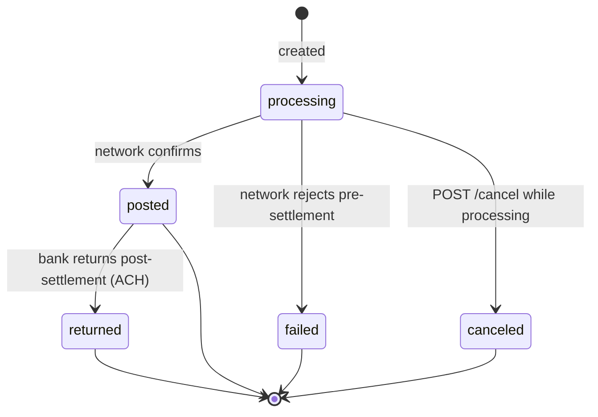
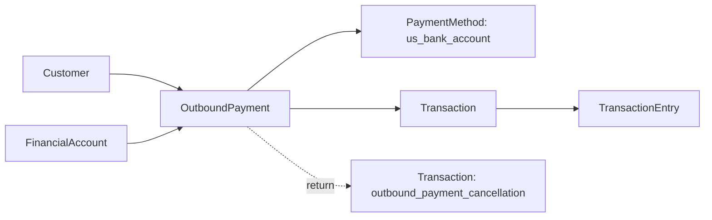

# Outbound Payment

> API resource: `treasury.outbound_payment` · API version: `2026-04-22.dahlia` · Category: [Treasury](README.md)

## What it is

An `OutboundPayment` (OBP) sends money from a [FinancialAccount](financial-accounts.md) to an external bank account, just like an [OutboundTransfer](outbound-transfers.md). The crucial difference: an OBP represents an *end-customer-initiated* payment that the platform is sending on the customer's behalf. Because there is a real third-party beneficiary, OBP carries identity-verification metadata (`customer`, `end_user_details`) and is subject to stricter AML/BSA compliance requirements.

If you're building a "send money to a friend" or bill-pay product on top of Treasury, OBP is the right primitive. If the platform is moving its own funds (sweep, merchant payout you control), use OBT instead.

## Why it exists

Bank regulators distinguish between (a) a business moving its own funds (OBT — low-touch, no end-customer KYC needed) and (b) a business *facilitating a payment* on a customer's behalf (OBP — must KYC the customer and the beneficiary, retain transaction monitoring records, support 1099 reporting where applicable). Splitting OBP off from OBT lets Stripe enforce these compliance differences at the API surface and gives platforms a clear data model for fintech apps.

## Lifecycle & states

Identical state machine to OBT — different rails, different compliance envelope.



| Status | Meaning |
|---|---|
| `processing` | Submitted to network; funds in `outbound_pending`. Cancel possible briefly. |
| `posted` | Settled at destination bank. |
| `failed` | Pre-settlement rejection. Funds released. |
| `canceled` | Canceled via API. |
| `returned` | ACH return after `posted`. |

`status_transitions.{posted_at,failed_at,canceled_at,returned_at}` track timing.

## Anatomy of the object

Mirrors OutboundTransfer plus end-customer metadata.

### Identity

| Field | Notes |
|---|---|
| `id` | `obp_…` |
| `object` | `"treasury.outbound_payment"` |
| `livemode` | mode flag |
| `created` | unix seconds |
| `description` | Free text, statement-line. |
| `statement_descriptor` | What the destination bank shows. |
| `metadata` | Your bag. |

### Money

| Field | Notes |
|---|---|
| `amount` | Positive integer cents. |
| `currency` | `"usd"`. |

### End-customer (the OBP-only part)

| Field | Notes |
|---|---|
| `customer` | `cus_…` — the end customer who initiated the payment. **Required for compliance.** |
| `end_user_details.ip_address` | IP the user submitted from. Stripe uses this for risk scoring. |
| `end_user_details.present` | Boolean — was the user physically present (e.g. in your app) at submission? `false` for scheduled/recurring payments. |

### Source / destination

| Field | Notes |
|---|---|
| `financial_account` | `fa_…` — debited account. |
| `destination_payment_method` | `pm_…` representing the destination bank account or destination FA. |
| `destination_payment_method_data` | Inline destination spec (alternative to passing `destination_payment_method`). Includes `type` (`us_bank_account` or `financial_account`), `billing_details`, `us_bank_account.{account_number,routing_number,account_holder_type}`, or `financial_account` ID for intra-Stripe transfers. |
| `destination_payment_method_details` | Snapshot of the destination at OBP creation. |
| `network_details.type` | `ach | us_domestic_wire`. |
| `network_details.ach.addenda` | Optional ACH addenda. |
| `network_details.us_domestic_wire.imad` / `omad` | Wire references. |

### Timing & tracking

| Field | Notes |
|---|---|
| `expected_arrival_date` | Date the network expects to settle. |
| `tracking_details.type` | `ach | us_domestic_wire`. |
| `tracking_details.ach.trace_id` | ACH trace number. |
| `tracking_details.us_domestic_wire.imad` / `omad` | Wire identifiers. |

### Status & receipts

| Field | Notes |
|---|---|
| `status` | enum, see lifecycle. |
| `status_transitions.*` | Per-state timestamps. |
| `returned_details.code` | Return reason (`account_closed`, `insufficient_funds`, `no_account`, etc.). |
| `returned_details.transaction` | Reversing FA Transaction. |
| `hosted_regulatory_receipt_url` | Hosted PDF receipt. |
| `transaction` | `trxn_…` — the FA ledger Transaction this OBP created. |

## Relationships



- One OBP → one Transaction. Returns append a separate Transaction.
- `customer` should be on the *connected account*, not on the platform.
- The destination can be either a bank account or another FinancialAccount (intra-Stripe). Intra-Stripe destinations settle near-instantly via the `intra_stripe_flows` feature.

## Common workflows

### 1. Pay a third party on behalf of a customer

```http
POST /v1/treasury/outbound_payments
  Stripe-Account: acct_…
  Idempotency-Key: <uuid>
  financial_account=fa_…
  amount=5000
  currency=usd
  customer=cus_…
  destination_payment_method=pm_…
  end_user_details[ip_address]=203.0.113.42
  end_user_details[present]=true
  description=Payment to landlord
  statement_descriptor=Rent Apr
```

### 2. Pay using inline destination data

```http
POST /v1/treasury/outbound_payments
  Stripe-Account: acct_…
  Idempotency-Key: <uuid>
  financial_account=fa_…
  amount=5000
  currency=usd
  customer=cus_…
  destination_payment_method_data[type]=us_bank_account
  destination_payment_method_data[us_bank_account][account_number]=000111222333
  destination_payment_method_data[us_bank_account][routing_number]=110000000
  destination_payment_method_data[us_bank_account][account_holder_type]=individual
  destination_payment_method_data[billing_details][name]=Jane Doe
  end_user_details[present]=true
```

Stripe creates a `pm_…` under the hood and references it.

### 3. Pay another FinancialAccount (intra-Stripe)

```http
POST /v1/treasury/outbound_payments
  Stripe-Account: acct_…
  financial_account=fa_source
  amount=2500
  currency=usd
  customer=cus_…
  destination_payment_method_data[type]=financial_account
  destination_payment_method_data[financial_account]=fa_destination
  end_user_details[present]=true
```

Requires `intra_stripe_flows` active on both FAs. Settles within seconds.

### 4. Cancel a processing payment

```http
POST /v1/treasury/outbound_payments/obp_…/cancel
  Stripe-Account: acct_…
```

Same caveats as OBT cancel: cancelable only briefly, wires usually too fast.

### 5. Handle a return

On `treasury.outbound_payment.returned`:
1. Refetch and read `returned_details.code`.
2. Refund the originating in-app charge to your end customer (or notify them).
3. The FA balance has already been credited back via a new Transaction.

## Webhook events

| Event | Fires when |
|---|---|
| `treasury.outbound_payment.created` | OBP submitted. |
| `treasury.outbound_payment.posted` | Settled at destination. |
| `treasury.outbound_payment.failed` | Pre-settlement rejection. |
| `treasury.outbound_payment.canceled` | Canceled via API. |
| `treasury.outbound_payment.returned` | Returned post-settlement. |
| `treasury.outbound_payment.expected_arrival_date_updated` | ETA revised. |
| `treasury.outbound_payment.tracking_details_updated` | New trace/IMAD/OMAD. |

> Always handle `returned`. Treating `posted` as terminal is the #1 OBP bug.

## Idempotency, retries & race conditions

- **`Idempotency-Key` is mandatory in practice.** OBP duplicates are end-customer-visible.
- The synchronous response always returns `processing`; trust the webhook for `posted`.
- Cancel endpoint can race with the network; handle `cancel succeeded but webhook says posted` defensively.
- ACH returns can arrive up to 60 days after `posted` for unauthorized-debit return codes. Don't archive OBPs as immutable too early.
- `customer` must already exist on the connected account at OBP creation; lookups are not deferred.

## Test-mode tips

- `stripe trigger treasury.outbound_payment.posted` / `.failed` / `.returned`.
- Test routing/account numbers same as OBT (sandbox ABA `110000000`).
- Test `customer` IDs created on a test connected account work normally.
- For intra-Stripe destinations, both source and destination FAs must be test-mode FAs with `intra_stripe_flows` active.

## Connect considerations

- Always include `Stripe-Account: acct_…`.
- Required FA features: `outbound_payments.ach` and/or `outbound_payments.us_domestic_wire`.
- The connected account (not the platform) is the regulatory "money services business" for OBPs. The connected account's KYC must be at the appropriate tier — Stripe enforces this via the `treasury` capability.
- The `customer` referenced is on the connected account's customer namespace, not the platform's.
- 1099-MISC / 1099-K reporting obligations may apply per OBP volume; consult Stripe Tax / your compliance team.

## Common pitfalls

- **Using OBT where OBP is required.** Sending money for an end customer with OBT looks fine technically but creates a regulatory gap — there is no `customer` link, no `end_user_details`. Bank examiners will flag it.
- **Missing `end_user_details.present`.** Stripe uses this to risk-score; defaulting to omitting it can cause silent declines.
- **Using a platform-side `cus_…` as `customer`.** It must be a customer on the connected account.
- **Treating `posted` as terminal.** ACH returns *will* happen.
- **Not reconciling intra-Stripe destinations.** Sending OBP to another FA produces both an OBP-side Transaction and a [ReceivedCredit](received-credits.md) on the destination FA — two events, two ledger rows.
- **Forgetting to refund the end customer on return.** The FA gets the money back, but your end customer still thinks they paid — they'll dispute or churn.

## Further reading

- [API reference: OutboundPayment](https://docs.stripe.com/api/treasury/outbound_payments/object)
- [Send money with OBP](https://docs.stripe.com/treasury/moving-money/financial-accounts/out-of-financial-accounts/outbound-payments)
- [OutboundTransfer](outbound-transfers.md) — when there is no end customer.
- [Treasury compliance](https://docs.stripe.com/treasury/compliance)
