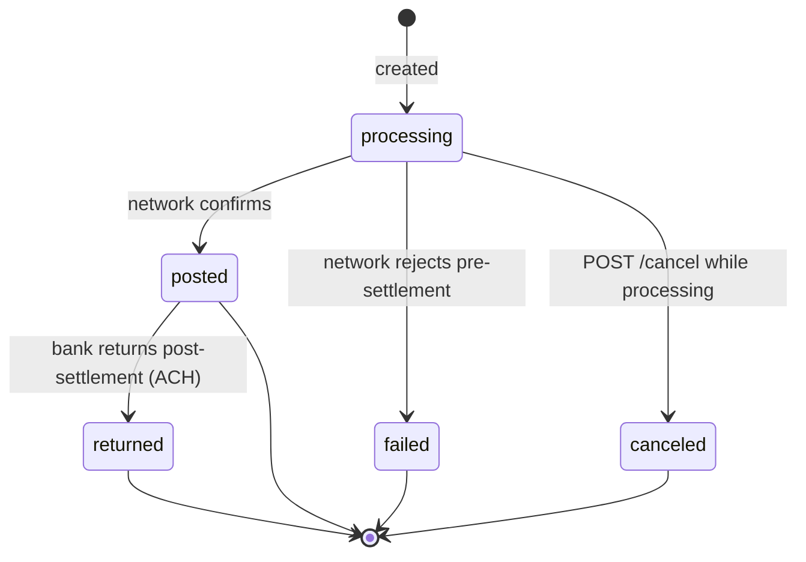
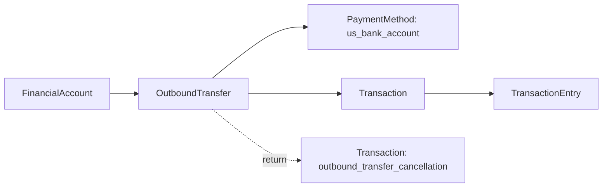

# Outbound Transfer

> API resource: `treasury.outbound_transfer` · API version: `2026-04-22.dahlia` · Category: [Treasury](README.md)

## What it is

An `OutboundTransfer` (OBT) sends money from a [FinancialAccount](financial-accounts.md) to an external bank account, over ACH or US domestic wire. The action is *initiated by the platform* and represents the platform's own money movement on behalf of the connected account — there is no end-customer identity attached to the transfer. Use OBT to pay merchants, sweep funds to a treasury account, or settle an internal obligation.

OBT is the Treasury-side cousin of a Payments [Payout](../01-core-resources/payouts.md), but it is not the same object. Payouts move from the Payments balance on a fixed schedule; OBTs move from a FA balance on demand.

## Why it exists

Without OBT, money entering a FA would have nowhere to go — it could only sit in cash or be spent via Issuing. OBT is the "send to an outside bank" primitive. It is distinct from [OutboundPayment](outbound-payments.md) because OBT does not require KYC of the destination beneficiary: the platform is moving its own connected-account funds, not a customer's.

## Lifecycle & states



| Status | Meaning | What's mutable |
|---|---|---|
| `processing` | Submitted to network. Funds in `outbound_pending`. | Can `cancel` (often only briefly — wires post fast). `metadata`, `description` editable. |
| `posted` | Settled at destination bank. Funds left `cash`. | `metadata` only. |
| `failed` | Rejected before settlement. Funds released back to `cash`. | `metadata`. Terminal. |
| `canceled` | Canceled by platform via API. Funds released. | `metadata`. Terminal. |
| `returned` | Posted then bounced (ACH return window, ~2–3 business days). Funds debited again? **No**: a return creates a separate ledger entry (a credit back) on a new Transaction; the OBT itself is marked `returned`. | `metadata`. Terminal. |

`status_transitions.{posted_at,failed_at,canceled_at,returned_at}` give precise timing.

ACH transfers can return up to ~60 days for some return reason codes (e.g. R10 unauthorized) — track `returned` status indefinitely.

## Anatomy of the object

### Identity

| Field | Notes |
|---|---|
| `id` | `obt_…` |
| `object` | `"treasury.outbound_transfer"` |
| `livemode` | mode flag |
| `created` | unix seconds |
| `description` | Free text, surfaced on bank statement. |
| `statement_descriptor` | What the destination bank shows. Strict character rules. |
| `metadata` | Your bag. |

### Money

| Field | Notes |
|---|---|
| `amount` | Positive integer cents. |
| `currency` | `"usd"`. |

### Source / destination

| Field | Notes |
|---|---|
| `financial_account` | `fa_…` the OBT debits. |
| `destination_payment_method` | `pm_…` representing the external bank account. |
| `destination_payment_method_details` | Snapshot of the destination at OBT creation: `type` (`us_bank_account`), `us_bank_account.last4`, `us_bank_account.routing_number`, `us_bank_account.bank_name`, `us_bank_account.network`. |
| `network_details.type` | `ach | us_domestic_wire`. Determines speed and cost. |
| `network_details.ach.addenda` | Optional ACH addenda record. |
| `network_details.us_domestic_wire.imad` / `omad` | Wire reference numbers (also surfaced under `tracking_details`). |

### Timing & tracking

| Field | Notes |
|---|---|
| `expected_arrival_date` | Date the network expects to settle. Updates on `treasury.outbound_transfer.expected_arrival_date_updated`. |
| `tracking_details.type` | `ach | us_domestic_wire`. |
| `tracking_details.ach.trace_id` | ACH trace number. |
| `tracking_details.us_domestic_wire.imad` | Inbound message accountability data. |
| `tracking_details.us_domestic_wire.omad` | Outbound. |

### Status & receipts

| Field | Notes |
|---|---|
| `status` | enum, see lifecycle. |
| `status_transitions.*` | Per-state timestamps. |
| `returned_details.code` | ACH/wire return reason if `status: returned`. Examples: `account_closed`, `no_account`, `insufficient_funds`. |
| `returned_details.transaction` | The reversing [Transaction](transactions.md) on the FA ledger. |
| `hosted_regulatory_receipt_url` | Stripe-hosted PDF receipt for the transfer. Sharable. |
| `transaction` | `trxn_…` — the FA ledger Transaction this OBT created. |

## Relationships



- One OBT → exactly one Transaction (initially). A return adds a *separate* Transaction on the same FA ledger.
- `destination_payment_method` must be a `us_bank_account` PaymentMethod. It does not need to be attached to a Customer.
- The OBT does not reference an end-customer. If you need that linkage, use [OutboundPayment](outbound-payments.md).

## Common workflows

### 1. Send funds to an external bank

```http
POST /v1/treasury/outbound_transfers
  Stripe-Account: acct_…
  Idempotency-Key: <uuid>
  financial_account=fa_…
  amount=10000
  currency=usd
  destination_payment_method=pm_…
  description=April sweep
  statement_descriptor=Acme Sweep
```

To force the network, add `network_details[type]=us_domestic_wire` (faster, more expensive) or `network_details[type]=ach` (cheaper, slower). If omitted, Stripe picks based on FA features and amount.

### 2. Create the destination PaymentMethod first

If you don't already have a `pm_…` for the external bank:

```http
POST /v1/payment_methods
  type=us_bank_account
  us_bank_account[account_number]=000123456789
  us_bank_account[routing_number]=110000000
  us_bank_account[account_holder_type]=company
  billing_details[name]=Acme LLC
```

For Treasury OBT destinations, no Customer attachment is required.

### 3. Cancel a processing transfer

```http
POST /v1/treasury/outbound_transfers/obt_…/cancel
  Stripe-Account: acct_…
```

Only valid while `status: processing`. ACH cancel windows are roughly minutes; wire cancellation usually fails outright because wires post in seconds.

### 4. Handle a return

When `treasury.outbound_transfer.returned` fires:

1. Refetch the OBT and read `returned_details.code`.
2. Refund the originating cause in your system (e.g. mark merchant payout failed, notify ops).
3. The FA balance has already been credited back via a new Transaction on the ledger — read `returned_details.transaction` for proof.

### 5. Show the receipt

`hosted_regulatory_receipt_url` is a stable, signed URL. You can email or display it without proxying through your server.

## Webhook events

| Event | Fires when |
|---|---|
| `treasury.outbound_transfer.created` | OBT submitted. |
| `treasury.outbound_transfer.posted` | Settled at destination bank. |
| `treasury.outbound_transfer.failed` | Rejected pre-settlement. |
| `treasury.outbound_transfer.canceled` | Canceled via API. |
| `treasury.outbound_transfer.returned` | Returned post-settlement. **Critical to handle for ACH.** |
| `treasury.outbound_transfer.expected_arrival_date_updated` | Network revised the ETA. |
| `treasury.outbound_transfer.tracking_details_updated` | New trace/IMAD/OMAD attached. |

> Listen to `posted` *and* `returned`. Treating `posted` as terminal will cause silent under-debits on returns.

## Idempotency, retries & race conditions

- **Always send `Idempotency-Key`.** Duplicate OBTs cost real money.
- The synchronous response returns `status: processing` even if the network has already accepted; trust the webhook for `posted`.
- `posted` is *not* terminal in the bookkeeping sense — a returned ACH can flip the user-perceived state days later. Your accounting must support post-posted reversals.
- The cancel endpoint is racy: it may return success but the wire/ACH already cleared. Handle the `failed` cancel response and the `posted` webhook arriving anyway.

## Test-mode tips

- `stripe trigger treasury.outbound_transfer.posted` / `.failed` / `.returned` to walk the state machine.
- Test ABA `110000000` plus account `000123456789` simulates a successful ACH; certain account numbers force returns. See Stripe's testing docs for the live list.
- Test mode wires post nearly instantly; use ACH for testing return flows.

## Connect considerations

- Always include `Stripe-Account: acct_…`. The OBT is owned by the connected account.
- The platform initiates OBTs *as* the connected account; there is no end-customer authorization required.
- Required FA features: `outbound_transfers.ach` and/or `outbound_transfers.us_domestic_wire` must be in `active_features`.
- Platform fees on OBT are not modeled here. If you bill connected accounts for transfers, do so on the Payments side via Charges to the platform.

## Common pitfalls

- **Treating `posted` as final.** ACH returns happen days later. Always wire your accounting to handle the `returned` event.
- **Skipping `Idempotency-Key`.** A retry on a flaky network can double-debit a merchant.
- **Picking `us_domestic_wire` for a small everyday transfer.** Wires cost ~$10–25; ACH is pennies. Default to ACH unless speed/finality is required.
- **Confusing OBT with [OutboundPayment](outbound-payments.md).** OBT is platform-action with no end-customer; OBP is end-customer-action with KYC. Regulators care which you used.
- **Forgetting that `outbound_pending` rises immediately.** A burst of OBTs can push `balance.cash - outbound_pending` negative — Stripe will reject the next OBT. Throttle.
- **Editing `amount` after creation.** Not allowed. Cancel and re-create.
- **Ignoring `expected_arrival_date_updated`.** If you show ETAs to merchants, listen and refresh — networks revise these regularly.

## Further reading

- [API reference: OutboundTransfer](https://docs.stripe.com/api/treasury/outbound_transfers/object)
- [Send money with OBT](https://docs.stripe.com/treasury/moving-money/financial-accounts/out-of-financial-accounts/outbound-transfers)
- [OutboundPayment](outbound-payments.md) — the end-customer-initiated counterpart.
- [ACH return codes](https://docs.stripe.com/treasury/moving-money/financial-accounts/out-of-financial-accounts/outbound-transfers#return-codes)
