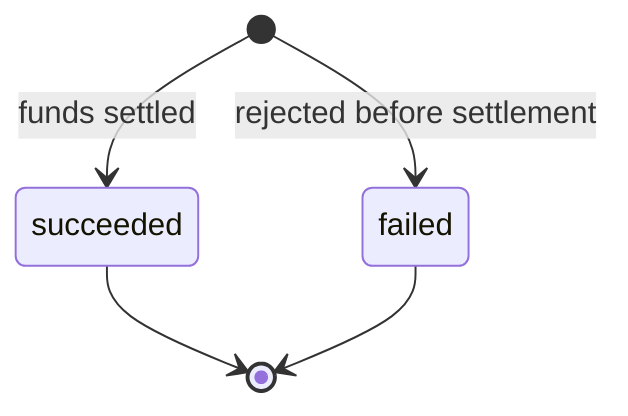
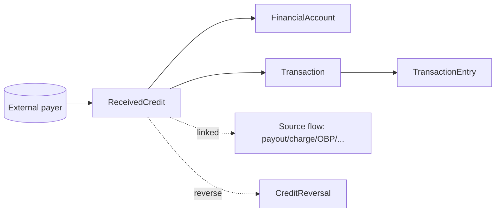

# Received Credit

> API resource: `treasury.received_credit` · API version: `2026-04-22.dahlia` · Category: [Treasury](README.md)

## What it is

A `ReceivedCredit` represents money arriving at a [FinancialAccount](financial-accounts.md) from outside, where the *external party* initiated the movement. ACH credits sent by a payroll provider, US domestic wires from a customer's bank, internal credits from another Stripe account or from Stripe itself (e.g. Issuing capture credits, intra-Stripe transfers, payouts from the Payments balance) — all manifest as ReceivedCredit objects.

The platform does not create ReceivedCredits via the API; Stripe creates them when funds land. The platform only reads them and reacts.

## Why it exists

Inbound money to a FA needs a single, normalized representation regardless of the rail it came in on (ACH, wire, intra-Stripe, card-network return). ReceivedCredit is that representation. It pairs with [ReceivedDebit](received-debits.md) (the inverse: money arriving as a debit, e.g. from an authorized ACH puller) to cover the full surface of incoming flows.

## Lifecycle & states



Unlike outbound flows, ReceivedCredits are essentially terminal at creation. The status fields:

| Status | Meaning |
|---|---|
| `succeeded` | Funds landed in `cash`. Almost all ReceivedCredits you'll see. |
| `failed` | Stripe or the partner bank rejected the inbound credit before crediting the FA. Rare; usually compliance-driven (sanctioned routing, malformed wire). `failure_code` populated. |

You **cannot pre-decline** a ReceivedCredit programmatically — by the time the object exists, the network has already accepted the credit. To unwind a ReceivedCredit, create a [CreditReversal](credit-reversals.md) within the network's return window (typically ~2–3 business days for ACH).

## Anatomy of the object

### Identity

| Field | Notes |
|---|---|
| `id` | `rec_…` |
| `object` | `"treasury.received_credit"` |
| `livemode` | mode flag |
| `created` | unix seconds — when Stripe created the object (close to settlement time). |
| `description` | Free text from the originator (ACH addenda, wire memo). |

### Money

| Field | Notes |
|---|---|
| `amount` | Positive integer cents. |
| `currency` | `"usd"`. |

### Source

| Field | Notes |
|---|---|
| `financial_account` | `fa_…` — the credited destination. |
| `network` | `ach | card | stripe | us_domestic_wire`. |
| `network_details` | Sub-object with rail-specific detail (e.g. `ach.{addenda}`, `us_domestic_wire.{imad,omad,sender_reference}`). |
| `initiating_payment_method_details.type` | `us_bank_account | balance | financial_account | issuing_card | stripe`. |
| `initiating_payment_method_details.us_bank_account` | `last4`, `routing_number`, `bank_name` — populated for ACH/wire. |
| `initiating_payment_method_details.billing_details.name` | Sender name (best-effort; banks vary in what they pass through). |
| `initiating_payment_method_details.financial_account` | Source `fa_…` for intra-Stripe credits. |
| `initiating_payment_method_details.balance` | `payments` for credits coming from the Payments balance (e.g. payout to FA). |

### Status & reversals

| Field | Notes |
|---|---|
| `status` | `succeeded | failed`. |
| `failure_code` | Populated only on `failed`. |
| `reversal_details.deadline` | unix seconds — last moment a CreditReversal can be created. After this, you can't reverse. |
| `reversal_details.restricted_reason` | If reversal is blocked: `already_reversed`, `deadline_passed`, `network_restricted`, `other`, `source_flow_restricted`, `payment_method_restricted`. `null` if reversal is currently possible. |

### Linked flows

| Field | Notes |
|---|---|
| `linked_flows.source_flow` | If the credit was caused by a known Stripe flow (issuing settlement, refund, payout, intra-Stripe OBP), the source object id. |
| `linked_flows.source_flow_type` | The type of `source_flow` (`charge`, `payout`, `outbound_payment`, `outbound_transfer`, `issuing_authorization`, etc.). |
| `linked_flows.source_flow_details` | Inline copy of the source flow object. |
| `linked_flows.issuing_authorization` | `iauth_…` if related to Issuing. |
| `transaction` | `trxn_…` — the FA ledger Transaction this credit created. |

### Receipts

| Field | Notes |
|---|---|
| `hosted_regulatory_receipt_url` | Hosted PDF receipt. |

## Relationships



- One ReceivedCredit → one Transaction.
- ReceivedCredit cannot be created directly; only Stripe creates them.
- Reversal is a separate object (CreditReversal) referencing this ReceivedCredit.

## Common workflows

### 1. React to incoming funds

Subscribe to `treasury.received_credit.created` (or `.succeeded`):

```http
POST <your-handler>
event.type = treasury.received_credit.created
event.data.object = ReceivedCredit { id: rec_…, amount, network, initiating_payment_method_details, … }
```

In the handler:
1. Persist the ReceivedCredit by `id`.
2. Credit your in-app user balance ledger.
3. Surface the sender info (`initiating_payment_method_details.billing_details.name`, `network`) in the user's transaction history.

### 2. List recent credits to a FA

```http
GET /v1/treasury/received_credits?financial_account=fa_…&limit=50
  Stripe-Account: acct_…
```

Filters: `status`, `linked_flows[source_flow_type]` (e.g. only payouts from Payments balance).

### 3. Reverse a ReceivedCredit

If the credit was sent in error (wrong account, fraud, etc.):

```http
POST /v1/treasury/credit_reversals
  Stripe-Account: acct_…
  Idempotency-Key: <uuid>
  received_credit=rec_…
```

Only works if `reversal_details.restricted_reason` is `null` and `reversal_details.deadline` is in the future. See [CreditReversal](credit-reversals.md).

### 4. Detect intra-Stripe origin

If `initiating_payment_method_details.type == "financial_account"` or `linked_flows.source_flow_type == "outbound_payment"`, the credit came from another Stripe FA — typically the result of an OBP whose destination was your FA. No external bank involved; settlement is near-instant.

## Webhook events

| Event | Fires when | Listener typically does |
|---|---|---|
| `treasury.received_credit.created` | Stripe creates the object. | Persist, kick off in-app crediting. |
| `treasury.received_credit.succeeded` | Status reaches `succeeded`. | Confirm crediting; release any "pending" UI. |
| `treasury.received_credit.failed` | Status reaches `failed`. | Roll back optimistic credit; surface failure. |

For most ACH/wire credits, `created` and `succeeded` fire in quick succession (sometimes the same delivery batch). For some flows the credit is `succeeded` immediately at creation.

## Idempotency, retries & race conditions

- **Read-only.** No `POST /v1/treasury/received_credits`.
- The `created` and `succeeded` events can arrive out of order in rare cases; handlers should be idempotent on `id`.
- If a credit is reversed (CreditReversal posts), the original ReceivedCredit's `status` does *not* flip — you discover the reversal via the CreditReversal object, not by re-reading the credit.
- Webhook delivery is at-least-once. Dedupe on `id`.

## Test-mode tips

- `stripe trigger treasury.received_credit.created` simulates an inbound credit.
- The Dashboard's Treasury → "Send test credit" lets you push synthetic ACH/wire credits with controllable sender info.
- For intra-Stripe credit testing, perform a test-mode OBP from one FA to another and observe both the OBP `posted` and the ReceivedCredit on the destination.

## Connect considerations

- Always include `Stripe-Account: acct_…`.
- Required FA features: `financial_addresses.aba` (so the FA has an address to receive ACH/wire) and/or `intra_stripe_flows` (for Stripe-internal credits).
- The platform sees ReceivedCredits per connected account; there is no platform-level aggregate.
- Sanctions screening on incoming wires is performed by Stripe's partner bank — credits that fail screening surface as `status: failed` with a generic `failure_code`.

## Common pitfalls

- **Trying to refuse incoming money.** You can't pre-decline a ReceivedCredit. Use CreditReversal *after* the fact, within the deadline.
- **Trusting `initiating_payment_method_details.billing_details.name`.** Banks pass arbitrary strings; this field is best-effort, not authenticated identity.
- **Crediting users on `created` then never reading `succeeded`.** Most credits succeed but a few fail; always reconcile.
- **Missing the reversal deadline.** ACH return windows close fast (~2–3 business days). After `reversal_details.deadline`, the only recourse is to send a fresh OBP/OBT back to the originator.
- **Confusing ReceivedCredit with InboundTransfer.** IBT is a platform-pull (you initiate); ReceivedCredit is a third-party push (they initiate). Different objects, different lifecycles.
- **Treating intra-Stripe ReceivedCredits as ACH.** They settle instantly and have different `network` (`stripe`) and `failure_code` semantics. Branch on `network` in your handler.

## Further reading

- [API reference: ReceivedCredit](https://docs.stripe.com/api/treasury/received_credits/object)
- [Receive funds into an FA](https://docs.stripe.com/treasury/moving-money/financial-accounts/into-financial-accounts)
- [CreditReversal](credit-reversals.md) — reverse a ReceivedCredit.
- [ReceivedDebit](received-debits.md) — the inverse object.
