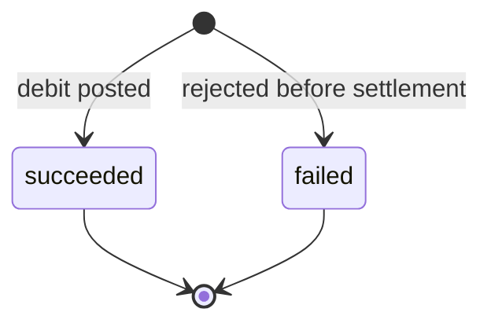
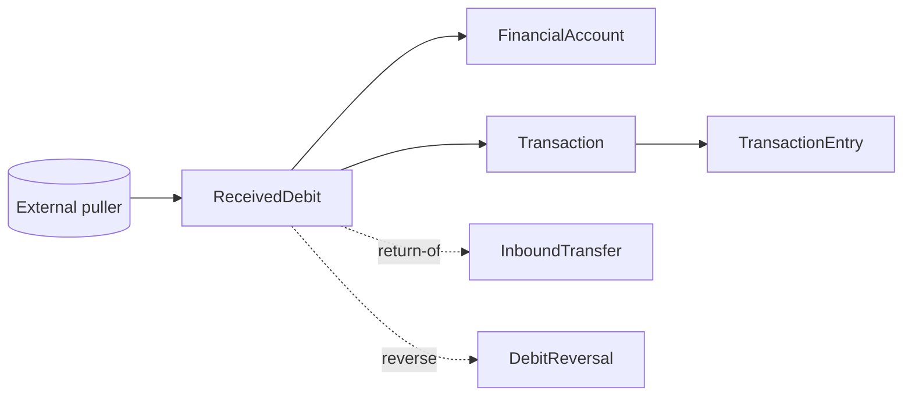

# Received Debit

> API resource: `treasury.received_debit` · API version: `2026-04-22.dahlia` · Category: [Treasury](README.md)

## What it is

A `ReceivedDebit` represents money being *pulled out of* a [FinancialAccount](financial-accounts.md) by an external party. The most common cause is an authorized ACH debit: you (or your user) gave a third party — utility company, payroll deduction, subscription service — your FA's routing/account numbers and authorized them to debit you. When the debit posts, Stripe creates a ReceivedDebit. ReceivedDebits also surface for return flows (e.g. an [InboundTransfer](inbound-transfers.md) bouncing back) and for some intra-Stripe debits.

It is the inverse of [ReceivedCredit](received-credits.md) and uses an almost identical shape.

## Why it exists

A FA is a real bank account; once the routing/account numbers are out in the world, third parties can debit it. ReceivedDebit is the model for those movements. It also gives Stripe a uniform place to surface return flows that take money back out of the FA (failed IBTs, unwound credits) so your reconciliation logic doesn't need a special case per cause.

## Lifecycle & states



| Status | Meaning |
|---|---|
| `succeeded` | Funds left `cash`. Almost all ReceivedDebits you'll see. |
| `failed` | Stripe or the partner bank rejected the inbound debit before debiting the FA. |

You **cannot pre-decline** a ReceivedDebit programmatically (modulo platform-level `inbound_flows: restricted` or revoked ACH authorization). To unwind a posted ReceivedDebit, create a [DebitReversal](debit-reversals.md) within the network's return window (typically ~2–3 business days for ACH).

## Anatomy of the object

Mirror image of ReceivedCredit; sign on the FA's balance is the only conceptual difference.

### Identity

| Field | Notes |
|---|---|
| `id` | `recd_…` |
| `object` | `"treasury.received_debit"` |
| `livemode` | mode flag |
| `created` | unix seconds |
| `description` | Free text from the originator. |

### Money

| Field | Notes |
|---|---|
| `amount` | Positive integer cents — the magnitude of the debit. (The FA balance impact is negative; this field is unsigned.) |
| `currency` | `"usd"`. |

### Source

| Field | Notes |
|---|---|
| `financial_account` | `fa_…` — the debited account. |
| `network` | `ach | card | stripe`. (Wires are not debit instruments — there is no `us_domestic_wire` here.) |
| `network_details` | Sub-object with rail-specific detail. |
| `initiating_payment_method_details.type` | `us_bank_account | balance | financial_account | issuing_card | stripe`. |
| `initiating_payment_method_details.us_bank_account` | `last4`, `routing_number`, `bank_name` of the puller. |
| `initiating_payment_method_details.billing_details.name` | Puller name (best-effort). |

### Status & reversals

| Field | Notes |
|---|---|
| `status` | `succeeded | failed`. |
| `failure_code` | Populated only on `failed`. |
| `reversal_details.deadline` | unix seconds — last moment a DebitReversal can be created. |
| `reversal_details.restricted_reason` | If reversal is blocked: `already_reversed`, `deadline_passed`, `network_restricted`, `other`, `source_flow_restricted`, `payment_method_restricted`. `null` if reversal is currently possible. |

### Linked flows

| Field | Notes |
|---|---|
| `linked_flows.payout` | If the debit is a Stripe-side debit feeding a Payments-side payout, the `po_…`. |
| `linked_flows.inbound_transfer` | `ibt_…` if this debit is the *return* of a previously-succeeded InboundTransfer. **Critical** — this is how IBT returns surface. |
| `linked_flows.issuing_authorization` | `iauth_…` if related to Issuing. |
| `linked_flows.issuing_transaction` | `ipi_…` for Issuing transactions. |
| `transaction` | `trxn_…` — the FA ledger Transaction this debit created. |

### Receipts

| Field | Notes |
|---|---|
| `hosted_regulatory_receipt_url` | Hosted PDF receipt. |

## Relationships



- One ReceivedDebit → one Transaction.
- ReceivedDebits are not creatable via API.
- A ReceivedDebit with `linked_flows.inbound_transfer` set is the return-of-IBT marker — your bookkeeping must reverse the prior credit.

## Common workflows

### 1. React to a debit

Subscribe to `treasury.received_debit.created`:

```http
POST <your-handler>
event.type = treasury.received_debit.created
event.data.object = ReceivedDebit { id, amount, network, linked_flows, … }
```

Branch logic:

- If `linked_flows.inbound_transfer != null` → this is an IBT return. Reverse the earlier credit you applied to the user.
- If `network == "ach"` and `linked_flows == {}` → this is a third-party-initiated debit (utility, payroll, etc.). Just record it.
- If `network == "stripe"` → an internal Stripe debit (e.g. fee, intra-Stripe transfer). Map per `initiating_payment_method_details`.

### 2. List recent debits

```http
GET /v1/treasury/received_debits?financial_account=fa_…&limit=50
  Stripe-Account: acct_…
```

### 3. Reverse a ReceivedDebit

If the third party debited in error or fraudulently:

```http
POST /v1/treasury/debit_reversals
  Stripe-Account: acct_…
  Idempotency-Key: <uuid>
  received_debit=recd_…
```

Only valid while `reversal_details.restricted_reason == null` and the deadline has not passed. See [DebitReversal](debit-reversals.md).

### 4. Block future debits from a particular originator

There is no per-originator blocklist API on the FA. Options:

- Set `platform_restrictions.inbound_flows: restricted` on the FA (blunt — blocks all inbound).
- Revoke the ACH authorization with the originator out-of-band.
- Use a fresh FA (with new routing/account numbers) and migrate.

## Webhook events

| Event | Fires when | Listener typically does |
|---|---|---|
| `treasury.received_debit.created` | Stripe creates the object. | Branch on `linked_flows`; debit user balance or reconcile IBT return. |

There is no separate `succeeded`/`failed` event today — `status` is set at creation and rarely changes. Refetch defensively if your handler depends on it.

## Idempotency, retries & race conditions

- **Read-only.** No `POST /v1/treasury/received_debits`.
- Webhook delivery is at-least-once; dedupe on `id`.
- For IBT-return debits, the IBT's own `returned: true` field updates around the same time as the ReceivedDebit creation; the order is not guaranteed. Refetch the IBT in your handler.
- A DebitReversal does *not* mutate the original ReceivedDebit's `status`. Reconciliation must walk both directions: ReceivedDebit → DebitReversals.

## Test-mode tips

- `stripe trigger treasury.received_debit.created` simulates a third-party debit.
- To test IBT return handling: trigger a successful IBT, then create a synthetic ReceivedDebit via dashboard test helpers with `linked_flows.inbound_transfer=ibt_…`.
- The Dashboard's Treasury → "Send test debit" lets you push synthetic ACH debits.

## Connect considerations

- Always include `Stripe-Account: acct_…`.
- Required FA features: `financial_addresses.aba` (so external parties can ACH-debit) and/or `intra_stripe_flows`.
- Platform-level `platform_restrictions.inbound_flows: restricted` blocks new ReceivedDebits going forward (existing in-flight ones still post).
- ReceivedDebits caused by Stripe-side fees (rare on Treasury today, but possible for premium features) appear with `network: stripe`.

## Common pitfalls

- **Treating every ReceivedDebit as a third-party action.** Many are returns of your own outflows. Always inspect `linked_flows` first.
- **Ignoring IBT-return ReceivedDebits.** If you credited the user when an IBT succeeded but never debit them back when the IBT later returns, you've handed out free money.
- **Trying to dispute a ReceivedDebit like a card chargeback.** ACH "disputes" don't exist as a Stripe object — you reverse via DebitReversal, and you must do so within the return-code deadline.
- **Surfacing the puller's name as authoritative.** It's a free-text bank field; spoofable.
- **Using `inbound_flows: restricted` as a long-term solution.** It blocks all inbound, including legitimate credits. Better: rotate the FA or chase the originator off-platform.
- **Confusing ReceivedDebit with [OutboundTransfer](outbound-transfers.md).** OBT is *you* sending money out; ReceivedDebit is *someone else* pulling money out. Both reduce `balance.cash` but they have different lifecycle, return mechanics, and compliance posture.

## Further reading

- [API reference: ReceivedDebit](https://docs.stripe.com/api/treasury/received_debits/object)
- [Money out of an FA](https://docs.stripe.com/treasury/moving-money/financial-accounts/out-of-financial-accounts)
- [DebitReversal](debit-reversals.md) — reverse a ReceivedDebit.
- [ReceivedCredit](received-credits.md) — the inverse object.
