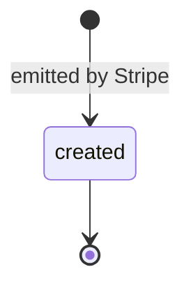
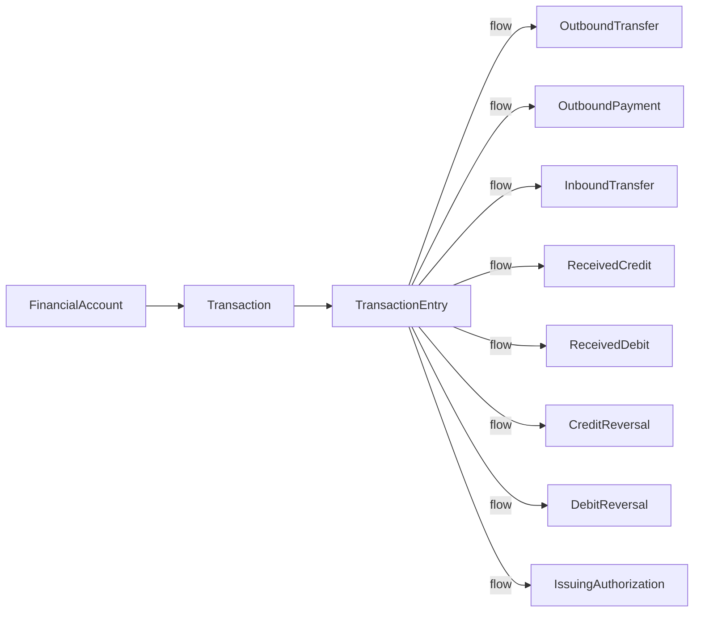

# Transaction Entry (Treasury)

> API resource: `treasury.transaction_entry` · API version: `2026-04-22.dahlia` · Category: [Treasury](README.md)

## What it is

A `treasury.transaction_entry` is a single ledger leg of a [Transaction](transactions.md). Where a Transaction is "this OBT happened," a TransactionEntry is "the FA's `outbound_pending` increased by $50 at 10:14:32 because of this OBT." Most Transactions have a single Entry; some — Issuing authorization holds + later releases, ACH flow + return — have multiple.

It is the finest-grained record in the Treasury ledger. If you are doing serious reconciliation, you read TransactionEntries; if you are doing a customer-facing statement, Transactions are enough.

## Why it exists

Some money movements are not atomic at the ledger level. An Issuing card swipe creates a hold (`issuing_authorization_hold`) at swipe time and a release/capture entry later when the merchant settles. The single Transaction abstracts these as one user-visible event, but the bank-style debit/credit ledger needs both legs separately. TransactionEntry is that finer view, intended for accounting systems that demand strict double-entry-style records.

## Lifecycle & states

TransactionEntries are **terminal on creation**. There is no status field — once an Entry exists, it is immutable. State transitions of the underlying Transaction (open → posted, etc.) do not retroactively edit Entries; new Entries are appended instead.



| Aspect | Behavior |
|---|---|
| Mutability | None. Entries are append-only. |
| Reversibility | A reversal flow creates a new Entry with an opposite-signed `gross_amount`, on a separate Transaction. |
| Effective time | `effective_at` — when the Entry took effect on the ledger; can differ from `created` (when the row was written). |

## Anatomy of the object

### Identity

| Field | Notes |
|---|---|
| `id` | `trxne_…` |
| `object` | `"treasury.transaction_entry"` |
| `livemode` | mode flag |
| `created` | unix seconds — when the row was written. |
| `effective_at` | unix seconds — when the leg actually hit the ledger. May lag `created` for backdated entries. |

### Money

| Field | Notes |
|---|---|
| `currency` | `"usd"`. |
| `gross_amount` | Signed integer cents. Sign is from the FA's perspective: positive = credit (money in), negative = debit (money out). |
| `balance_impact.cash` | Cents added/removed from `balance.cash`. |
| `balance_impact.inbound_pending` | Cents added/removed from `balance.inbound_pending`. |
| `balance_impact.outbound_pending` | Cents added/removed from `balance.outbound_pending`. |

`balance_impact.cash + balance_impact.inbound_pending + balance_impact.outbound_pending = gross_amount`.

### Flow pointers

| Field | Notes |
|---|---|
| `transaction` | `trxn_…`. The parent Transaction. |
| `flow` | The originating flow object id (same value as the parent Transaction's `flow`). |
| `flow_type` | Same enum as the parent. |
| `flow_details` | Inline copy of the typed flow. |
| `financial_account` | `fa_…`. |

### Entry type

| Field | Values |
|---|---|
| `type` | `credit_reversal | debit_reversal | inbound_transfer | inbound_transfer_return | issuing_authorization_hold | issuing_authorization_release | other | outbound_payment | outbound_payment_cancellation | outbound_transfer | outbound_transfer_cancellation | outbound_transfer_failure | received_credit | received_debit` |

`type` is finer-grained than `flow_type` because it distinguishes the *legs* of a flow. A single OutboundTransfer that fails will produce two Entries on the same Transaction: `outbound_transfer` (debit, into `outbound_pending`) and `outbound_transfer_failure` (credit, releasing `outbound_pending`). A captured Issuing authorization produces `issuing_authorization_hold` then later `issuing_authorization_release`.

## Relationships



- Many Entries can share one Transaction.
- One Entry belongs to exactly one Transaction.
- Entries reference the same flow as their parent Transaction; the linkage is denormalized for query performance.

## Common workflows

### 1. Paginate all entries for a Transaction

```http
GET /v1/treasury/transaction_entries?transaction=trxn_…&limit=100
  Stripe-Account: acct_…
```

Use this when the inline `entries.data[]` on the Transaction is truncated.

### 2. List all entries in a date range (ledger export)

```http
GET /v1/treasury/transaction_entries?financial_account=fa_…&effective_at[gte]=…&effective_at[lte]=…&order_by=effective_at&limit=100
  Stripe-Account: acct_…
```

Filter by `effective_at`, not `created`, for true ledger periods. Sort by `effective_at` to produce a clean chronological journal.

### 3. Reconcile an Issuing authorization

For a captured card swipe you'll see two entries on one Transaction:

| Entry | `type` | `gross_amount` | `balance_impact.outbound_pending` | `balance_impact.cash` |
|---|---|---|---|---|
| 1 | `issuing_authorization_hold` | -1500 | +1500 | 0 |
| 2 | `issuing_authorization_release` | -1500 | -1500 | -1500 |

The hold doesn't move cash; the release does. Entry 1's `effective_at` is swipe time; Entry 2 is settlement.

### 4. Reconstruct daily balance

Sum `balance_impact.cash` for all Entries with `effective_at` in the day, in order. Add to prior day's closing `balance.cash`. The result must equal Stripe's reported `balance.cash` at end of day; otherwise you missed an Entry.

## Webhook events

Treasury TransactionEntries do not have their own webhook events. Listen for:

| Event | Why it matters |
|---|---|
| `treasury.transaction.created` | A new Transaction (and at least one Entry) appeared. Fetch the Entry list. |
| `treasury.outbound_transfer.*`, `treasury.received_credit.*`, etc. | A flow status changed; new Entries may have been appended to its Transaction. |

The lack of a dedicated event means you must refetch entries for a Transaction whenever the underlying flow's status changes.

## Idempotency, retries & race conditions

- **Read-only.** No `POST` endpoint exists. Stripe creates Entries as a side-effect of processing flows.
- Entries can appear *after* their parent Transaction is created — particularly for multi-leg flows. Don't assume the inline `entries.data[]` snapshot is complete forever.
- `effective_at` can be earlier than `created`. Don't sort by `created` for ledger reporting.
- Two Entries with the same `effective_at` second are possible (hold + release at the same instant in test mode). Use `id` as a tiebreaker for stable ordering.

## Test-mode tips

- Trigger an Issuing authorization with `stripe trigger issuing_authorization.created` to see hold/release Entries appear.
- Trigger an OBT failure with `stripe trigger treasury.outbound_transfer.failed` to see the `outbound_transfer` + `outbound_transfer_failure` Entry pair.
- The Dashboard exposes Entries under each Transaction's detail view — useful to cross-check your sums.

## Connect considerations

- All Treasury endpoints require `Stripe-Account: acct_…`. Entries are scoped per connected account.
- Platform-side reconciliation across many connected accounts must aggregate per-account exports; there is no cross-account list.
- If your platform charges connected accounts for Treasury usage, those fees are *not* TransactionEntries — they live on the Payments side as Charges/ApplicationFees.

## Common pitfalls

- **Sorting by `created` for statements.** Use `effective_at`. `created` reflects ingestion order, not money-movement order.
- **Treating an Entry as a single fact about a flow.** Some flows produce only one Entry; some produce many. Always iterate.
- **Trusting the inline `entries.data[]` for a flow that just got an update.** That snapshot is from Transaction-fetch time. Refetch with `?transaction=trxn_…` after a flow event.
- **Confusing `type` with `flow_type`.** `flow_type` is the source category; `type` is the leg-specific role. They differ for cancellation/failure/release legs.
- **Summing `gross_amount` to derive cash balance.** Use `balance_impact.cash` — `gross_amount` includes movements that landed in pending buckets only.
- **Rebuilding double-entry books from one side.** A debit on the FA has no corresponding credit *inside* the Treasury ledger — the other side is the external bank or the counterparty's account. Treat the FA ledger as single-entry from your books' POV; the second leg lives in your accounting system.

## Further reading

- [API reference: TransactionEntry](https://docs.stripe.com/api/treasury/transaction_entries/object)
- [Transaction](transactions.md) — the parent.
- [Treasury reconciliation](https://docs.stripe.com/treasury/moving-money/reconciliation)
