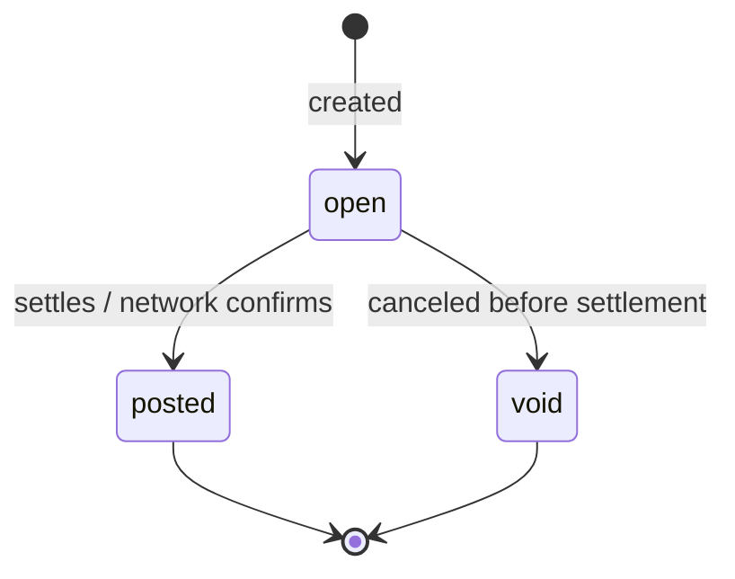
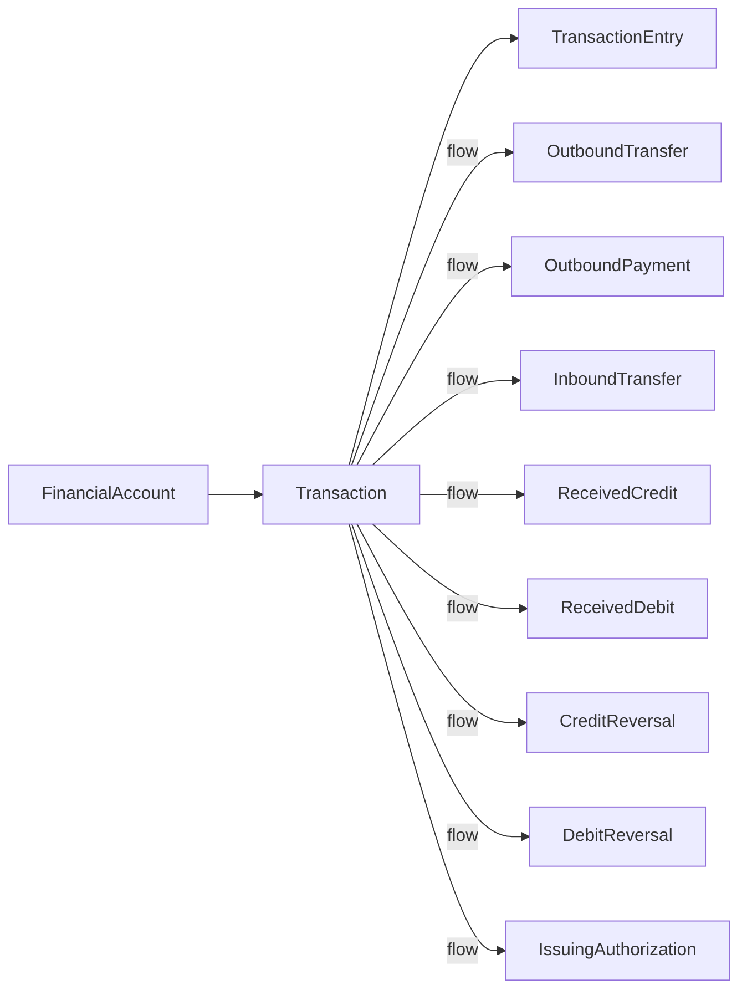

# Transaction (Treasury)

> API resource: `treasury.transaction` · API version: `2026-04-22.dahlia` · Category: [Treasury](README.md)

## What it is

A `treasury.transaction` is one complete money movement on a [FinancialAccount](financial-accounts.md)'s ledger. Every flow that affects the FA's balance — an Outbound Transfer, a Received Credit, a Credit Reversal, an Issuing authorization, etc. — produces exactly one Transaction. The Transaction is the customer-facing "line on the bank statement" view; underneath it sits one or more [TransactionEntry](transaction-entries.md) rows that capture each ledger leg.

Treasury Transactions are conceptually similar to Payments-side `BalanceTransaction`s, but they live in a separate ledger (the FA ledger) and they reference Treasury flow types instead of Charge/Refund/Payout.

## Why it exists

Without a unified Transaction object, reconciling a FinancialAccount would require joining across every flow type (OBT, OBP, IBT, ReceivedCredit, ReceivedDebit, CreditReversal, DebitReversal, Issuing). Transaction is the single ledger view that gives you a uniform shape — `amount`, `currency`, `flow`, `flow_type`, `balance_impact`, `status` — regardless of what produced the movement. It is the right object to feed an accounting export.

## Lifecycle & states



| Status | Meaning |
|---|---|
| `open` | Movement initiated but not finalized. May still be reversed by the underlying flow (e.g. an OBT in `processing`). Affects pending balance, not cash. |
| `posted` | Final, settled. Affects `balance.cash`. Irreversible at the ledger level (a *new* Transaction is created if the underlying flow is reversed later). |
| `void` | Canceled before settlement. Pending balance impact released. |

`status_transitions.posted_at` and `status_transitions.voided_at` give the timing.

A returned ACH (e.g. an Outbound Transfer that bounces three days after `posted`) does *not* mutate the original Transaction back to `void` — instead, a new Transaction with `flow_type: outbound_transfer_cancellation` (or similar reversal type) is appended to the ledger.

## Anatomy of the object

### Identity

| Field | Notes |
|---|---|
| `id` | `trxn_…` |
| `object` | `"treasury.transaction"` |
| `livemode` | mode flag |
| `created` | unix seconds |
| `description` | Free-text, derived from the flow. |

### Money

| Field | Notes |
|---|---|
| `amount` | Signed integer cents. **Negative for debits**, positive for credits, from the FA's perspective. |
| `currency` | `"usd"`. |
| `balance_impact.cash` | Cents added/removed from `balance.cash`. |
| `balance_impact.inbound_pending` | Cents added/removed from `balance.inbound_pending`. |
| `balance_impact.outbound_pending` | Cents added/removed from `balance.outbound_pending`. |

The three `balance_impact` keys sum to `amount`. For an `open` ACH credit, you'll typically see `inbound_pending: +X, cash: 0`; once `posted`, a new Transaction or a status flip moves it to `cash: +X, inbound_pending: -X`.

### Status

| Field | Notes |
|---|---|
| `status` | `open | posted | void`. |
| `status_transitions.posted_at` | unix seconds, or null. |
| `status_transitions.voided_at` | unix seconds, or null. |

### Flow pointers

| Field | Notes |
|---|---|
| `financial_account` | `fa_…`. The ledger this entry lives on. |
| `flow` | The ID of the source object: `obt_…`, `obp_…`, `ibt_…`, `rec_…`, `recd_…`, `credrev_…`, `debrev_…`, or `iauth_…`. |
| `flow_type` | Enum: `outbound_transfer | outbound_payment | inbound_transfer | received_credit | received_debit | credit_reversal | debit_reversal | issuing_authorization | other`. |
| `flow_details` | Sub-object echoing the typed flow (`flow_details.outbound_transfer = {…}` etc.). Lets you avoid a second fetch for common dashboard rendering. |

### Entries

| Field | Notes |
|---|---|
| `entries.data[]` | Inline list of [TransactionEntry](transaction-entries.md) objects. Up to 10 inline; paginate via `/v1/treasury/transaction_entries?transaction=trxn_…` for the rest. |

## Relationships



Invariants:

- **One flow → one Transaction.** A single OutboundTransfer always produces exactly one Transaction (which in turn may have multiple TransactionEntries).
- **A Transaction always has at least one TransactionEntry.**
- **Reversals append, they don't mutate.** A returned OBT creates a *new* Transaction; the original stays `posted`.

## Common workflows

### 1. List transactions for an FA (statement view)

```http
GET /v1/treasury/transactions?financial_account=fa_…&limit=100
  Stripe-Account: acct_…
```

Filters: `status`, `created[gte]`, `created[lte]`, `order_by=created` or `posted_at`. For end-of-month statements, paginate with `created[gte]`/`created[lte]` and `status=posted`.

### 2. Drill into one transaction

```http
GET /v1/treasury/transactions/trxn_…?expand[]=entries
  Stripe-Account: acct_…
```

`flow_details` is already inlined; `entries` needs expansion if you want them in the same call.

### 3. Reconcile to the originating flow

For each Transaction, dispatch on `flow_type`:

```python
match txn.flow_type:
    case "outbound_transfer":
        obt = stripe.treasury.OutboundTransfer.retrieve(txn.flow, stripe_account=acct)
    case "received_credit":
        rc  = stripe.treasury.ReceivedCredit.retrieve(txn.flow, stripe_account=acct)
    ...
```

Or just read `txn.flow_details.<type>` for the inline copy.

### 4. Build an accounting export

1. List `posted` transactions in a date range.
2. For each, pick a side based on `amount` sign (positive = credit, negative = debit).
3. Map `flow_type` to your chart-of-accounts category.
4. Use `id` as the ledger entry's external reference for idempotency.

## Webhook events

| Event | Fires when | Listener typically does |
|---|---|---|
| `treasury.transaction.created` | A new Transaction appears on the FA ledger (in any status). | Insert into your local ledger mirror; await flow-specific events for status. |

There is no `treasury.transaction.posted` or `.updated` event. Posting is observed indirectly via the originating flow's events (`treasury.outbound_transfer.posted`, `treasury.received_credit.succeeded`, etc.). Refetch the Transaction when the corresponding flow event fires.

## Idempotency, retries & race conditions

- Transactions are **read-only**. There is no `POST /v1/treasury/transactions` — they are created by Stripe as a by-product of flow processing.
- `treasury.transaction.created` can arrive *before* the corresponding flow event (`treasury.outbound_transfer.created`) in rare cases. Order your handlers to be commutative.
- `flow_details` is a snapshot; if the underlying flow object changes (status, tracking_details), the Transaction's `flow_details` does *not* update. Refetch the flow itself for current truth.

## Test-mode tips

- Trigger flows (`stripe trigger treasury.outbound_transfer.posted`, etc.) and a Transaction is created automatically.
- In test mode, `posted_at` is usually set instantly; in live mode there can be days of delay for ACH.
- Use the Dashboard's Treasury → Transactions tab to visually verify your reconciliation logic against Stripe's view.

## Connect considerations

- Every list/retrieve requires `Stripe-Account: acct_…`.
- Transactions are scoped to a single connected account's FA. There is no platform-level aggregate endpoint — you must list per FA.
- Platform fees (if you charge connected accounts for Treasury usage) are not modeled here; bill them outside the Treasury ledger.

## Common pitfalls

- **Treating Treasury Transaction as the same thing as `BalanceTransaction`.** They live in different ledgers. The Payments-side `BalanceTransaction` (`txn_…`) and Treasury Transaction (`trxn_…`) share a similar conceptual role but never reference each other directly.
- **Reading `amount` without checking sign.** Outbound flows are negative.
- **Expecting `posted` to be terminal-immutable for the underlying flow.** A posted OBT can still be returned days later — it manifests as a *new* Transaction, not an update to the original.
- **Filtering by `created` for statement periods.** Use `posted_at` (via `order_by=posted_at` and time-window filters) — `created` reflects when the flow was initiated, not when funds settled.
- **Skipping `flow_details` and refetching the flow object every time.** Fine for accuracy but wasteful; for read-only display, `flow_details` is enough.
- **Assuming all Transactions have exactly one Entry.** Most do, but Issuing authorizations (hold + release) and some return flows produce multi-entry Transactions. Always iterate `entries.data[]`.

## Further reading

- [API reference: Treasury Transaction](https://docs.stripe.com/api/treasury/transactions/object)
- [TransactionEntry](transaction-entries.md) — the ledger leg breakdown.
- [Treasury reconciliation](https://docs.stripe.com/treasury/moving-money/reconciliation)
