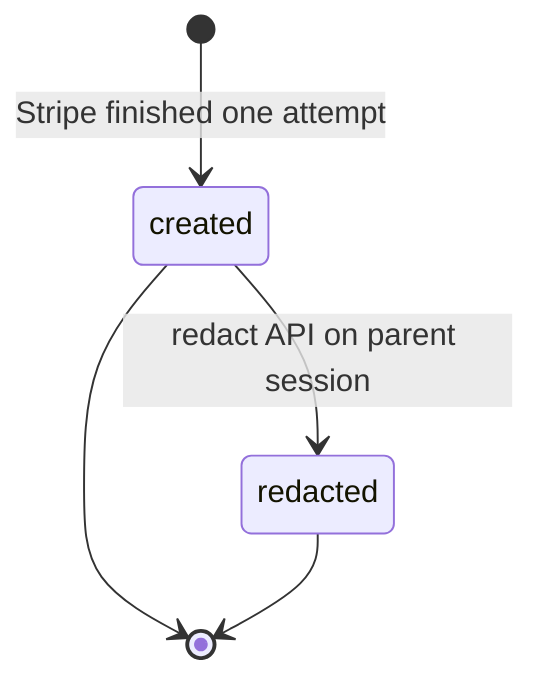
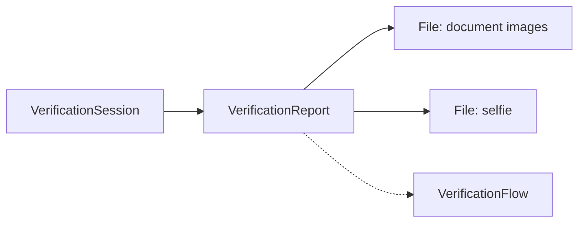

# Identity Verification Report

> API resource: `identity.verification_report` · API version: `2026-04-22.dahlia` · Category: [Identity](README.md)

## What it is

A `VerificationReport` is the immutable record of one *attempt* inside a [VerificationSession](verification-sessions.md). One Session = one user = potentially many Reports (one per submission cycle: first try, retry after a blurry photo, retry after the wrong document type). The Report holds the parsed fields Stripe extracted, the per-check `verified | unverified` verdicts, the file IDs of the captured images, and — when an attempt fails — the precise `error.code` and `error.reason`.

Reports are read-only. You can't update one, delete one, or reattach one to a different Session. The only mutation that ever touches a Report is **redaction**: when the parent Session is redacted (by you or by retention policy), the Report's PII fields are wiped while the status enums and error codes survive for compliance audit.

## Why it exists

Sessions tell you *did Jane verify?* Reports tell you *what exactly happened on each attempt — what document she uploaded, which checks passed, which checks failed and why*. You need that detail for:

- **Audit / compliance** — regulators want the trail of attempts and outcomes, not just the final yes/no.
- **Diagnosing failed flows** — when a user tells you "the verification didn't work", you read the latest Report's `error.code` to know whether they uploaded an expired ID, the selfie didn't match, or the document was unsupported.
- **Pulling extracted data after the fact** — if you didn't capture `verified_outputs` from the Session at success time, you can re-derive most of it from the latest Report.

## Lifecycle & states

A Report has no top-level `status` enum. It is **born terminal**: created at the moment Stripe finishes processing one submission and never changes. The state of the *attempt* lives on the sub-objects (`document.status`, `id_number.status`, `selfie.status`), each of which is a fixed `verified | unverified` after creation.



- **created** — sub-object `status` fields are `verified` or `unverified`. PII fields are populated where extractable.
- **redacted** — PII fields wiped. Sub-object `status` enums and `error.code` / `error.reason` are preserved. Detect via missing fields, not via a top-level flag (the Report doesn't expose `redacted: true` directly; you tell from the parent Session and the empty fields).

## Anatomy of the object

### Identity

| Field | Notes |
|---|---|
| `id` | `vr_…` |
| `object` | `"identity.verification_report"` |
| `livemode` | True / false. |
| `created` | Unix seconds — moment Stripe finished processing this attempt. |
| `verification_session` | `vs_…` parent. |
| `type` | `document` or `id_number`. Mirrors the parent Session's type at the time of the attempt. |
| `options` | Snapshot of the Session's `options` at the moment of the attempt. Useful when the parent Session was later updated. |

### `document` sub-object (when `type=document`)

| Field | Notes |
|---|---|
| `status` | `verified` or `unverified`. |
| `type` | `driving_license`, `id_card`, or `passport`. |
| `issuing_country` | ISO 3166-1 alpha-2. |
| `issued_date.day/month/year` | When extractable. |
| `expiration_date.day/month/year` | When extractable. |
| `first_name`, `last_name` | OCR'd. |
| `dob.day/month/year` | OCR'd. |
| `address.line1/line2/city/state/postal_code/country` | When extractable. Many passports lack address. |
| `number` | Document number (license number, passport number). PII — handle carefully. |
| `files[]` | Array of [File](../01-core-resources/files.md) IDs (`file_…`) for the captured front, back, and any auxiliary images. Retrieve via `GET /v1/files/file_…` and use `purpose: identity_document` File Links to render. |
| `error.code` | Set when `status: unverified`. e.g. `document_expired`, `document_type_not_supported`, `document_unverified_other`, `document_missing_back`, `document_photo_mismatch`. |
| `error.reason` | Human-readable counterpart. |

### `id_number` sub-object (when `type=id_number` or when the document flow also collected an ID number)

| Field | Notes |
|---|---|
| `status` | `verified` or `unverified`. |
| `id_number_type` | `br_cpf`, `sg_nric`, `us_ssn`. |
| `id_number` | The number, decrypted. **PII** — see pitfalls. |
| `first_name`, `last_name`, `dob.day/month/year` | What the user (or the document) supplied for the number lookup. |
| `error.code` | e.g. `id_number_mismatch`, `id_number_insufficient_coverage`, `id_number_unverified_other`. |
| `error.reason` | Human-readable. |

### `selfie` sub-object (when `options.document.require_matching_selfie` was true)

| Field | Notes |
|---|---|
| `status` | `verified` or `unverified`. |
| `document` | `file_…` of the document image used for face comparison (i.e. the photo *on* the ID). |
| `selfie` | `file_…` of the live selfie capture. |
| `error.code` | e.g. `selfie_face_mismatch`, `selfie_unverified_other`, `selfie_manipulated`, `selfie_document_missing_photo`. |
| `error.reason` | Human-readable. |

### Optional collection sub-objects

| Field | Notes |
|---|---|
| `email.email` / `email.status` / `email.error` | When the flow also collected/verified email. |
| `phone.phone` / `phone.status` / `phone.error` | When the flow also collected/verified phone. |

These appear only when the parent Session's flow asked for them (often via a `verification_flow`).

## Relationships



- One **Session** to many **Reports**. Reports are listed by `verification_session` filter.
- A Report points at multiple **File** objects through its sub-objects. Files have their own retention; redacting the Session removes them.
- Reports do not reference Customer, even if the parent Session does.

## Common workflows

### 1. Read the verdict for the latest attempt

```http
GET /v1/identity/verification_sessions/vs_…?expand[]=last_verification_report
```

Inspect `last_verification_report.document.status`, `last_verification_report.selfie.status`, etc.

### 2. List every attempt for a session

```http
GET /v1/identity/verification_reports?verification_session=vs_…&limit=20
```

Useful for audit trails and for "show the user what they did wrong on each retry".

### 3. Render the captured document image

```http
POST /v1/file_links
  file=file_…
  expires_at=<unix>
```

Then use `link.url`. Don't expose raw File IDs to your frontend; use FileLinks with short expiry. See [File](../01-core-resources/files.md).

### 4. Diagnose a failed verification

```http
GET /v1/identity/verification_reports/vr_…
```

Branch on `document.error.code`, `id_number.error.code`, `selfie.error.code`. Map codes to user-facing copy:

| code | user message |
|---|---|
| `document_expired` | "Your ID is expired. Please use a current document." |
| `document_unverified_other` | "We couldn't verify the document. Try a clearer photo." |
| `selfie_face_mismatch` | "The selfie didn't match the photo on your ID." |
| `id_number_mismatch` | "The ID number didn't match the name and date of birth provided." |

### 5. Audit Reports after redaction

After redact, list-by-session still returns the Reports — with PII gone but `status` and `error.code` preserved. Sufficient for "show me how many sessions failed for `selfie_face_mismatch` last quarter" without retaining biometric data.

## Webhook events

Reports do not have their own event family. The lifecycle of an attempt is communicated via the parent **Session's** events:

| Session event | What it implies about Reports |
|---|---|
| `identity.verification_session.processing` | A new Report is being generated; it doesn't exist yet. |
| `identity.verification_session.verified` | A new Report exists with all sub-object statuses `verified`. Read it via `last_verification_report`. |
| `identity.verification_session.requires_input` | A new Report exists with at least one sub-object `unverified`; read its `error.code`s to know what to ask the user to redo. |
| `identity.verification_session.redacted` | Every Report under this session has been wiped of PII. |

There is no `identity.verification_report.created` — listen at the Session level and pivot to Reports for detail.

## Idempotency, retries & race conditions

- Reports are **created by Stripe**, not by you. There is no `POST /v1/identity/verification_reports` and therefore no idempotency surface.
- Listing Reports is naturally idempotent. Pagination uses standard `starting_after` cursors.
- The race between "Session went `verified`" webhook and the Report being readable in the API is *not* a real concern — Stripe writes the Report before firing the event. Refetching the Session after the webhook always returns a populated `last_verification_report`.

## Test-mode tips

- Test-mode Reports contain **synthetic** OCR data — the names and document numbers are fabricated by the test flow's outcome picker. Don't pattern-match on them.
- `stripe trigger identity.verification_session.verified` produces a Session with one synthetic Report attached.
- File IDs on test-mode Reports point at test-mode placeholder images; FileLinks still work for previewing your renderer.
- No [TestClock](../06-billing/test-clocks.md) interaction.

## Connect considerations

- A Report inherits the account scope of its parent Session. If the Session was created on a connected account (`Stripe-Account: acct_…` header), the Reports live there too.
- Listing Reports requires the same `Stripe-Account` header you used to create the Session.
- For platform-managed KYC of *connected account principals*, the Reports surface through the Account / Person flows, not through this resource. Don't confuse the two surfaces.

## Common pitfalls

- **Reading PII without a retention plan.** `id_number`, `document.number`, file contents are all PII / sensitive personal data. If you mirror them, you take on the redaction obligation.
- **Treating `error.code` as i18n-ready copy.** It's a machine string. Map it to your own localized messages.
- **Polling Reports instead of listening to Session events.** Reports appear after the Session transitions; the Session is the source of truth for "is there new state to look at".
- **Assuming the latest Report equals the verified Report.** A Session can go `verified` and then later be re-attempted in some flows (rare but possible). Walk reports by `created` and look for the one whose attempt produced the latest `verified` event.
- **Mixing up `document.error` and the Session's `last_error`.** Session.`last_error` is a flattened single-error view; the Report's per-sub-object errors are richer. For diagnostics use the Report.
- **Exposing File IDs to the browser.** Always go through FileLinks with an `expires_at`. Raw File IDs aren't directly fetchable by the public, but the convention keeps you honest about retention.
- **Forgetting that redaction preserves enums.** If your audit query relies on PII being present to know "was this verified?", switch it to read `status` instead — that field survives redaction.

## Further reading

- [API reference: VerificationReport](https://docs.stripe.com/api/identity/verification_reports/object)
- [Verification checks](https://docs.stripe.com/identity/verification-checks) — what each check measures.
- [Handling verification outcomes](https://docs.stripe.com/identity/handle-verification-outcomes)
- [Files](../01-core-resources/files.md) — for retrieving captured document and selfie images.
- [Data redaction](https://docs.stripe.com/identity/verification-sessions#redact)
