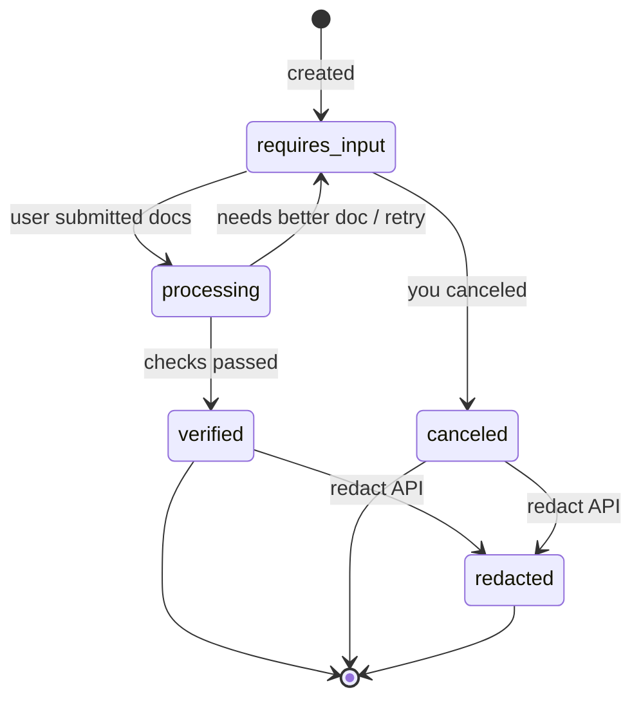
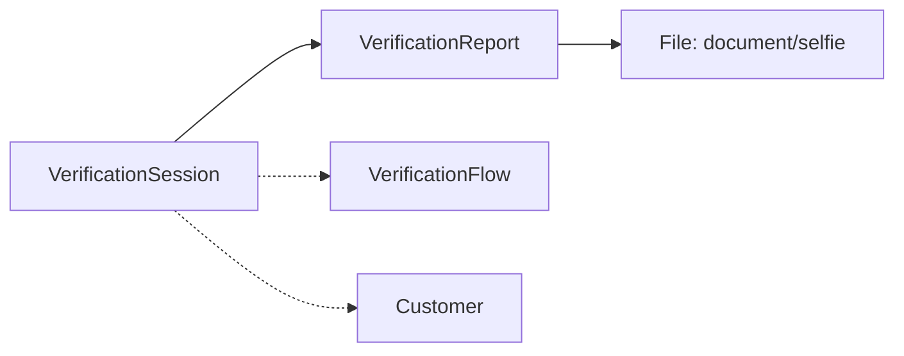

# Identity Verification Session

> API resource: `identity.verification_session` · API version: `2026-04-22.dahlia` · Category: [Identity](README.md)

## What it is

A `VerificationSession` is one end-to-end attempt to verify a single human's identity — government photo ID, optional selfie match, optional national ID number — against Stripe's document and biometric checks. It's the *handle* you create on the server, hand off to the user via a hosted page or embedded SDK, and watch transition through `processing` to either `verified` or back to `requires_input`. When it succeeds, it exposes parsed `verified_outputs` (name, DOB, address, ID number) and a pointer to the most recent [VerificationReport](verification-reports.md) with the underlying check results and file IDs.

A Session is per-user and per-flow. If you need to re-verify the same user later (annual KYC refresh, sensitive action confirmation), create a new Session — don't reuse an old one.

## Why it exists

Building ID verification yourself means: integrating an OCR vendor, a face-match vendor, a liveness-detection vendor, a document-template database, hosting an upload UI that works on every phone, redacting PII on a schedule, surviving compliance audits. VerificationSession bundles all of that behind one POST. You hand Stripe a `type`, get back a URL or `client_secret`, and Stripe owns the capture UX, the ML, the storage, and the redaction lifecycle.

It's also the only Identity primitive that *transacts* — Reports are read-only outputs of a Session.

## Lifecycle & states



Per state:

- **`requires_input`** — initial state after create, *and* the state Stripe returns to when an attempt fails recoverably (blurry photo, glare, mismatched selfie, expired ID). `client_secret` and `url` are still valid; the user can retry without you creating a new session. `last_error.code` and `last_error.reason` describe what went wrong on the previous attempt.
- **`processing`** — user finished uploading; Stripe's pipeline is running OCR, document authenticity checks, and (if requested) selfie match. Usually seconds; can be minutes for some document types.
- **`verified`** — terminal-positive. `verified_outputs` is populated. `last_verification_report` points at the successful Report. Read this state from the webhook, not from the redirect — the redirect URL fires when the user *finishes the flow*, which precedes Stripe's final decision.
- **`canceled`** — terminal-negative. You called `POST /v1/identity/verification_sessions/:id/cancel`, or the session expired (sessions auto-cancel after a period of inactivity). Cannot be reopened.
- **`redacted`** — terminal-erased. After you call the redact endpoint (or after Stripe's automatic retention window elapses, depending on your settings), PII fields on the Session and its Reports are wiped. Status enums and `error.code` survive for audit. Cannot be un-redacted.

> `verified` is *not* permanent in the eyes of Stripe's downstream fraud signals. If a pattern of fraud emerges across many sessions later, individual results may be flagged in your Dashboard. Treat `verified` as "passed at this moment", not "this human is forever certified".

## Anatomy of the object

### Identity

| Field | Notes |
|---|---|
| `id` | `vs_…` |
| `object` | `"identity.verification_session"` |
| `livemode` | True in live, false in test. |
| `created` | Unix seconds. |
| `metadata` | Your bag — link to your user record here. |

### Flow handle

| Field | Notes |
|---|---|
| `client_secret` | Scoped credential for client-side Stripe.js (`stripe.verifyIdentity(clientSecret)`). Don't log; don't put in URLs you log. |
| `url` | Hosted-flow URL Stripe generates. Send the user here for the redirect-style flow. Single-use; expires when the session terminates. |
| `return_url` | Where Stripe redirects the user after they finish (success *or* failure). You decide what to render based on a server fetch of the session's status — the redirect itself isn't proof of `verified`. |

### Configuration

| Field | Notes |
|---|---|
| `type` | `document` (ID + optional selfie) or `id_number` (national ID number lookup, US SSN / SG NRIC / BR CPF). Mutually exclusive with `verification_flow`. |
| `verification_flow` | `vf_…`. Newer Dashboard-defined flow that combines steps and branding. If set, `type` and `options` come from the flow definition. Prefer this for non-trivial integrations — lets non-engineers tune the flow without redeploys. |
| `options.document.allowed_types[]` | Subset of `driving_license`, `id_card`, `passport`. Default is all three. |
| `options.document.require_id_number` | Force the user to also enter a government ID number. |
| `options.document.require_live_capture` | Require the document photo to come from the live camera (no upload from gallery). |
| `options.document.require_matching_selfie` | Add the selfie + face-match step. |
| `options.email`, `options.phone` | Sub-objects to gate on email / phone collection or verification within the same session. |
| `provided_details` | Optional pre-filled `email` / `phone` you already collected — Stripe skips re-asking. |

### Outcome

| Field | Notes |
|---|---|
| `status` | Enum, see lifecycle. |
| `last_error.code` | Machine-readable failure reason, e.g. `consent_declined`, `device_not_supported`, `under_supported_age`, `document_expired`, `document_unverified_other`, `selfie_unverified_other`, `id_number_mismatch`, `id_number_insufficient_coverage`. |
| `last_error.reason` | Human-readable copy you can surface to the user. |
| `last_verification_report` | `vr_…` — the most recent attempt's Report. Read this for raw extracted fields and per-check status. |
| `verified_outputs.first_name` / `last_name` / `dob.day/month/year` | Set only when `status: verified`. |
| `verified_outputs.address.line1/line2/city/state/postal_code/country` | When extractable. Hedge: not all document types yield an address (e.g. many passports lack one). |
| `verified_outputs.id_number` | Decrypted national ID number when `type=id_number` or when `options.document.require_id_number` was set and the ID number was successfully read. **PII — see pitfalls.** |
| `verified_outputs.id_number_type` | `br_cpf`, `sg_nric`, `us_ssn`. |

### Lifecycle controls

| Field | Notes |
|---|---|
| `redaction.status` | `processing` while a redact request is in flight, then the object flips to `status: redacted`. |
| `related_customer` | Optional `cus_…` link to a [Customer](../01-core-resources/customers.md). Used for KYC flows tied to billing. |

## Relationships



- A Session has **many** Reports — one per attempt. The newest is `last_verification_report`; full list via `GET /v1/identity/verification_reports?verification_session=vs_…`.
- A Session can reference a `verification_flow` (Dashboard-managed) or carry its own inline `options`.
- A Session can reference a `related_customer` for KYC against a billing record. Deleting that Customer doesn't delete the Session.
- File IDs live on the Report's sub-objects, not on the Session.

## Common workflows

### 1. Hosted redirect flow (lowest-effort)

Server creates with a `return_url`:

```http
POST /v1/identity/verification_sessions
  type=document
  options[document][require_matching_selfie]=true
  options[document][require_live_capture]=true
  return_url=https://example.com/kyc/done?vs_id={CHECKOUT_SESSION_ID}
  metadata[app_user_id]=42
  -H "Idempotency-Key: kyc-user-42-2026-05-06"
```

Redirect the user to `session.url`. They complete the flow on Stripe's hosted pages. Stripe redirects back to `return_url`. Your `/kyc/done` handler should **not** trust the redirect — fetch the Session and inspect `status`, or wait for the `identity.verification_session.verified` webhook.

### 2. Embedded modal (Stripe.js)

Server creates *without* a `return_url`:

```http
POST /v1/identity/verification_sessions
  type=document
  options[document][require_matching_selfie]=true
```

Return `client_secret` to the browser. Client opens the Stripe Identity modal:

```js
const { error } = await stripe.verifyIdentity(clientSecret);
```

Same webhook contract. The modal closes when the user is done; you still fetch from your server (or trust the webhook) to get the verdict.

### 3. ID number only (no document)

```http
POST /v1/identity/verification_sessions
  type=id_number
  provided_details[email]=jane@example.com
```

User enters name + DOB + ID number on a hosted page. Stripe checks against the issuing-country authority. Faster + cheaper than document flow but supports fewer countries (US/SG/BR at time of writing). Hedge: country support changes — check the Identity coverage docs.

### 4. Cancel a stalled session

```http
POST /v1/identity/verification_sessions/vs_…/cancel
```

Allowed only in `requires_input` (and `processing`, in a narrow window). Use this when the user abandons the flow and you want to free the slot in your dashboard.

### 5. Redact PII after retention window

```http
POST /v1/identity/verification_sessions/vs_…/redact
```

Async — the session's `redaction.status` flips to `processing`, then the session lands in `status: redacted`. Wipes `verified_outputs.*`, document images, selfie images, and PII on the underlying Reports. **Status enums and error codes survive** for compliance audit. Irreversible.

## Webhook events

| Event | Fires when | Listener typically does |
|---|---|---|
| `identity.verification_session.created` | Session created | Sync to your DB. |
| `identity.verification_session.processing` | User submitted docs; Stripe verifying | Show "we're checking…" UI. |
| `identity.verification_session.verified` | **Terminal success.** `verified_outputs` populated | Mark user verified; persist `vs_…` and any extracted fields you need (legally). |
| `identity.verification_session.requires_input` | A previous attempt failed recoverably; user can retry | Re-prompt the user with `last_error.reason`. |
| `identity.verification_session.canceled` | You canceled or session expired | Cleanup; ask user to start a new session if needed. |
| `identity.verification_session.redacted` | Redact completed | Wipe any PII you mirrored locally. |

`verified` and `requires_input` can both fire from `processing` — your handler must distinguish.

## Idempotency, retries & race conditions

- **Always** send `Idempotency-Key` on `POST /v1/identity/verification_sessions`. A network retry without it creates a duplicate session, charges you twice, and confuses the user (two different `client_secret`s).
- The user-facing return URL fires *before* `processing` finishes for some attempts. Don't tell the user "you're verified" based on the redirect alone — wait for the webhook or refetch.
- Webhook delivery is at-least-once and unordered. A `requires_input` event can arrive after a later `verified` event. Use the Event's `created` timestamp or refetch the session to get authoritative status.
- The session object is mostly read-only after creation; the only write operations are `cancel` and `redact`, both naturally idempotent.

## Test-mode tips

- Stripe Identity test mode uses **simulated documents** — there's no real OCR. The hosted page asks you which outcome you want and produces synthetic `verified_outputs`. Same with selfie match.
- `stripe trigger identity.verification_session.verified` fakes a full success event for handler testing.
- Test-mode sessions don't bill. Live-mode sessions bill per verified session (pricing varies by `type` and country).
- There's no [TestClock](../06-billing/test-clocks.md) interaction — Identity sessions are not time-driven.

## Connect considerations

- Sessions can be created **on a connected account** by setting the `Stripe-Account: acct_…` header. Useful when your platform is helping a connected merchant verify *their* end users (e.g. marketplace sellers).
- Verification fees default to billing the **platform** even when the session lives on a connected account, unless your contract says otherwise. Check your Connect billing settings.
- A platform-owned session for verifying the *connected account's principal* is a different flow — that lives in the Account Onboarding / Account Links surface, not in plain VerificationSession. Don't confuse the two.
- The `Stripe-Account` header determines which account's Dashboard the session shows up in and which account the Reports belong to.

## Common pitfalls

- **Trusting the return URL.** It fires when the user closes the hosted page, not when Stripe finishes verifying. Always confirm via webhook or refetch.
- **Storing `verified_outputs.id_number` casually.** It's PII. If you don't need it, don't read it. If you need it, store it encrypted, set retention, and redact when allowed.
- **Never redacting.** Stripe will eventually auto-redact per your account's retention setting, but your *own* mirror of `verified_outputs` won't. Mirror only what you need and run your own redaction job.
- **Treating `verified` as permanent.** For high-value actions (large transfers, account changes), re-verify periodically.
- **Reusing a `client_secret` across users.** It's bound to one session, which is bound to one human. Create a fresh session per user per attempt-window.
- **Setting both `type` and `verification_flow`.** Stripe rejects this — `verification_flow` overrides `type`/`options`.
- **Logging `client_secret` or `url`.** Both are scoped credentials; either lets a third party complete the flow on the user's behalf.
- **Confusing Session with Report.** The Session is the user-facing handle and survives multiple attempts. Per-attempt extracted data and per-check status live on the Report. If a session went `requires_input` then `verified`, there are two Reports — read the latest one.

## Further reading

- [API reference: VerificationSession](https://docs.stripe.com/api/identity/verification_sessions/object)
- [Identity overview](https://docs.stripe.com/identity)
- [Verification flows](https://docs.stripe.com/identity/verification-flows) — Dashboard-managed flows.
- [Handling verification outcomes](https://docs.stripe.com/identity/handle-verification-outcomes)
- [Data redaction](https://docs.stripe.com/identity/verification-sessions#redact)
