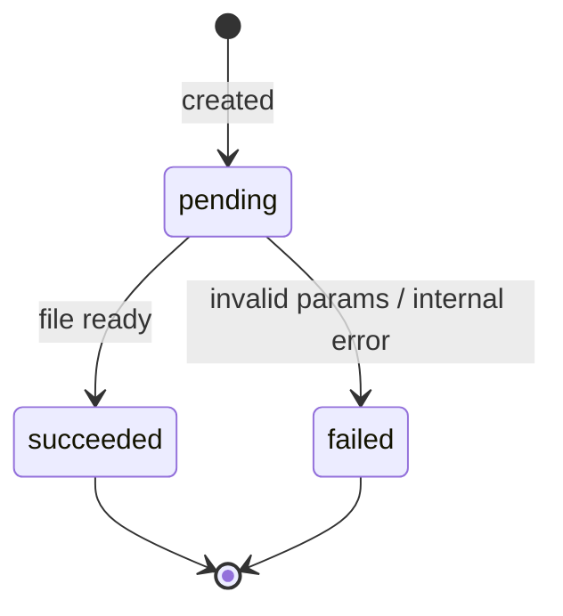
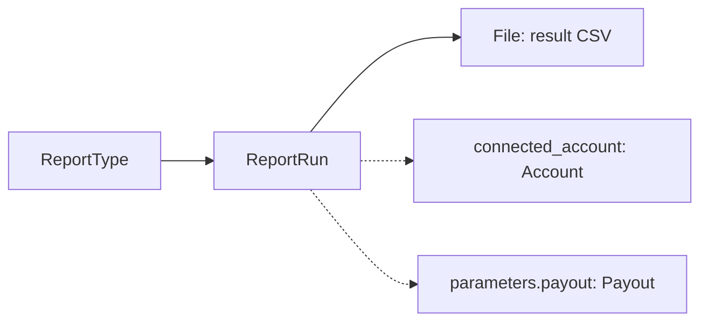

# Report Run

> API resource: `reporting.report_run` · API version: `2026-04-22.dahlia` · Category: [Reporting](README.md)

## What it is

A `ReportRun` is one *request* to generate one of Stripe's pre-built reports — a `report_type` like `balance.summary.1` or `payouts.1` — for a given time window and parameter set. It's an **async job**: you POST to create it, Stripe queues it, and minutes later (sometimes seconds, sometimes much longer for big windows) it lands in `succeeded` with `result` pointing at a downloadable [File](../01-core-resources/files.md) — typically a CSV.

The Run is the *job* and the file is the *output*. The schema, columns, and time-bucket semantics belong to the [ReportType](report-types.md) — the Run just says "give me that schema for this window".

## Why it exists

Stripe's Dashboard report download UI is fine for one-off ops use. For finance pipelines (daily balance summary into NetSuite, monthly tax remittance, weekly payout reconciliation into your data warehouse), you need an API: schedulable, idempotent, machine-parseable. ReportRuns are that API. Same datasets the Dashboard uses, exposed as objects.

If your accounting close depends on Stripe data, ReportRuns (especially the `*_reconciliation.itemized.*` types) are the canonical, GAAP-friendly source. Listing the API objects directly (Charges, Refunds, BalanceTransactions) is faster *but* may not match Dashboard reports exactly when fees / FX / disputes are involved. Reports do the reconciliation math for you.

## Lifecycle & states



- **`pending`** — Stripe has queued the run. No `result` yet. `succeeded_at` is null. Duration depends on report type and window size: small balance summaries can be seconds, multi-month itemized reports across high-volume accounts can be minutes to tens of minutes.
- **`succeeded`** — terminal. `result` is a File ID; `result.url` (after expansion or refetch via the Files API) is downloadable. `succeeded_at` set.
- **`failed`** — terminal. `error` is populated with a human-readable message. Common causes: parameters outside `data_available_start..data_available_end`, an `interval_end` later than the report type allows, missing required Connect context.

There is no cancel — once submitted, you wait. Reports never re-enter `pending` after leaving it.

## Anatomy of the object

### Identity

| Field | Notes |
|---|---|
| `id` | `frr_…` ("financial report run"). |
| `object` | `"reporting.report_run"` |
| `livemode` | True / false. Live and test reports are separate datasets. |
| `created` | Unix seconds. |

### What was requested

| Field | Notes |
|---|---|
| `report_type` | The [ReportType](report-types.md) ID, e.g. `balance.summary.1`, `payouts.1`, `payout_reconciliation.itemized.5`. |
| `parameters.interval_start` | Unix seconds. Inclusive lower bound on the data window. Must be ≥ the report type's `data_available_start`. |
| `parameters.interval_end` | Unix seconds. Inclusive upper bound. Must be ≤ `data_available_end`. |
| `parameters.timezone` | IANA TZ. Defaults to the report type's `default_timezone` (usually `Etc/UTC`). Affects how rows bucket into days. |
| `parameters.columns[]` | Subset of the report type's available columns. If unset, defaults to `default_columns`. Pinning columns makes your downstream parser robust to Stripe adding new ones. |
| `parameters.currency` | Filter / FX-conversion hint, depending on report type. Some types require it (multi-currency summaries). |
| `parameters.connected_account` | `acct_…`. For platform users running a report scoped to one connected account's activity. |
| `parameters.payout` | `po_…`. Filter to a specific payout (relevant for `*_reconciliation.itemized.*` types). |
| `parameters.reporting_category` | Filter on Stripe's accounting-flavored categorization. |

### Status & outcome

| Field | Notes |
|---|---|
| `status` | `pending`, `succeeded`, or `failed`. |
| `result` | When `succeeded`, the [File](../01-core-resources/files.md) object (or its ID — expand to inline). The File's `url` is the download link. CSV by default. |
| `error` | When `failed`, a human-readable string (no structured `code` on this object). |
| `succeeded_at` | Unix seconds when the run finished successfully. Null otherwise. |

The result File typically has `purpose: financial_report_run` and a finite **expiry**. Don't treat the URL as forever-valid — re-fetch the File or store the bytes yourself.

## Relationships



- A Run references one **ReportType** by ID. The ReportType is read-only metadata; the Run is the transaction.
- The Run's output is one **File**. Files have their own lifecycle and expiry; see [File](../01-core-resources/files.md).
- Optional links to a connected **Account** or a specific **Payout** scope the data window further.

## Common workflows

### 1. Generate yesterday's balance summary

```http
POST /v1/reporting/report_runs
  report_type=balance.summary.1
  parameters[interval_start]=1746489600     # 2026-05-05 00:00 UTC
  parameters[interval_end]=1746575999       # 2026-05-05 23:59:59 UTC
  parameters[timezone]=Etc/UTC
  -H "Idempotency-Key: balance-summary-2026-05-05"
```

Returns `frr_…` with `status: pending`.

### 2. Poll until ready, then download

```http
GET /v1/reporting/report_runs/frr_…?expand[]=result
```

Loop with backoff (e.g. 5s → 15s → 60s → 5m). When `status: succeeded`:

```http
GET <result.url>
Authorization: Bearer sk_test_…
```

The File URL is gated by your API key. Stream to disk; don't slurp huge ones into memory. Better than polling: subscribe to webhooks (next section).

### 3. Daily payout reconciliation

```http
POST /v1/reporting/report_runs
  report_type=payout_reconciliation.itemized.5
  parameters[payout]=po_…
  parameters[timezone]=America/Los_Angeles
  -H "Idempotency-Key: payout-reco-po_…"
```

The `.5` suffix is the schema version; newer is generally better (more columns, fewer omissions). Pin a version explicitly so your parser doesn't break when Stripe ships `.6`.

### 4. Per-connected-account report (platforms)

```http
POST /v1/reporting/report_runs
  report_type=connected_account_balance.summary.1
  parameters[connected_account]=acct_…
  parameters[interval_start]=…
  parameters[interval_end]=…
```

Don't use the `Stripe-Account` header for this — pass `parameters.connected_account` instead. The Run lives on the platform; only the *data* is scoped.

### 5. Pin columns for a stable downstream parser

```http
POST /v1/reporting/report_runs
  report_type=charges.1
  parameters[columns][0]=id
  parameters[columns][1]=created
  parameters[columns][2]=amount
  parameters[columns][3]=currency
  parameters[columns][4]=status
```

Now your CSV parser doesn't care if Stripe later adds `payment_method_subtype` to the default column set.

## Webhook events

| Event | Fires when | Listener typically does |
|---|---|---|
| `reporting.report_run.succeeded` | Run completed successfully | Trigger downstream pipeline (download CSV, load into warehouse). |
| `reporting.report_run.failed` | Run failed terminally | Page on-call; inspect `error`; reissue with corrected params. |

Subscribe to these instead of polling. The webhook delivers the full Run object, including `result` (you may still need to re-fetch the File for the freshest signed URL).

## Idempotency, retries & race conditions

- **Always** set `Idempotency-Key` on `POST /v1/reporting/report_runs`. A network retry without one creates a duplicate Run that re-bills the work and produces a redundant File. Your scheduler's `(report_type, interval_start, interval_end)` tuple is a great natural key for the header.
- The synchronous create response returns `status: pending`. Don't try to read `result` from it.
- Webhook delivery is at-least-once; a `succeeded` event for a Run you already processed should be a no-op. Track processed `frr_…` IDs in your DB.
- Two Runs with overlapping params are allowed and produce independent Files — Stripe doesn't deduplicate by content.

## Test-mode tips

- Live and test mode have separate data; a test-mode Run only sees test-mode activity.
- Test-mode runs are not metered/billed.
- `stripe trigger reporting.report_run.succeeded` simulates an event for handler testing — but produces a synthetic `result` File you can't realistically download.
- For shape-of-the-CSV testing, generate runs against a real test-mode account with seeded charges/payouts.

## Connect considerations

- For platforms, two distinct concepts:
  1. **Platform-level data** — the Run lives on your platform account; data covers your platform's own activity. No special headers.
  2. **Per-connected-account data** — the Run still lives on your platform, but `parameters.connected_account=acct_…` filters to one account. Use this for "give me Acme's payout reconciliation".
- Some report types **only** make sense for platforms (e.g. `connected_account_balance.summary.1`). Listing ReportTypes on a non-platform account just won't show these.
- If you're a connected account *yourself* (not a platform), you can still run reports on your own data — same API, no `connected_account` parameter needed.
- Setting the `Stripe-Account` header to run a report *on behalf of* a connected account is supported but unusual; prefer the parameter-based approach for traceability.

## Common pitfalls

- **Polling forever.** Use webhooks. Polling on a 1s interval will burn rate limit and won't make the report any faster.
- **Treating `result.url` as permanent.** Files expire (typically 30 days, varies). Download and store bytes if you need long-term retention.
- **Asking for a window outside `data_available_start..end`.** The Run goes straight to `failed`. Read the ReportType first and clamp.
- **Not pinning the report type version.** `payout_reconciliation.itemized.5` is a different schema from `…itemized.4`. Pin the version your parser expects.
- **Not pinning `columns[]`.** Stripe adds new columns to default sets occasionally. If your CSV reader is positional, that breaks you.
- **Confusing `report_type=balance_change_from_activity.summary.1` with `balance.summary.1`.** Different reports — one is delta of activity in the window, the other is point-in-time snapshot at end. Read the ReportType description.
- **Using `Stripe-Account` to scope when you meant `parameters.connected_account`.** The former runs the Run *on* the connected account (it ends up in their Dashboard); the latter runs on your platform but filters data. For platform reconciliation you almost always want the parameter.
- **Forgetting timezone.** `Etc/UTC` is the default for most types but not all; if your finance team buckets days in `America/New_York`, set it explicitly or your daily numbers will straddle midnight.

## Further reading

- [API reference: ReportRun](https://docs.stripe.com/api/reporting/report_run/object)
- [Reporting overview](https://docs.stripe.com/reports)
- [Available report types](https://docs.stripe.com/reports/report-types) — the catalog backing [ReportType](report-types.md).
- [Files](../01-core-resources/files.md) — for downloading and managing the result CSVs.
