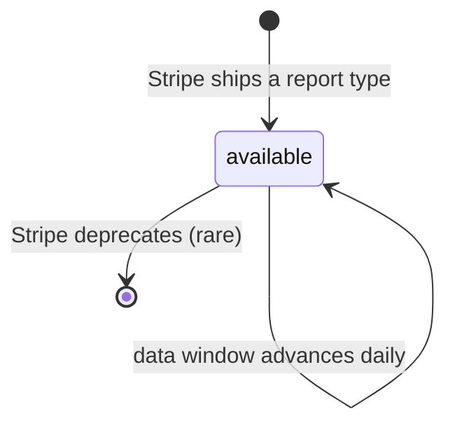
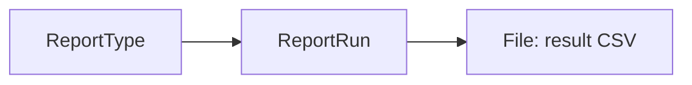

# Report Type

> API resource: `reporting.report_type` · API version: `2026-04-22.dahlia` · Category: [Reporting](README.md)

## What it is

A `ReportType` is one entry in Stripe's catalog of pre-built reports. Read-only metadata: which report it is, what columns it produces, what timezone it defaults to, what date window has data, what schema version it represents. You don't create ReportTypes; Stripe does. You list them to discover what's available, then quote the `id` when you create a [ReportRun](report-runs.md).

A ReportType is the *menu*; a ReportRun is the *order*; the resulting [File](../01-core-resources/files.md) is the *meal*.

## Why it exists

Stripe's reporting product wraps a fixed set of well-defined queries — balance summaries, payout reconciliations, charge listings, tax reports, and so on — that finance teams need consistently. Each one has a documented schema, vetted by Stripe's accounting team, and a stable contract within a version. Without a catalog, integrators would have to hardcode strings like `payout_reconciliation.itemized.5` blindly. The ReportType resource exposes the catalog as data: discoverable, versioned, with column definitions inline.

You typically read this resource at integration time (to pick which reports to schedule) and then never again.

## Lifecycle & states

ReportTypes are **static** as far as your code is concerned. Stripe adds new ones, ships new schema versions of existing ones, and (rarely) deprecates old ones. There is no `status` field, no creation API, no update API.



What changes day-to-day on a given ReportType:

- **`data_available_end`** rolls forward — usually once per day, sometimes faster, depending on the report. Until your `interval_end` ≤ this value, the Run will fail.
- **`default_columns`** can change when Stripe adds new fields to a schema. The ReportType `id` (with version suffix) does *not* change; only what it returns by default does. Pin `columns[]` on your Runs to insulate yourself.

There's no webhook for "a new ReportType shipped" — you'd discover it by re-listing.

## Anatomy of the object

### Identity & version

| Field | Notes |
|---|---|
| `id` | The slug you pass to ReportRun, e.g. `balance.summary.1`, `charges.1`, `payouts.1`, `payout_reconciliation.itemized.5`, `connected_account_balance.summary.1`, `tax_reports.tax_id_associated_balance_change.itemized.1`. Versioned suffix (`.1`, `.2`, `.5`) is part of the ID. |
| `object` | `"reporting.report_type"` |
| `name` | Human-readable label, e.g. `"Balance summary"`. |
| `version` | Integer matching the suffix. Newer = more columns / fewer omissions, occasionally renamed columns — read the changelog. |

### Column metadata

| Field | Notes |
|---|---|
| `default_columns` | Array of column name strings the report ships with if you don't override. Order is the CSV column order. |
| (no enumerated `columns` list) | Stripe documents the *full* available columns out-of-band (in the ReportType reference docs), not on the object itself. The object only tells you the defaults; the catalog of allowable values lives in docs. Hedge: this may have changed in newer API versions — check the API reference. |

### Time semantics

| Field | Notes |
|---|---|
| `default_timezone` | IANA TZ. Most types default to `Etc/UTC`. |
| `data_available_start` | Unix seconds. The earliest moment with data for this type. Often the date your Stripe account opened. |
| `data_available_end` | Unix seconds. The latest moment with finalized data. Reports cannot ask for windows extending past this; pending or in-flight data is excluded. |
| `updated` | Unix seconds. When this ReportType's metadata last changed (typically when `data_available_end` rolled forward). |

## Relationships



- A ReportType is referenced by `id` from any number of [ReportRun](report-runs.md) objects.
- ReportTypes don't reference other resources themselves — they're pure metadata.

### Important type families

| Family | Examples | Use |
|---|---|---|
| Balance summaries | `balance.summary.1`, `connected_account_balance.summary.1`, `balance_change_from_activity.summary.1` | Point-in-time and delta views of your Stripe balance. |
| Itemized financial activity | `balance_change_from_activity.itemized.3`, `payout_reconciliation.itemized.5`, `ending_balance_reconciliation.itemized.4` | Row-per-balance-transaction reports for accounting close. |
| Charges / payments | `charges.1`, `unified_payments.1` | Row-per-charge listings. |
| Payouts | `payouts.1`, `payout_reconciliation.itemized.5` | Payout-level summary and per-payout itemization. |
| Tax | `tax_reports.tax_id_associated_balance_change.itemized.1` and others | For tax remittance and audit. |

This list is illustrative, not exhaustive — call the List API to see what your account currently has access to. Some types require Connect platform context; some require Stripe Tax / Issuing / Treasury enabled.

## Common workflows

### 1. Discover what's available

```http
GET /v1/reporting/report_types?limit=100
```

Returns every type your account can run. Filter client-side by `id` prefix to find a family ("everything that starts with `payout_reconciliation`").

### 2. Inspect one type before scheduling

```http
GET /v1/reporting/report_types/payout_reconciliation.itemized.5
```

Read `default_columns`, `default_timezone`, `data_available_start`, `data_available_end`. Decide whether to pin a column subset on your Runs. Confirm your desired window fits inside the available range.

### 3. Detect a new schema version

A daily job that re-lists ReportTypes and diffs against your stored snapshot will catch:

- new `id`s appearing (Stripe shipped a new report or a new version of one),
- old `id`s disappearing (deprecation — rare, usually announced),
- `default_columns` shifting (Stripe added a column to an existing schema).

Treat any of these as "review before bumping our pinned version".

### 4. Pin a version explicitly

When you settle on `payout_reconciliation.itemized.5`, hardcode the suffix `.5`. When you want to evaluate `.6` later, you can run both side-by-side without breaking your existing pipeline.

## Webhook events

**None.** ReportType is metadata; Stripe does not emit events when types change. If you want to be notified, build it yourself: cron a list-and-diff job. The events that matter for the reporting product live on [ReportRun](report-runs.md) (`reporting.report_run.succeeded` / `failed`).

## Idempotency, retries & race conditions

- All operations are reads. Idempotent natively.
- The List endpoint paginates with the standard `starting_after` cursor; no special concerns.
- Two reads of the same ReportType seconds apart can show different `data_available_end` values — that's expected as the data window advances.

## Test-mode tips

- Test-mode ReportTypes have separate `data_available_start/end` reflecting your test-mode activity. Your test account may have *no* data and `data_available_end` very close to `data_available_start`.
- The set of available types is the same in test and live mode. If a type doesn't show up in test, it almost certainly won't show up in live either — likely an account-feature gating issue (Tax / Issuing / Connect not enabled).
- No [TestClock](../06-billing/test-clocks.md) interaction.

## Connect considerations

- Some types (`connected_account_balance.summary.1`, the various `connected_account_*` reports) appear **only** in platform accounts' lists. Standalone accounts won't see them.
- A few types are only meaningful when run with a `parameters.connected_account` filter; the type shows up in the catalog regardless, but a Run without the filter may produce empty or platform-only results.
- The `Stripe-Account` header changes whose catalog you're listing — set it to a connected account ID and you'll get *that account's* available types.

## Common pitfalls

- **Hardcoding column order from `default_columns`.** Stripe can add columns. Pin via the Run's `parameters.columns[]` if you parse positionally.
- **Skipping the version suffix.** `charges.1` is a real ID; `charges` is not. The suffix is mandatory.
- **Trying to update a ReportType.** It's read-only. The "updates" you'd want (new columns, new timezones) come from Stripe shipping a new version under a new `id`.
- **Assuming a type exists.** Some require account features (Tax, Issuing, Connect). Always List first to confirm availability for *this* account before depending on a type.
- **Ignoring `data_available_end`.** A Run with `interval_end > data_available_end` fails. If you schedule "yesterday's report" at 00:05 UTC, double-check the type's typical lag — some have multi-hour delays before the prior day is final.
- **Using `default_timezone` blindly.** Most are `Etc/UTC`; finance teams usually want their local TZ. Set `parameters.timezone` explicitly on every Run to make it grep-able later.

## Further reading

- [API reference: ReportType](https://docs.stripe.com/api/reporting/report_type/object)
- [Available report types](https://docs.stripe.com/reports/report-types) — the canonical catalog with column-by-column documentation.
- [ReportRun](report-runs.md) — how to actually generate one.
- [Files](../01-core-resources/files.md) — what the eventual output looks like.
