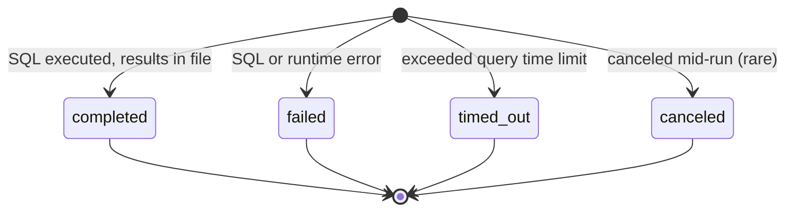
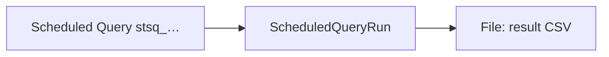

# Sigma Scheduled Query Run

> API resource: `scheduled_query_run` · API version: `2026-04-22.dahlia` · Category: [Sigma](README.md)

## What it is

A `ScheduledQueryRun` is one *execution* of a Sigma scheduled query. The query itself — the SQL text, the cadence (hourly / daily / weekly), the destination — is created and managed in the **Stripe Dashboard**, not via this API. Each time Stripe fires the schedule, it produces a `scheduled_query_run` object exposing run metadata: the SQL that was executed, when, the result file, the status, and any error.

Think of it as a read-only audit trail of your Sigma cron jobs. You don't create runs; you list them and download their result Files.

## Why it exists

Sigma's primary delivery channels (email, SFTP, S3) are configured per-query in the Dashboard and don't always fit. When you want to:

- pull the result CSV programmatically into your data warehouse,
- monitor whether a query failed or timed out,
- audit which SQL ran on which schedule and when,

…you need an API surface for the runs themselves. `scheduled_query_run` is that surface. It complements (it doesn't replace) the Dashboard configuration of the query.

The parent **Scheduled Query** (`stsq_…`) is *not* exposed as a separate top-level CRUD resource on this API version — only its runs are listable, and the parent ID appears as a foreign key.

## Lifecycle & states

Each Run is born terminal. Stripe queues the SQL when the schedule fires, executes it against the Sigma data warehouse, and writes the Run object once execution completes (successfully or not).



- **`completed`** — query finished within the time budget; `file` is set; `result_available_until` tells you how long the file URL stays good.
- **`failed`** — SQL error (syntax, schema mismatch), permission error, or other runtime failure. `error.code` and `error.message` describe it.
- **`timed_out`** — query hit Sigma's per-run wall-clock limit (precise limit varies; Sigma documents this separately). Usually means inefficient SQL or unrealistic window. No `file`.
- **`canceled`** — uncommon; the Run was canceled by Stripe (e.g. parent query deleted mid-execution, or platform-side cancel for service health). Treat like `failed` for retry purposes.

There is no transition between these — once written, the Run is immutable. The next scheduled firing produces a *new* Run object.

## Anatomy of the object

### Identity & timing

| Field | Notes |
|---|---|
| `id` | `sqr_…` |
| `object` | `"scheduled_query_run"` |
| `livemode` | True / false. Sigma is a live-mode-only product in practice; test-mode queries exist but operate on test data. |
| `created` | Unix seconds. Moment the Run object was written (i.e. execution finished). |
| `data_load_time` | Unix seconds. The "as-of" timestamp for the data the query saw. Sigma's warehouse lags real time by some minutes; this field tells you exactly which snapshot was queried. Use this, not `created`, for "how fresh is this report". |

### What ran

| Field | Notes |
|---|---|
| `scheduled_query` | `stsq_…` — the parent Scheduled Query object's ID. Not directly retrievable as a top-level resource on this API version; treat as an opaque grouping key. |
| `sql` | The exact SQL string Stripe executed. Useful for audit and debugging — you can paste it into the Dashboard query editor to reproduce. |
| `title` | Human-readable name from the parent query's Dashboard configuration. |

### Outcome

| Field | Notes |
|---|---|
| `status` | `completed`, `canceled`, `failed`, or `timed_out`. |
| `file` | When `status: completed`, a [File](../01-core-resources/files.md) (ID or expanded). CSV. Use `file.url` to download. |
| `result_available_until` | Unix seconds. After this, the File URL stops working — Stripe garbage-collects results on a retention window. Pull the bytes before this. |
| `error.code` | Set when `status` is `failed` or `timed_out`. Machine string. |
| `error.message` | Human-readable. |

## Relationships



- A Scheduled Query (Dashboard-managed, `stsq_…`) produces **many** Runs over its lifetime — one per schedule firing.
- Each Run produces **at most one** File. `failed` and `timed_out` runs have no File.
- Files have their own retention, governed by `result_available_until` (which mirrors the File's expiry for this purpose).

## Common workflows

### 1. List recent runs

```http
GET /v1/sigma/scheduled_query_runs?limit=20
```

Returns runs across all your scheduled queries, newest first. Filter client-side by `scheduled_query` to focus on one query.

### 2. Pull the result CSV into your warehouse

```http
GET /v1/sigma/scheduled_query_runs/sqr_…?expand[]=file
```

Then:

```http
GET <file.url>
Authorization: Bearer sk_live_…
```

Stream to disk or directly into your loader. Don't wait until `result_available_until`; pull as soon as the webhook fires.

### 3. Monitor for failures

Subscribe to the `sigma.scheduled_query_run.created` webhook. In your handler:

```text
if event.data.object.status != "completed":
    page_oncall(event.data.object)
```

The webhook fires for **every** Run regardless of outcome — it's a single signal you branch on.

### 4. Reproduce a failed run for debugging

Take `scheduled_query_run.sql`, paste into the Sigma Dashboard query editor, and run it ad-hoc. Often a `timed_out` becomes obvious when you see the query plan.

### 5. Audit "which query ran when"

List with pagination, persist `(id, scheduled_query, title, status, created, data_load_time)` into your own table. Now you can answer "did our daily payouts query run yesterday?" without depending on Stripe's UI.

## Webhook events

| Event | Fires when | Listener typically does |
|---|---|---|
| `sigma.scheduled_query_run.created` | A Run object is written, regardless of `status` | Branch on `status`: download CSV on `completed`, page on-call on `failed`/`timed_out`/`canceled`. |

There is no separate `succeeded` / `failed` event — the single `created` event covers all outcomes. Inspect `status` in your handler.

## Idempotency, retries & race conditions

- You don't create Runs, so there's no idempotency key to send. Runs are produced exclusively by Stripe's scheduler.
- The `created` webhook is at-least-once. Track processed `sqr_…` IDs to avoid double-loading the same CSV into your warehouse.
- A Run object appears in the API at the moment Stripe fires the webhook — no race to worry about. Refetching by ID after the webhook always succeeds.
- The `file.url` is a signed URL with limited lifetime; if you store it for later use, store the bytes instead.

## Test-mode tips

- Test-mode Sigma queries operate on test-mode data only. The schema is the same as live; the rows are not.
- `stripe trigger sigma.scheduled_query_run.created` produces a synthetic Run event, useful for testing your handler's branching logic. The synthetic `file` in that event is a placeholder — don't expect realistic CSV bytes.
- No [TestClock](../06-billing/test-clocks.md) interaction; the schedule fires on real wall-clock time even in test mode.
- For end-to-end integration testing, configure a real (low-frequency) test-mode scheduled query in the Dashboard and let it actually fire.

## Connect considerations

- Sigma is a **platform-account-level** product. Connected accounts don't have their own Sigma; their data is queryable from the platform's Sigma if your warehouse access permits.
- The `Stripe-Account` header is generally not relevant — `scheduled_query_run` lives on whichever Stripe account owns the parent Scheduled Query, which is the account that created it in the Dashboard.
- For platforms running per-merchant reports, the typical pattern is one parameterized SQL query that filters by `account_id` columns inside the Sigma warehouse — *not* one query per connected account.

## Common pitfalls

- **Treating `created` as the data freshness timestamp.** Use `data_load_time`. The query may have been queued seconds after a schedule firing and finished minutes after that; the data snapshot is older still.
- **Letting `file.url` go stale.** It's signed and time-limited. Download promptly; store the bytes if you need long retention.
- **Assuming `sigma.scheduled_query_run.created` only fires on success.** It fires on every outcome. Branch on `status` or you'll silently consume errored runs as if they were data.
- **Looking for a top-level `ScheduledQuery` resource.** On this API version, the parent query is Dashboard-managed; the API exposes only the Runs. The `stsq_…` ID appears as a foreign key, not as a retrievable object.
- **Editing `sql` from a Run.** Runs are immutable; the SQL field is a snapshot of what executed. To change the query, edit it in the Dashboard — future Runs will use the new SQL.
- **Confusing Sigma with Reporting.** Sigma is "your SQL against Stripe's data warehouse"; [Reporting](../13-reporting/README.md) is "Stripe's pre-built report definitions". Sigma is more flexible, costs per query, and you write the SQL. Reporting is fixed-schema and effectively free at typical volumes.
- **Assuming Postgres dialect.** Sigma's SQL is Presto-flavored (with Stripe-specific extensions). Some Postgres patterns don't work; window functions and date arithmetic differ. Read the Sigma SQL reference. Hedge: dialect details aren't part of this resource — they live in the Sigma product docs.

## Further reading

- [API reference: ScheduledQueryRun](https://docs.stripe.com/api/sigma/scheduled_queries/object)
- [Sigma overview](https://docs.stripe.com/stripe-data/access-data-in-dashboard) — Dashboard-side configuration.
- [Sigma SQL reference](https://docs.stripe.com/stripe-data/sigma-quickstart) — table schema and dialect notes.
- [Files](../01-core-resources/files.md) — for downloading the result CSVs.
- [Reporting](../13-reporting/README.md) — for the pre-built-report alternative when SQL is overkill.
