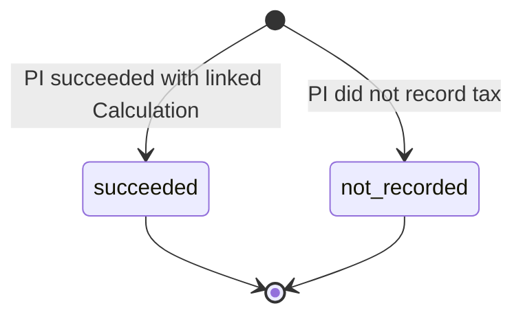
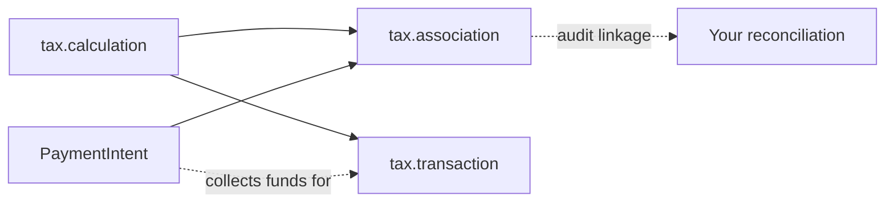

# Tax Association

> API resource: `tax.association` · API version: `2026-04-22.dahlia` · Category: [Tax](README.md)

## What it is

A `tax.association` is the **explicit linkage between a [tax.calculation](calculations.md) and the [PaymentIntent](../01-core-resources/payment-intents.md) that ultimately collected (or didn't collect) the tax it computed**. It exists for **custom checkout flows**, where Stripe doesn't manage the calculation-to-payment hand-off itself, and you need an audit trail proving "this PI collected the tax described by this Calculation."

In Invoice / Checkout flows the linkage is implicit — the Invoice or Checkout Session already knows its Calculation. In a custom flow built on PaymentIntent + manual `tax.calculation`, there is no built-in record. `tax.association` is that record.

> Hedge: this is one of the newer Tax resources. It documents and enriches reconciliation; it does not replace the [Transaction](transactions.md) commit step. Most teams discover it later in their Stripe Tax journey, when their auditor asks "show me how each PI maps to its tax computation."

## Why it exists

Without it, your reconciliation pipeline has to maintain its own mapping between `taxcalc_…` and `pi_…`, derived from your own DB. That's brittle — orphaned Calculations, abandoned PaymentIntents, retries that span two PIs all confound it. `tax.association` puts the mapping in Stripe's database, queryable and observable from the dashboard, and tells you definitively when an expected payment **didn't** record (e.g. PI was canceled before confirm).

## Lifecycle & states



| `status` | Meaning |
|---|---|
| `succeeded` | The PaymentIntent succeeded and the Calculation's tax is recorded against it. Healthy state. |
| `not_recorded` | The Calculation could not be associated with a successful PI. Reasons live in `status_details.not_recorded.reason`. |

Associations are immutable post-creation. They surface state about the Calculation/PI pair at a single point in time; later state changes (e.g. PI is refunded) are reflected on the underlying objects, not by mutating the Association.

### `status_details.not_recorded.reason` (open enum)

| Value | Meaning |
|---|---|
| `payment_intent_canceled` | The linked PI was canceled before it succeeded. The Calculation never resulted in collection. |
| `payment_intent_uncreated` | No PI was ever created for this Calculation (e.g. user abandoned the cart). |

Stripe is likely to add reasons over time as more failure modes are catalogued. Treat as open enum.

## Anatomy of the object

### Identity

| Field | Notes |
|---|---|
| `id` | `taxassoc_…` |
| `object` | `"tax.association"` |
| `livemode` | Bool. |
| `created` | Unix seconds. |

### Linkage

| Field | Notes |
|---|---|
| `calculation` | `taxcalc_…`. The Calculation being associated. |
| `payment_intent` | `pi_…` or `null`. The PI that collected (or was supposed to). Null when `status_details.not_recorded.reason=payment_intent_uncreated`. |

### Status

| Field | Notes |
|---|---|
| `status` | `succeeded | not_recorded`. |
| `status_details.not_recorded.reason` | Present only when `status=not_recorded`. See enum above. |

## Relationships



- **Calculation → Association** — every Association references exactly one Calculation.
- **PaymentIntent → Association** — usually exactly one PI (or null when none was created).
- **Calculation → Transaction** — the commit; orthogonal to Association. You can have a Transaction without an Association and vice-versa, but for a clean audit trail you want both.

## Common workflows

### 1. Reconcile a custom-flow payment

After your custom checkout completes, link the Calculation you used to the PI that collected. (Exact endpoint shape evolves; check the API reference for the current verb.) Conceptually:

```http
POST /v1/tax/associations
  calculation=taxcalc_1Nl…
  payment_intent=pi_3Nl…
```

The returned Association has `status=succeeded` if the PI is in a terminal-success state; `not_recorded` otherwise.

### 2. Detect an orphan Calculation (PI was canceled)

```http
GET /v1/tax/associations/taxassoc_1Nl…
```

```json
{
  "id": "taxassoc_1Nl…",
  "calculation": "taxcalc_1Nl…",
  "payment_intent": "pi_3Nl…",
  "status": "not_recorded",
  "status_details": {
    "not_recorded": { "reason": "payment_intent_canceled" }
  }
}
```

Action: don't commit a [Transaction](transactions.md) — there's nothing to remit tax on. If you already committed (e.g. you committed eagerly on PI confirm), reverse it.

### 3. Audit-trail query at month-end

For each Calculation your custom flow produced this month, look up its Association and verify it's `succeeded`. Anything `not_recorded` warrants investigation:

- Was the cart abandoned? → fine, no action.
- Did the PI succeed but no Association was created? → your reconciliation pipeline missed a record; backfill.
- Did you commit a Transaction for an unrecorded Calculation? → you have phantom tax revenue; reverse.

## Webhook events

Tax Associations emit **no dedicated webhooks**. The only Tax-namespace event is `tax.settings.updated`. Drive Association reads off PI events:

| Event | Use to |
|---|---|
| `payment_intent.succeeded` | Create / verify the Association, then create the [Transaction](transactions.md). |
| `payment_intent.canceled` | Expect `not_recorded` if you query the Association. Skip Transaction creation. |
| `payment_intent.payment_failed` | Same — don't commit. |

## Idempotency, retries & race conditions

- Association create operations should be idempotent on `(calculation, payment_intent)`. Use `Idempotency-Key` defensively.
- Race: `payment_intent.succeeded` arrives, you create the Association, but the PI is later canceled or refunded. The Association's `status` is a snapshot — it does not re-evaluate. Don't over-trust an old Association in the face of post-success events; cross-check the PI's current status when computing tax remittance.
- An Association created against a still-processing PI may transiently report `not_recorded` until the PI reaches terminal success.

## Test-mode tips

- Test-mode Associations are isolated from live, like every other Stripe object.
- Drive end-to-end tests by: creating a Calculation, creating a PI, confirming with `4242 4242 4242 4242`, then creating the Association.
- For the cancellation case: create a PI with `confirmation_method=manual`, create the Association before confirming, then `POST /v1/payment_intents/<id>/cancel`. Re-fetch the Association to observe `not_recorded` (depending on creation timing — the snapshot may already be `succeeded` if you waited).
- No `stripe trigger` event for Associations.

## Connect considerations

- Associations live on the account that owns the underlying Calculation and PaymentIntent. If you're computing tax for a connected account, the Association must be created under `Stripe-Account: acct_…`.
- Cross-account associations (platform's Calculation, connected account's PI, or vice versa) are not supported — both objects must reside in the same account.
- For platforms doing destination-charge subscription billing, you typically don't need Associations at all — Invoice flows handle the linkage internally.

## Common pitfalls

- **Mistaking Association for Transaction.** They are *different objects*. Association links Calculation ↔ PI for audit. Transaction is what shows up in your tax filings. Both are usually needed for custom flows; neither replaces the other.
- **Treating `not_recorded` as a hard error.** It often just means "the cart was abandoned" — no action needed. Investigate only when you expected the PI to have succeeded.
- **Re-using one Calculation for multiple PIs.** A Calculation is a single basket-snapshot; attaching it to two PIs in two Associations is conceptually wrong. Recompute the Calculation per attempt.
- **Skipping Associations because Transactions are enough.** They are enough for *filings*. They are not enough for *audit trails* connecting tax events to payment events when refunds, retries, or platform reconciliation come up.
- **Hard-coding the `not_recorded.reason` enum.** Stripe will add new reasons; treat as open enum and log unknowns.
- **Querying Associations as the primary signal.** They have no webhook stream. Always drive off the PaymentIntent's events; treat Associations as a verification / audit lookup.

## Further reading

- [API reference: Tax Association](https://docs.stripe.com/api/tax/associations/object)
- [Stripe Tax for custom payment flows](https://docs.stripe.com/tax/custom)
- [Calculation](calculations.md) — the input.
- [Transaction](transactions.md) — the filing-level commit; complements Associations.
- [PaymentIntent](../01-core-resources/payment-intents.md) — the other half of the linkage.
