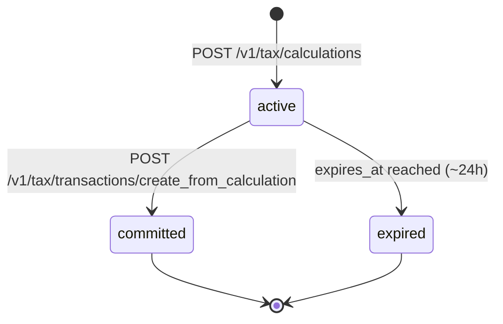
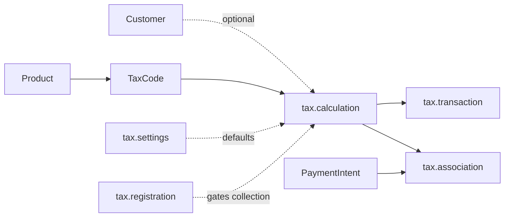

# Tax Calculation

> API resource: `tax.calculation` · API version: `2026-04-22.dahlia` · Category: [Tax](README.md)

## What it is

A `tax.calculation` is a **standalone, ephemeral tax computation** for a basket of line items shipped to a specific customer location. You hand Stripe a list of (amount, quantity, tax_code) tuples plus a `customer_details.address`, and Stripe returns "this is exactly what tax would be, broken down by jurisdiction."

The Calculation does not commit anything to your tax-filing record. It is a *quote*. It expires (~24 hours after creation). To turn it into a permanent, filable record, you create a [Transaction](transactions.md) from it.

For Invoice / Checkout flows with `automatic_tax.enabled=true`, Stripe creates and commits Calculations + Transactions automatically — you don't see them. You reach for `tax.calculation` directly when you have a **custom checkout flow** (your own UI on top of [PaymentIntent](../01-core-resources/payment-intents.md)) and need to display tax line-by-line, or when you want a tax preview during cart / quote rendering.

## Why it exists

Without `tax.calculation`, there is no first-class way in a custom flow to ask Stripe "what is the tax on this cart?" before payment is collected. You'd be forced to either:

- Use Invoice / Checkout (which auto-computes but constrains your UI), or
- Roll your own tax engine (jurisdictions, nexus, product taxability — a small army of tax engineers).

`tax.calculation` is the API equivalent of "give me a quote." It's the building block under custom-flow Stripe Tax: compute → display → collect payment → commit a Transaction.

## Lifecycle & states

A Calculation has no `status` field. Its lifecycle is time-based:



- **active** — Created, not yet expired, not yet committed. You may read it, display it to the user, and reference it when creating a Transaction.
- **committed** — A Transaction was created from this Calculation. The Calculation object itself stays readable but **cannot be re-used to create a second Transaction** (you'd hit `tax_calculation_already_committed`).
- **expired** — Past `expires_at`. The object remains readable for a short period, but `create_from_calculation` will fail. Recompute from scratch.

Calculations are append-only. There is no update, no delete, no cancel — they're conceptually pure functions of (inputs, tax engine state at creation time).

## Anatomy of the object

### Identity

| Field | Notes |
|---|---|
| `id` | `taxcalc_…` |
| `object` | `"tax.calculation"` |
| `livemode` | Bool. |
| `expires_at` | Unix seconds. ~24 hours after creation. After this, you cannot commit a Transaction from it. |

### Customer location (the input that drives jurisdiction)

| Field | Notes |
|---|---|
| `customer` | `cus_…` if you passed one; Stripe pulls address & tax IDs from the Customer. |
| `customer_details.address` | `{line1, line2, city, state, postal_code, country}`. The shipping/use address. Drives which jurisdictions apply. |
| `customer_details.address_source` | `shipping` or `billing`. Which address to treat as the place of supply. Most physical goods → `shipping`. |
| `customer_details.ip_address` | If you pass an IP, Stripe can geolocate when no explicit address is given (limited; prefer an address). |
| `customer_details.tax_ids[]` | `[{type, value}]` — VAT IDs, ABN, etc. Needed for B2B reverse-charge / zero-rating. |
| `customer_details.taxability_override` | `none | reverse_charge | customer_exempt`. Force a specific treatment, e.g. for a charity-exempt customer. |

> **One of `customer` or `customer_details.address` is required.** If both are passed, `customer_details` wins for that field.

### Line items

| Field | Notes |
|---|---|
| `line_items.data[].amount` | Integer in smallest currency unit. The pre-tax amount unless `tax_behavior=inclusive`. |
| `line_items.data[].quantity` | Default `1`. Affects the line total but not the per-unit tax rate. |
| `line_items.data[].reference` | Your idempotent key per line — usually a SKU or order line ID. Returned in the response so you can map back. |
| `line_items.data[].tax_behavior` | `exclusive` (amount excludes tax; tax is added on top) or `inclusive` (amount already includes tax; Stripe backs it out). Defaults to your `tax.settings.defaults.tax_behavior`. |
| `line_items.data[].tax_code` | `txcd_…`. Stripe's product taxability classifier. Without it, falls back to `tax.settings.defaults.tax_code`. |
| `line_items.data[].amount_tax` | Computed tax for this line. |
| `line_items.data[].tax_breakdown[]` | Per-jurisdiction breakdown for *this line*. Same shape as the top-level `tax_breakdown[]` (see below). |

### Shipping

| Field | Notes |
|---|---|
| `shipping_cost.amount` | Pre-tax shipping. Stripe taxes shipping per the destination jurisdiction's rules (taxable in many US states, exempt in others). |
| `shipping_cost.amount_tax` | Tax computed on shipping. |
| `shipping_cost.tax_behavior` | `exclusive | inclusive`. |
| `shipping_cost.tax_code` | Defaults to a shipping tax code. Override only if you know what you're doing. |

### Money totals

| Field | Notes |
|---|---|
| `currency` | ISO currency. Inherited from the line items / customer. |
| `amount_total` | Grand total, post-tax (or equal to subtotal if all lines are inclusive). |
| `tax_amount_exclusive` | Tax to be added on top of the listed amounts. |
| `tax_amount_inclusive` | Tax already baked into the listed amounts. |

### Per-jurisdiction breakdown

`tax_breakdown[]` aggregates across all lines. Each entry:

| Field | Notes |
|---|---|
| `amount` | Tax amount in the smallest currency unit for this jurisdiction. |
| `inclusive` | Whether this slice was computed from inclusive-priced items. |
| `tax_rate_details.country` | ISO country (`US`, `DE`, `CA`, …). |
| `tax_rate_details.state` | Sub-national, when relevant (e.g. `CA` for California). |
| `tax_rate_details.percentage_decimal` | The applied rate as a decimal-string percentage (e.g. `"7.25"`). |
| `tax_rate_details.tax_type` | `vat | gst | sales_tax | hst | pst | qst | rst | jct | igst | service_tax | lease_tax | amusement_tax | communications_tax | …`. Stripe adds new types as it expands; treat this as an open enum. |
| `tax_rate_details.jurisdictional_level` | `country | state | county | city | district | multiple`. |
| `tax_rate_details.jurisdiction_name` | Human-readable name (e.g. `"San Francisco"`). |
| `taxability_reason` | **Why** this slice was taxed (or not) — see below. |
| `taxable_amount` | The portion of the line subject to this jurisdiction. |

### `taxability_reason` enum

The single most useful field for debugging "why is the number what it is":

| Value | Meaning |
|---|---|
| `standard_rated` | Normal full rate. |
| `reduced_rated` | A reduced rate applies (e.g. EU VAT on books). |
| `zero_rated` | 0% by law (e.g. exports). |
| `reverse_charge` | B2B sale where the buyer self-accounts (EU intra-community). |
| `excluded_territory` | Address is inside a country but outside its tax area (e.g. Canary Islands within Spain). |
| `jurisdiction_unsupported` | Stripe Tax doesn't yet support this jurisdiction. |
| `not_collecting` | You don't have a [Registration](registrations.md) here, so Stripe didn't collect. **Action signal: register or accept the exposure.** |
| `not_subject_to_tax` | The transaction itself is outside the tax base. |
| `not_supported` | The product/service isn't supported by Stripe Tax. |
| `proportionally_rated` | Multiple rates apportioned across the line. |
| `product_exempt` | The product's `tax_code` is exempt in this jurisdiction. |
| `customer_exempt` | The customer is exempt (overrides or tax-ID-based). |
| `excluded` / `exempt` | Catch-all variants for edge cases. |

> Stripe expands this enum as new tax laws roll in. Don't hard-code an exhaustive switch — log unknowns and handle the common cases.

## Relationships



- **Customer (optional)** — pulls in default address & tax IDs. You can override per-call via `customer_details`.
- **TaxCode** (per line) — drives jurisdiction-specific rates and exemptions.
- **tax.settings** — supplies defaults (`tax_behavior`, `tax_code`).
- **tax.registration** — gates whether Stripe *collects* in a jurisdiction. No active Registration → `taxability_reason: not_collecting`, `amount: 0`.
- **tax.transaction** — the commit. One Transaction per Calculation maximum.
- **tax.association** — links the Calculation to the [PaymentIntent](../01-core-resources/payment-intents.md) that ultimately collected.

## Common workflows

### 1. Custom checkout: live tax preview

Compute on each cart change to show "Tax: $X" before the user pays.

```http
POST /v1/tax/calculations
  currency=usd
  customer_details[address][line1]=510 Townsend St
  customer_details[address][city]=San Francisco
  customer_details[address][state]=CA
  customer_details[address][postal_code]=94103
  customer_details[address][country]=US
  customer_details[address_source]=shipping
  line_items[0][amount]=10000
  line_items[0][quantity]=1
  line_items[0][reference]=sku_widget
  line_items[0][tax_code]=txcd_99999999
  line_items[0][tax_behavior]=exclusive
  shipping_cost[amount]=500
```

Display `amount_total`, `tax_amount_exclusive`, and `tax_breakdown[]` in the UI. Stash `taxcalc_…` somewhere (cart row in your DB) so you can commit it after payment.

### 2. Commit after payment succeeds

When `payment_intent.succeeded` fires:

```http
POST /v1/tax/transactions/create_from_calculation
  calculation=taxcalc_…
  reference=order_4242            # idempotent business key
```

Now your tax filings will reflect this sale. See [Transaction](transactions.md).

### 3. B2B reverse-charge for an EU buyer

Pass the buyer's VAT ID. Stripe will return `reverse_charge` and zero tax — but the transaction still must be reported.

```http
POST /v1/tax/calculations
  currency=eur
  customer_details[address][country]=DE
  customer_details[address][postal_code]=10115
  customer_details[address][line1]=Unter den Linden 1
  customer_details[address][city]=Berlin
  customer_details[tax_ids][0][type]=eu_vat
  customer_details[tax_ids][0][value]=DE123456789
  line_items[0][amount]=50000
  line_items[0][reference]=invoice_lic
  line_items[0][tax_code]=txcd_10000000
```

### 4. Inclusive pricing (EU storefront)

Set `tax_behavior=inclusive`. The displayed price is the price the customer pays; Stripe backs out the tax from it.

```http
POST /v1/tax/calculations
  currency=eur
  customer_details[address][country]=FR
  customer_details[address][postal_code]=75001
  customer_details[address][line1]=1 Rue de Rivoli
  line_items[0][amount]=12000
  line_items[0][tax_behavior]=inclusive
  line_items[0][tax_code]=txcd_99999999
```

`amount_total` will equal the sum of inclusive line amounts; `tax_amount_inclusive` is the embedded tax.

## Webhook events

Calculations **do not emit webhooks**. They are request/response only. The only Tax-related event is `tax.settings.updated`. For commit events, watch the [PaymentIntent](../01-core-resources/payment-intents.md) and re-fetch the [Transaction](transactions.md) you create.

## Idempotency, retries & race conditions

- `POST /v1/tax/calculations` accepts `Idempotency-Key`. Use the cart-version + customer-address-hash so identical recomputes return the same Calculation instead of stacking up.
- Calculations are immutable; retrying with the same key is safe.
- `create_from_calculation` is also idempotent — the second call with the same `reference` returns the existing Transaction.
- **Race**: user changes address between Calculation and payment. Rule of thumb: recompute right before `confirm()` and pass the freshly returned `taxcalc_…` to your post-payment commit.

## Test-mode tips

- Use Stripe's recommended test address `354 Oyster Point Blvd, South San Francisco, CA 94080` for predictable US sales-tax behavior.
- For EU, any plausible address inside a country where you've set up a test [Registration](registrations.md) will collect; without it you'll see `not_collecting`.
- There is no `stripe trigger` for tax events — drive Calculations directly from the CLI: `stripe tax calculations create …`.
- Test-mode and live-mode Calculations are isolated; you can't promote one across modes.

## Connect considerations

- Calculations are scoped to one Stripe account. To compute tax for a connected account, pass `Stripe-Account: acct_…` — the connected account's Settings, Registrations, and head office drive the math.
- Each connected merchant manages its own nexus. The platform cannot share Registrations.
- For destination-charge subscription flows, the connected account's tax setup determines collection on its renewals; use `automatic_tax` instead of manual Calculations there.

## Common pitfalls

- **Using a Calculation past `expires_at`.** `create_from_calculation` will fail. Recompute and use the new `taxcalc_…`.
- **Treating `not_collecting` as a bug.** It means you have no active [Registration](registrations.md) for the jurisdiction. Either register or accept the lost revenue and the legal exposure.
- **Hard-coding the `taxability_reason` enum.** New values appear as Stripe expands tax engine coverage. Treat as open enum.
- **Mixing `tax_behavior=inclusive` and `exclusive` lines without thinking.** Stripe tolerates it, but your UI usually shouldn't — pick one mode per cart for a sane "Tax: $X" line.
- **Skipping `customer_details.tax_ids[]` for B2B.** Without the buyer's VAT ID, Stripe charges B2C-style VAT instead of applying reverse charge; the buyer will demand a corrected invoice.
- **Computing your own totals from the breakdown.** Use `amount_total`, `tax_amount_exclusive`, `tax_amount_inclusive` directly. Reproducing rounding rules per jurisdiction is a trap.
- **Forgetting to commit.** A computed-but-uncommitted Calculation is invisible to your filings. Every successful payment that used a Calculation should have a matching Transaction.
- **Reusing `reference` on `create_from_calculation` for two different orders.** That returns the first Transaction silently and your second order will appear unrecorded.

## Further reading

- [API reference: Tax Calculation](https://docs.stripe.com/api/tax/calculations/object)
- [Stripe Tax for custom payment flows](https://docs.stripe.com/tax/custom)
- [Tax codes catalog](https://docs.stripe.com/tax/tax-codes)
- [Transaction](transactions.md) — committing a Calculation.
- [Registration](registrations.md) — what gates `not_collecting`.
- [Settings](settings.md) — defaults for `tax_behavior` and `tax_code`.
