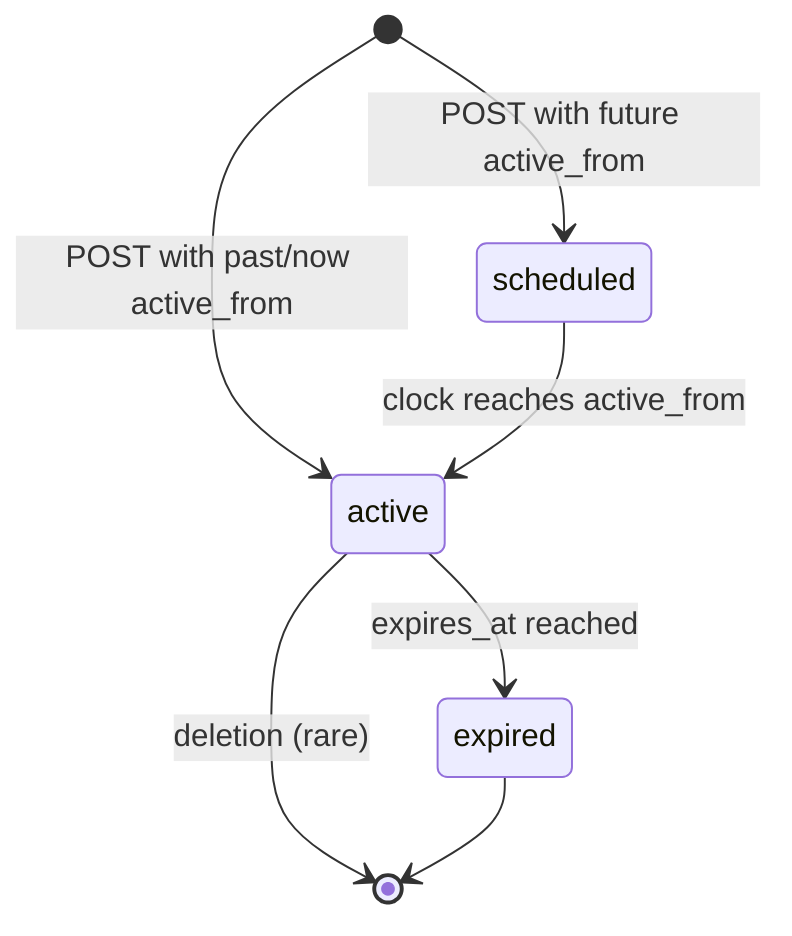
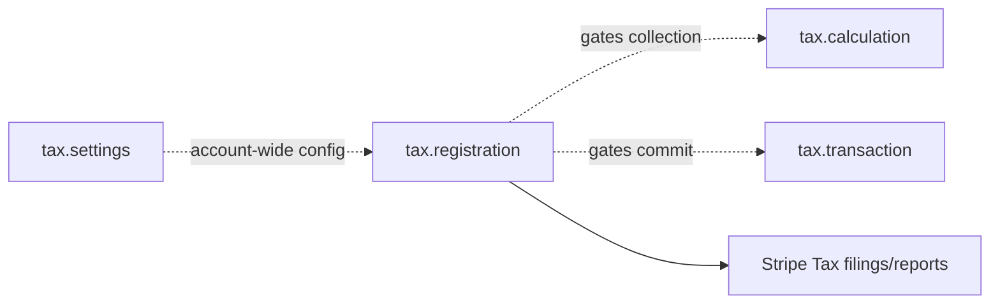

# Tax Registration

> API resource: `tax.registration` · API version: `2026-04-22.dahlia` · Category: [Tax](README.md)

## What it is

A `tax.registration` is the in-Stripe record of a tax registration **you hold with a real-world tax authority** in a specific jurisdiction (a US state, a country, an EU OSS scheme, etc.). It is the gate that controls whether Stripe Tax actually collects tax on your behalf in that jurisdiction.

Stripe does **not** register you with the authority — you do that yourself (or via a tax-advisory service). What you give Stripe is a record saying "as of this date, I am registered in California for sales tax." From `active_from` onward, Calculations and Transactions for buyers in California will collect.

Without a Registration in a jurisdiction, [Calculations](calculations.md) for that jurisdiction will return `taxability_reason: not_collecting` and `amount: 0`. You may still be legally obligated to collect — Stripe just refuses to until you tell it you're registered.

## Why it exists

Two reasons:

1. **Compliance gating.** Collecting tax in a jurisdiction where you're not registered is illegal in many places. Stripe defaults to *not* collecting until you assert registration.
2. **Per-jurisdiction nuance.** Each jurisdiction has its own scheme: US states have economic-nexus thresholds, the EU has OSS / IOSS schemes, the UK has VAT, India has GST, Japan has JCT. The Registration object encodes the *type* of registration so Stripe applies the right rules (e.g. "EU OSS Union Scheme" vs "DE-only registration" produce very different tax behavior on intra-EU sales).

## Lifecycle & states



| `status` | Meaning | Stripe Tax collects? |
|---|---|---|
| `scheduled` | `active_from` is in the future. Registration exists but isn't yet effective. | No. |
| `active` | Currently in force. | Yes — Calculations in this jurisdiction will collect. |
| `expired` | `expires_at` is in the past (you set an end date). | No. |

- **Entry into `scheduled`** — `POST /v1/tax/registrations` with `active_from` set to a future Unix second.
- **Entry into `active`** — `active_from` was past or now at create; or scheduled time elapses. Stripe transitions automatically.
- **Entry into `expired`** — you previously set `expires_at`, and it elapsed. Stripe stops collecting in that jurisdiction the moment it transitions.

What you can mutate:

- `expires_at` is editable on a `scheduled` or `active` Registration (use `POST /v1/tax/registrations/taxreg_…`).
- `active_from` and the country/scheme cannot be changed after creation. To "fix" them, expire the bad Registration immediately and create a fresh one.

## Anatomy of the object

### Identity

| Field | Notes |
|---|---|
| `id` | `taxreg_…` |
| `object` | `"tax.registration"` |
| `livemode` | Bool. Test- and live-mode Registrations are isolated; you must register in both for both modes to collect. |
| `created` | Unix seconds. |
| `country` | ISO country code (`US`, `DE`, `GB`, `JP`, …). The macro jurisdiction. |
| `active_from` | Unix seconds. When the Registration starts being effective. May be back-dated for cleanup. |
| `expires_at` | Unix seconds or `null`. When it stops being effective. Null = open-ended. |
| `status` | `scheduled | active | expired` (computed from `active_from` / `expires_at` / now). |

### Country options (the per-country sub-shape)

`country_options.<country_code>` carries the specifics — the shape varies wildly per jurisdiction. Stripe maintains the catalogue. A few representative shapes:

| Country | Path | Notes |
|---|---|---|
| US | `country_options.us.standard.state` | Two-letter state code. Each US state is its own Registration. |
| US | `country_options.us.standard.type` | E.g. `state_sales_tax`, `local_amusement_tax`. Use `state_sales_tax` unless you know you need a niche type. |
| EU | `country_options.eu.oss_union.standard.place_of_supply_scheme` | `small_seller` or `standard`. The OSS Union Scheme covers all EU member states under one registration. |
| EU | `country_options.eu.oss_non_union.standard` | OSS Non-Union Scheme (digital services from outside the EU). |
| GB | `country_options.gb.standard` | Single UK VAT registration. |
| CA | `country_options.ca.province_standard.province` | Two-letter province code. Some provinces (`BC`, `MB`, `SK`, `QC`) have their own provincial registration; others ride federal GST. |
| AU | `country_options.au.standard` | GST. |
| JP | `country_options.jp.standard` | JCT (Japanese Consumption Tax). |
| IN | `country_options.in.standard` | GST. |
| DE / FR / ES / IT | `country_options.de.standard` etc. | Per-country VAT registration, used when you have a domestic registration outside the OSS umbrella. |

> Stripe ships new shapes regularly as it expands tax engine coverage. Treat the country_options keys as an open enum — code defensively, log unknowns, and consult the API reference for the exact shape of a country you don't recognize.

### Sub-fields you'll commonly set

| Field | Notes |
|---|---|
| `type` (within the country sub-object) | The kind of tax registration. Defaults to `standard` for most countries. |
| `place_of_supply_scheme` | EU-only. `standard` (>EUR 10k cross-border threshold) or `small_seller` (under threshold). |
| `state` / `province` | For sub-national US / Canadian registrations. |

## Relationships



- **Settings → Registration** — Settings must be `active` (head office set, etc.) before Stripe will collect for any Registration.
- **Registration → Calculation** — when computing tax for an address inside the registered jurisdiction, `taxability_reason` becomes one of the collected values; without it, `not_collecting`.
- **Registration → Reports** — what Stripe Tax filings show as "you owe X for jurisdiction Y for period Z."

Registrations have no direct child objects.

## Common workflows

### 1. Register in a US state (after you crossed economic nexus)

You filed with the state's Department of Revenue last week. Now record it in Stripe:

```http
POST /v1/tax/registrations
  country=US
  active_from=1714521600                # the date your state registration took effect
  country_options[us][state]=CA
  country_options[us][type]=state_sales_tax
```

Stripe immediately starts collecting California sales tax on Calculations destined for CA addresses.

### 2. EU OSS Union Scheme registration (one Registration, all 27 countries)

You're a German company shipping into other EU member states above the EUR 10k threshold:

```http
POST /v1/tax/registrations
  country=DE
  active_from=1704067200
  country_options[eu][oss_union][standard][place_of_supply_scheme]=standard
```

Now Stripe collects destination-country VAT on all your intra-EU B2C sales under your single OSS registration.

### 3. Future-dated registration

You've filed but the authority's effective date is two weeks out:

```http
POST /v1/tax/registrations
  country=GB
  active_from=1717200000
  country_options[gb][standard][type]=standard
```

`status` will be `scheduled` until `active_from` arrives.

### 4. End a registration (you deregistered with the authority)

```http
POST /v1/tax/registrations/taxreg_1Nl…
  expires_at=1735689599                 # last second you're active
```

After `expires_at`, Stripe will stop collecting in that jurisdiction. Transactions committed before `expires_at` remain on your filings.

### 5. List your Registrations

```http
GET /v1/tax/registrations?status=active&limit=100
```

Snapshot at the start of every reporting period to verify nothing expired unintentionally.

## Webhook events

Registrations emit **no dedicated webhooks**. The only Tax-namespace event is `tax.settings.updated`. Strategy for staying in sync:

- Treat Registration list state as a daily-resync resource. Cache it; refresh on a cron.
- For changes you initiated via API, your code is the source of truth — log the `taxreg_…` returned by the create call.
- For changes via Dashboard, periodically reconcile.

| Adjacent signal | Use to |
|---|---|
| `tax.settings.updated` | Re-fetch Settings; if status flipped, your Registrations may now be silent. |

## Idempotency, retries & race conditions

- `POST /v1/tax/registrations` accepts `Idempotency-Key`. Use one per (jurisdiction, active_from) tuple to dedupe.
- Stripe does **not** dedupe on `(country, state, type)` — you can create two Registrations for California by mistake. Both will collect. Filter and clean up.
- The `scheduled → active` transition is server-side and time-based. There is no event; rely on the date.

## Test-mode tips

- Test-mode Registrations are isolated from live. **You must create them in both modes** for your test integration to actually collect tax.
- Use a test Registration in every jurisdiction your test-mode Calculations target, otherwise everything will return `not_collecting` and you'll think your code is broken.
- No CLI trigger for Registrations — create via `stripe tax registrations create …` directly.

## Connect considerations

- Each connected account holds its **own** Registrations. The platform's Registrations do not cascade.
- Use `Stripe-Account: acct_…` on `POST /v1/tax/registrations` to register on behalf of a connected merchant.
- Platforms that onboard merchants in many states should build a tooling layer to surface "you have economic nexus in CA but no Registration" — Stripe will not warn you automatically.
- For `Standard` connected accounts, the merchant can also register themselves via the Tax dashboard.

## Common pitfalls

- **Forgetting to register where you have nexus.** Legal exposure. The customer pays no tax (because Stripe says `not_collecting`), but the authority will still come for you.
- **Registering in a jurisdiction you don't have nexus in.** Compliance overhead — you now have to file zero-returns forever (or de-register).
- **Treating "I registered with one US state" as "I registered with the US."** US sales tax is *per state*. There is no federal sales tax. You need one Registration per state.
- **Confusing OSS with per-country EU registrations.** OSS Union Scheme covers all 27 EU countries under your home country's MOSS. If you also have a separate domestic registration in DE, set both — but typically OSS is enough for cross-border B2C.
- **Mode mixing.** Live-mode Registrations don't apply in test mode and vice-versa. Surprise `not_collecting` in test usually means "no test Registration."
- **Editing immutable fields.** `country`, `country_options.*`, and `active_from` are frozen at creation. To change, expire and recreate.
- **Back-dating without thinking.** A back-dated `active_from` doesn't retroactively collect tax on past Transactions — it only affects future Calculations. Past sales remain `not_collecting`.
- **Letting Registrations silently expire.** Set a calendar reminder before `expires_at`; there's no webhook to remind you.

## Further reading

- [API reference: Tax Registration](https://docs.stripe.com/api/tax/registrations/object)
- [Stripe Tax: registrations overview](https://docs.stripe.com/tax/registering)
- [Economic nexus reference (US)](https://docs.stripe.com/tax/monitoring)
- [EU OSS / IOSS schemes](https://docs.stripe.com/tax/eu)
- [Settings](settings.md) — must be `active` for Registrations to take effect.
- [Calculation](calculations.md) — what Registrations gate.
