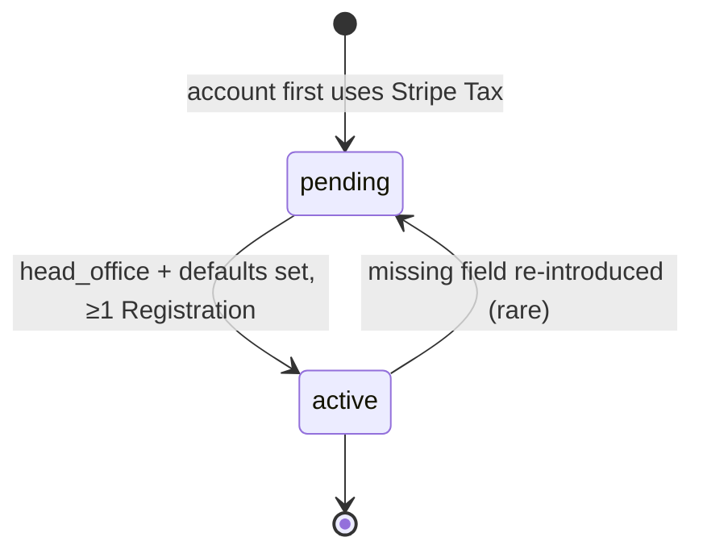
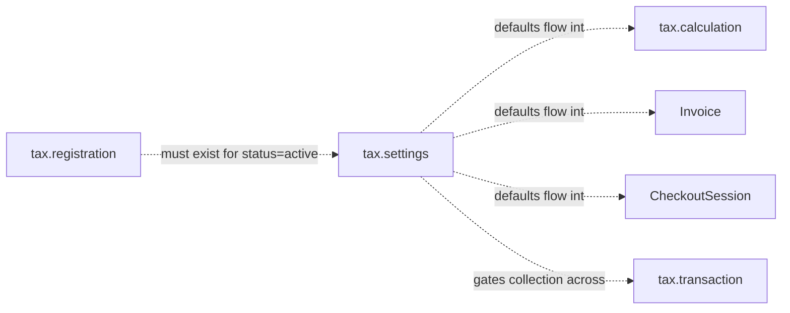

# Tax Settings

> API resource: `tax.settings` · API version: `2026-04-22.dahlia` · Category: [Tax](README.md)

## What it is

`tax.settings` is the **account-wide configuration object** for Stripe Tax. It is a **singleton** — exactly one per Stripe account (one in test mode, one in live). You don't create it; it springs into existence the first time Stripe Tax is touched on the account, and you mutate it via `POST /v1/tax/settings` (no ID in the URL).

Settings answer three questions for the tax engine:

1. **Where is your business located?** (`head_office.address`) — drives origin-based US sales tax, EU place-of-supply rules, and which jurisdictions Stripe considers "domestic" vs "cross-border."
2. **What's the default tax behavior?** (`defaults.tax_behavior`) — exclusive (tax added on top of the listed price) or inclusive (tax baked in).
3. **What's the default product taxability?** (`defaults.tax_code`) — what `txcd_…` to apply to lines that didn't specify one.

## Why it exists

Without Settings, the tax engine has no idea who you are or how you price. The very first [Calculation](calculations.md) you run will fail or default badly. Settings consolidate "things every Calculation needs to know about the seller" so you don't have to pass them on every API call.

It's also the visible signal of "Stripe Tax is properly turned on." Until `status=active`, you should expect erratic behavior — especially around B2B reverse-charge and origin-based US states.

## Lifecycle & states



| `status` | Meaning |
|---|---|
| `pending` | Required configuration is missing. The tax engine may still run, but with degraded results. `status_details.pending.missing_fields[]` enumerates what's missing. |
| `active` | All required fields populated; Stripe Tax is live for this account. |

There is no `expired`, no `deleted`. Settings persist for the life of the account.

### What triggers entry into each state

- **pending** — The account hasn't finished onboarding to Stripe Tax. Most commonly: no `head_office.address`, no defaults, or no [Registrations](registrations.md) yet. Stripe also returns `pending` when you mutate Settings in a way that strips out a required field.
- **active** — All required fields are populated, head office country is supported, and at least one Registration exists. Stripe flips the status server-side; `tax.settings.updated` fires.

### What's mutable

Everything on Settings is mutable at any time via `POST /v1/tax/settings`. There are no frozen states. But reverting to `pending` will silently degrade collection across the account, so changes deserve a code review.

## Anatomy of the object

### Identity

| Field | Notes |
|---|---|
| `object` | `"tax.settings"` |
| `livemode` | Bool. **Test and live each have their own singleton** — configure both. |

> Note: `tax.settings` has no `id` field. You retrieve via `GET /v1/tax/settings` and update via `POST /v1/tax/settings` — Stripe always operates on the singleton for the authenticated account.

### Defaults

| Field | Notes |
|---|---|
| `defaults.tax_behavior` | `exclusive`, `inclusive`, or `inferred_by_currency`. Applied to any line that doesn't explicitly set `tax_behavior`. `inferred_by_currency` picks based on currency norms (EU currencies → inclusive; USD → exclusive). |
| `defaults.tax_code` | `txcd_…`. Default product taxability code applied to lines (and to Products) that don't specify one. Pick the most representative code for your catalogue (`txcd_10000000` for SaaS, etc.). |

### Head office

| Field | Notes |
|---|---|
| `head_office.address.line1` | Required for `active`. |
| `head_office.address.line2` | Optional. |
| `head_office.address.city` | Required for `active`. |
| `head_office.address.state` | Required for US/CA — drives origin-based sourcing in some states. |
| `head_office.address.postal_code` | Required for most countries. |
| `head_office.address.country` | ISO country code. **Cannot be a country Stripe Tax doesn't support as a seller location.** |

The head office is where Stripe considers "you" to be located for the purposes of place-of-supply rules. Critical in:

- **Origin-based US states** (e.g. Texas) — sales tax computed from your address, not the buyer's.
- **EU place-of-supply** — for B2B intra-EU services, your country drives reverse-charge eligibility.
- **B2B vs B2C distinctions** — your country relative to the buyer's drives the entire VAT scheme picked.

### Status

| Field | Notes |
|---|---|
| `status` | `active | pending`. |
| `status_details.active.country` | The country your account is configured for. |
| `status_details.active.origin_country` | The head-office country used for origin determinations. |
| `status_details.pending.missing_fields[]` | An array of dotted field paths Stripe needs you to fill. Iterate this on every render of your "set up Stripe Tax" UI. |

## Relationships



- **Settings → Calculation / Invoice / Checkout** — `defaults.tax_behavior` and `defaults.tax_code` apply when a line doesn't override.
- **Registration → Settings** — at least one Registration is part of what flips Settings to `active`.
- **Settings → Transaction** — when `pending`, commits in some jurisdictions can fail.

## Common workflows

### 1. First-time setup

```http
POST /v1/tax/settings
  defaults[tax_behavior]=exclusive
  defaults[tax_code]=txcd_10000000
  head_office[address][line1]=510 Townsend St
  head_office[address][city]=San Francisco
  head_office[address][state]=CA
  head_office[address][postal_code]=94103
  head_office[address][country]=US
```

Then create your first [Registration](registrations.md). Watch for `tax.settings.updated` — `status` should flip to `active`.

### 2. Detecting incomplete setup

```http
GET /v1/tax/settings
```

If `status=pending`, render a setup UI from `status_details.pending.missing_fields[]`:

```json
{
  "status": "pending",
  "status_details": {
    "pending": {
      "missing_fields": [
        "head_office.address.postal_code",
        "head_office.address.state"
      ]
    }
  }
}
```

### 3. Switching default tax behavior (EU launch)

You're going inclusive in EUR storefronts:

```http
POST /v1/tax/settings
  defaults[tax_behavior]=inferred_by_currency
```

`inferred_by_currency` is the safe choice for multi-region: EUR/GBP behave inclusive; USD/CAD behave exclusive.

### 4. Updating head office (you moved)

```http
POST /v1/tax/settings
  head_office[address][line1]=1 New Address Way
  head_office[address][city]=Austin
  head_office[address][state]=TX
  head_office[address][postal_code]=78701
  head_office[address][country]=US
```

This changes future Calculations only. Past Transactions retain the head office address that was in effect at commit time.

## Webhook events

| Event | Fires when | Listener typically does |
|---|---|---|
| `tax.settings.updated` | Any field on Settings changes — defaults, head office, status flip. | Re-fetch Settings; if `status` changed, alert ops. If `defaults.tax_code` changed, audit which Products silently inherited. |

This is the **only** event in the Tax namespace. There is no `tax.calculation.*`, no `tax.transaction.*`, no `tax.registration.*`. Build any state-syncing around `tax.settings.updated` plus periodic resync.

## Idempotency, retries & race conditions

- `POST /v1/tax/settings` is naturally idempotent — it's an upsert on a singleton. Stripe accepts `Idempotency-Key` but it adds little value; the operation is "set these fields to these values."
- Two concurrent updates to disjoint fields will both apply (last-writer-wins per field). Two updates to the *same* field race; final value is whichever request Stripe processes last.
- The `pending → active` flip is async with respect to your Registration POST; budget a few seconds before relying on `status=active`.

## Test-mode tips

- **Test-mode Settings are entirely separate.** Configure both modes; otherwise test Calculations may return wildly different numbers from live.
- For a test head office, use Stripe's recommended test address `354 Oyster Point Blvd, South San Francisco, CA 94080` to get clean US sales-tax behavior.
- No `stripe trigger tax.settings.updated` — modify via `stripe tax settings update` to fire the event for handler testing.

## Connect considerations

- Each connected account has its own `tax.settings` singleton. To configure one for a connected merchant, send `POST /v1/tax/settings` with `Stripe-Account: acct_…`.
- Standard accounts let the merchant configure their own Settings via the Stripe dashboard.
- For Express / Custom accounts, the platform typically owns onboarding — you must walk the merchant through head-office and defaults via your own UI, then POST on their behalf.
- A connected account whose `tax.settings.status` is `pending` may collect zero tax even where they have Registrations. Surface their `status_details.pending.missing_fields[]` in your platform's onboarding UI.

## Common pitfalls

- **Assuming Stripe Tax "just works" out of the box.** Without head office and defaults, you're in `pending` and collection is unreliable.
- **Forgetting to set test-mode Settings.** Causes "tax works in prod, not in dev" mysteries.
- **Switching `defaults.tax_code` mid-flight.** Products and Calculations that didn't override silently inherit the new code. Audit.
- **Using `inclusive` everywhere because the EU does.** US storefronts almost universally display tax exclusive. Pick per market or use `inferred_by_currency`.
- **Treating head office as billing-only.** It's a tax-engine input, not a contact address — wrong head office = wrong place-of-supply = wrong rates in origin-based states.
- **Watching for `tax.settings.created`.** Doesn't exist. The singleton appears implicitly; the only event is `updated`.
- **No `id` in the URL.** Engineers hit `POST /v1/tax/settings/<id>` and get 404. The endpoint takes no ID.

## Further reading

- [API reference: Tax Settings](https://docs.stripe.com/api/tax/settings/object)
- [Stripe Tax setup guide](https://docs.stripe.com/tax/set-up)
- [Origin- vs destination-based US sales tax](https://docs.stripe.com/tax/zero-tax)
- [Tax codes](https://docs.stripe.com/tax/tax-codes) — for picking `defaults.tax_code`.
- [Registration](registrations.md) — needed for `status=active`.
- [Calculation](calculations.md) — consumes Settings defaults.
