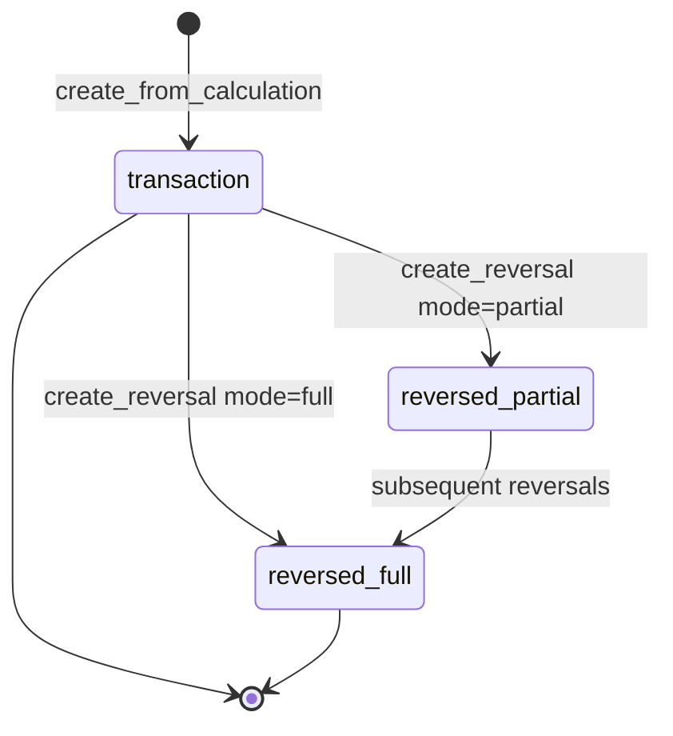
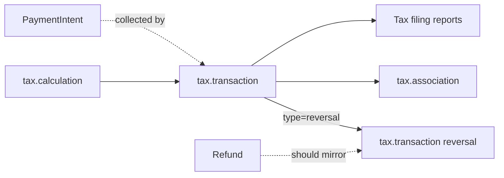

# Tax Transaction

> API resource: `tax.transaction` · API version: `2026-04-22.dahlia` · Category: [Tax](README.md)

## What it is

A `tax.transaction` is the **finalized, filable record of a tax event**. It is what Stripe Tax reports show, what you remit to tax authorities, and the long-term source of truth for "we collected $X of tax in jurisdiction Y on date Z."

Transactions come in two `type`s:

- `transaction` — a sale was completed; tax was collected (or determined to be zero).
- `reversal` — a refund / cancellation reduced or undid a prior `transaction`.

For Invoice and Checkout flows with `automatic_tax.enabled=true`, Stripe creates Transactions for you the moment payment succeeds. For **custom checkout flows** built on [PaymentIntent](../01-core-resources/payment-intents.md), you must create them yourself from a [Calculation](calculations.md) — Stripe will not do it implicitly.

## Why it exists

A [Calculation](calculations.md) is a quote — ephemeral, expires in ~24h, invisible to filings. A `tax.transaction` is the durable commit. Without it, your tax engine has no idea you actually collected the tax it computed, and your monthly Stripe Tax filings will under-report revenue.

Reversals are the analogue for refunds: when you refund a [Charge](../01-core-resources/charges.md) you must also reverse the corresponding tax slice, otherwise you'll remit tax on money you no longer have.

## Lifecycle & states

Transactions are **append-only**. There is no `status` field, no edit, no delete:



- **`type=transaction`** — created from a Calculation. The Calculation it was derived from is locked to it; you cannot create a second Transaction from the same Calculation.
- **`type=reversal`** — references the original Transaction via `reversal.original_transaction`. Has its own `id` (also `tx_…`), its own `reference`, and its own line items describing what was undone.
- A single original Transaction may have **many partial reversals** that, in aggregate, cannot exceed the original amounts. A `mode=full` reversal closes the original out — further reversals against it return an error.

There are no terminal states in the conventional sense; every Transaction stays queryable forever for audit.

## Anatomy of the object

### Identity

| Field | Notes |
|---|---|
| `id` | `tx_…` |
| `object` | `"tax.transaction"` |
| `type` | `transaction` or `reversal`. |
| `livemode` | Bool. |
| `created` | Unix seconds. When the Transaction record was committed in Stripe. |
| `posted_at` | Unix seconds. The accounting date — usually equals `created`, but a back-dated commit can differ. |
| `tax_date` | The date the underlying sale occurred (drives which filing period it lands in). |
| `metadata` | Free-form. |

### Reference (idempotency anchor)

| Field | Notes |
|---|---|
| `reference` | **Required, unique per account.** Your business key — typically `order_<id>` for sales and `refund_<id>` for reversals. Stripe uses it as a soft idempotency key for `create_from_calculation` and `create_reversal`. |

### Customer

| Field | Notes |
|---|---|
| `customer` | `cus_…` if one was on the source Calculation. |
| `customer_details` | Snapshot of address, address_source, ip_address, tax_ids, taxability_override at the time of commit. **Frozen** — does not update if the underlying Customer changes. |

### Money & lines

| Field | Notes |
|---|---|
| `currency` | ISO. |
| `line_items.data[]` | Snapshot of the committed lines: `amount`, `quantity`, `reference`, `tax_behavior`, `tax_code`, `amount_tax`, `tax_breakdown[]`. |
| `shipping_cost` | `{amount, amount_tax, tax_behavior, tax_code, tax_breakdown[]}` — same shape as on a Calculation. |
| `tax_breakdown[]` | Per-jurisdiction roll-up — drives reports. Same shape as on [Calculation](calculations.md) (with `tax_rate_details`, `taxability_reason`, etc.). |

### Reversal-only fields

| Field | Notes |
|---|---|
| `reversal.original_transaction` | `tx_…` of the Transaction this reversal undoes. Required when `type=reversal`. |
| `reversal.mode` | `full` or `partial`. (Reflects what was passed at create time.) |

### Tax engine state

The Transaction freezes the tax engine's view of the world at commit time — rates, jurisdiction definitions, registration status. Reversals re-use that frozen view, so a refund six months later remits at the rate that was in force on the original sale.

## Relationships



- **Calculation → Transaction** — exactly one Transaction per Calculation.
- **PaymentIntent → Transaction** — implicit linkage (you committed when the PI succeeded). Make it explicit by creating a [tax.association](associations.md).
- **Refund → reversal Transaction** — Stripe does **not** auto-reverse for custom flows. Each Refund you issue must be mirrored by a `create_reversal` call.

## Common workflows

### 1. Commit after a successful custom-flow payment

`payment_intent.succeeded` fires; you have the original `taxcalc_…` from your cart row.

```http
POST /v1/tax/transactions/create_from_calculation
  calculation=taxcalc_1NlT8…
  reference=order_4242
  expand[]=line_items
```

Idempotent on `reference`. Store `tx_…` against your order.

### 2. Full refund → full reversal

```http
POST /v1/tax/transactions/create_reversal
  original_transaction=tx_1NlT9…
  reference=refund_4242
  mode=full
  flat_amount=-12500           # negative; the full original tax base
```

For full reversals, you can pass `flat_amount` (the negative of the original total) instead of enumerating lines. Stripe applies the reversal proportionally across all lines and jurisdictions.

### 3. Partial refund → partial reversal

You refunded one of three lines plus shipping. Mirror it line-by-line:

```http
POST /v1/tax/transactions/create_reversal
  original_transaction=tx_1NlT9…
  reference=refund_4242_partial
  mode=partial
  line_items[0][original_line_item]=tax_li_…
  line_items[0][reference]=refund_li_a
  line_items[0][amount]=-5000        # negative; the refunded subtotal
  line_items[0][amount_tax]=-413     # negative; the refunded tax slice
  line_items[0][quantity]=1
  shipping_cost[amount]=-500
  shipping_cost[amount_tax]=-41
```

Each `line_items[i].original_line_item` is the `id` of a line on the original Transaction (look in `tax_transaction.line_items.data[].id`). Multiple partial reversals can exist; their absolute sums cannot exceed the original.

### 4. Reading a Transaction back

```http
GET /v1/tax/transactions/tx_1NlT9…
  expand[]=line_items
```

Or list by `reference`:

```http
GET /v1/tax/transactions?reference=order_4242
```

### 5. Auto-managed Transactions (Invoice / Checkout)

You don't call `create_from_calculation`. When `invoice.paid` or `checkout.session.completed` fires, Stripe has already committed the underlying Transaction. Find it via the [Calculation](calculations.md) ID exposed on `invoice.automatic_tax` (when expandable) or via the Tax dashboard.

## Webhook events

Tax Transactions emit **no dedicated webhooks**. The only event in the Tax namespace is `tax.settings.updated`. To react to commit/reversal:

- For invoice flows: listen to `invoice.paid` / `invoice.voided` and resolve the Transaction by inspecting the invoice.
- For Checkout: listen to `checkout.session.completed` and similarly resolve.
- For custom flows: you control the commit, so wire reactions inside the same handler that calls `create_from_calculation`.

| Indirect signal | Use to |
|---|---|
| `payment_intent.succeeded` | Trigger your `create_from_calculation` call. |
| `charge.refunded` | Trigger your `create_reversal` call. |
| `invoice.paid` | Resolve the auto-created Transaction. |
| `tax.settings.updated` | Re-validate that Settings are still `active` for filings. |

## Idempotency, retries & race conditions

- `create_from_calculation` is idempotent on **`reference`**. Calling twice with the same `reference` returns the existing Transaction. Calling twice with the same `calculation` but different `reference` errors with `tax_calculation_already_committed`.
- `create_reversal` is also idempotent on `reference`. Use one `reference` per Refund (e.g. `refund_<refund_id>`).
- You can additionally pass `Idempotency-Key`; both layers protect you.
- **Race**: `payment_intent.succeeded` arrives, you commit, then the Charge is later auto-refunded by Radar. The reversal must still happen — ideally driven off `charge.refunded`, not the original PI succeeded handler.
- **Race**: webhook fires before your DB has stored the `taxcalc_…`. Persist the Calculation ID *before* confirming the PaymentIntent, so the handler can always look it up.

## Test-mode tips

- Test-mode Transactions never count toward real filings. They show up in test-mode reports for sanity-checking your integration shape.
- There's no `stripe trigger` event for `tax.transaction.*` — drive them with the CLI directly: `stripe tax transactions create_from_calculation --calculation taxcalc_… --reference order_test_1`.
- [TestClock](../06-billing/test-clocks.md) does not advance Tax Transactions — they're committed at real wall-clock time.
- To rehearse reversals end-to-end, use a test Charge with a refundable card (`4242 4242 4242 4242`), refund partially, then call `create_reversal` with matching line slices.

## Connect considerations

- Tax Transactions live on the account that recorded the sale. For `Stripe-Account: acct_…` flows, the *connected* account's Tax filings include the Transaction.
- Platforms that compute tax centrally (rare) and want it filed under the platform must commit the Transaction without `Stripe-Account`. Most platforms commit per-merchant.
- A connected account whose [Settings](settings.md) `status` is `pending` will accept Calculations but **may** error on commit, depending on jurisdiction. Watch for `tax_settings_inactive`.

## Common pitfalls

- **Forgetting to reverse on refund.** Without a reversal, the tax slice stays on your filing — you'll remit tax on money the customer has back. Tie `create_reversal` to your refund pipeline, not your support team's good intentions.
- **Reusing `reference` across logically distinct events.** Idempotency means the second call returns the *first* Transaction; the second event silently goes unrecorded.
- **Trying to commit a Calculation past `expires_at`.** `tax_calculation_expired`. Recompute first.
- **Trying to commit the same Calculation twice.** `tax_calculation_already_committed`. There is no "supersede" — issue a reversal against the first Transaction and create a new Calculation+Transaction for the corrected basket.
- **Editing a Transaction.** You can't. To correct, reverse and re-issue.
- **Assuming Invoice / Checkout flows need manual commits.** They don't — and double-committing will fail.
- **Mismatched amounts in partial reversals.** Stripe enforces that summed reversals can't exceed the original. Off-by-one rounding errors will reject; mirror the line shape exactly when in doubt.
- **Looking for `tax.transaction.created` webhooks.** They don't exist. Drive off the underlying payment events.

## Further reading

- [API reference: Tax Transaction](https://docs.stripe.com/api/tax/transactions/object)
- [Stripe Tax for custom payment flows](https://docs.stripe.com/tax/custom)
- [Refunding tax](https://docs.stripe.com/tax/custom#refund-a-transaction)
- [Calculation](calculations.md) — the input.
- [Association](associations.md) — link Calculation to PaymentIntent for audit.
- [Settings](settings.md) — must be `active` for committed filings.
