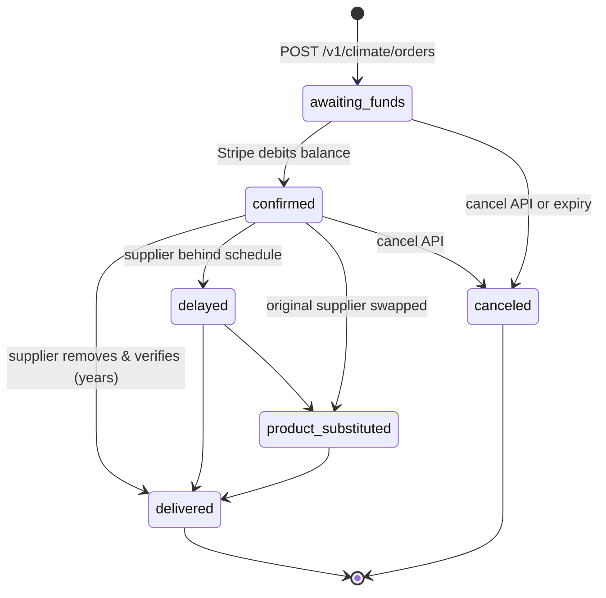
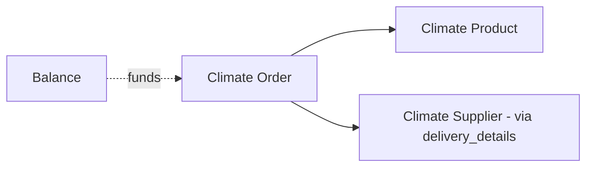

# Climate Order

> API resource: `climate.order` · API version: `2026-04-22.dahlia` · Category: [Climate](README.md)

## What it is

A `climate.order` is a purchase commitment for a specific tonnage of permanent carbon removal. You spend either a dollar amount or a metric-tonne quantity against a [climate.product](products.md) (a pathway like direct air capture, biomass burial, or enhanced weathering); Stripe debits your balance, contracts with the supplier portfolio for that product on your behalf, and tracks delivery for years until the carbon has actually been removed and verified.

It is **not** a carbon offset. Stripe Climate is removal-only — every tonne is physically pulled from the atmosphere and locked away by a vetted [climate.supplier](suppliers.md).

## Why it exists

Buying high-quality removal directly is hard: you'd vet suppliers, negotiate per-tonne pricing, monitor multi-year delivery, handle supplier failures, and reconcile partial deliveries. The Order object collapses that into one resource: pick a product, name an amount, and Stripe runs the procurement, allocation, substitution, and reporting lifecycle for you.

Most teams use it in two patterns: a fixed monthly order (set up once, never touched again), or a percentage of revenue computed weekly/monthly and posted as a new order each cycle.

## Lifecycle & states



State meanings:

- **`awaiting_funds`** — order accepted but Stripe has not yet debited your balance for it. You can still cancel for free. If your balance can't cover the amount within Stripe's funding window, the order auto-cancels with `cancellation_reason: expired`.
- **`confirmed`** — funds debited; the purchase is locked in with the supplier set. Cancel is still possible in some pathways but increasingly restricted as delivery work begins.
- **`delayed`** — supplier missed the original `expected_delivery_year`. Order remains in flight; Stripe pushes the year forward and emits a webhook. Side branch — not terminal.
- **`product_substituted`** — Stripe swapped the original supplier for an equivalent (or higher-quality) one because the original failed (loss of certification, project shutdown). At no extra cost; `delivery_details[]` is rewritten.
- **`delivered`** — verified removal complete. Terminal. Certificate available in Dashboard.
- **`canceled`** — terminated before delivery. Funds restored to balance. `cancellation_reason` distinguishes `expired`, `product_unavailable`, and `requested`.

`delivered` and `canceled` are terminal and irreversible.

## Anatomy of the object

### Identity

| Field | Notes |
|---|---|
| `id` | `climorder_…` |
| `object` | `"climate.order"` |
| `livemode` | true in live, false in test. Test orders never debit real funds. |
| `metadata` | your bag — useful for tagging the reporting period the order belongs to. |

### Money

| Field | Notes |
|---|---|
| `amount_total` | Integer (smallest currency unit). What you pay. |
| `amount_subtotal` | `amount_total - amount_fees`. The portion that flows to suppliers. |
| `amount_fees` | Stripe's fee. Disclosed up front. |
| `currency` | ISO. Limited set; USD is universal. |
| `metric_tons` | Decimal string (e.g. `"0.0257"`). Tonnes purchased. At create you supply *either* `amount=…` or `metric_tons=…`; Stripe fills in the other from current product pricing. |

### Product & delivery

| Field | Notes |
|---|---|
| `product` | `climsku_…` reference to a [climate.product](products.md). Immutable. |
| `beneficiary.public_name` | Optional name (≤30 chars) shown on the public removal certificate (e.g. your customer's company if you're reselling). May be null. |
| `delivery_details[]` | Array of `{ supplier, delivered_at, metric_tons }`. Populated incrementally as suppliers ship. Multi-supplier breakdown — one product can be fulfilled by several. |
| `expected_delivery_year` | Integer year. Mutable when status flips to `delayed`. |

### Status & timestamps

| Field | Notes |
|---|---|
| `status` | enum, see lifecycle. |
| `confirmed_at` | unix seconds when `awaiting_funds → confirmed`. Null until then. |
| `delivered_at` | unix seconds at full delivery. Null until terminal. |
| `canceled_at` | unix seconds when canceled. |
| `cancellation_reason` | `expired | product_unavailable | requested`. Null unless `status = canceled`. |

## Relationships



- The `product` link is required and immutable.
- `delivery_details[].supplier` is a denormalized snapshot: a `product_substituted` event rewrites the array with the new supplier set.
- Funding comes from your Stripe `balance` — there is no separate billing instrument. Make sure your balance has headroom or the order will sit in `awaiting_funds` and may eventually expire.

## Common workflows

### 1. One-shot order by dollar amount

```http
POST /v1/climate/orders
  amount=10000
  currency=usd
  product=climsku_…
  beneficiary[public_name]=Acme Corp
Idempotency-Key: climate-2026-05-acme
```

Response: `status: awaiting_funds`. Stripe converts `amount` to a `metric_tons` figure based on the product's current pricing.

### 2. One-shot order by tonnage

```http
POST /v1/climate/orders
  metric_tons=0.5
  currency=usd
  product=climsku_…
```

Stripe computes `amount_total` from current per-tonne pricing. **Re-read the product right before** to avoid sticker shock — pricing fluctuates.

### 3. Monthly fixed order from a cron

Compute the amount in your scheduler, then:

```http
POST /v1/climate/orders
  amount=50000
  currency=usd
  product=climsku_…
  metadata[period]=2026-05
Idempotency-Key: climate-2026-05
```

Idempotency-keying by period prevents accidental double-orders if the cron retries.

### 4. Cancel before delivery

```http
POST /v1/climate/orders/climorder_…/cancel
```

Allowed only while `awaiting_funds` or (with restrictions) `confirmed`. Funds return to your balance. After delivery work is in progress, cancel calls are rejected.

### 5. List orders for a reporting period

```http
GET /v1/climate/orders?created[gte]=…&created[lt]=…&limit=100
```

Aggregate `metric_tons` across the page for a "tonnes purchased this quarter" report. The Dashboard's exports also surface the same data as CSV.

## Webhook events

| Event | Fires when | Listener typically does |
|---|---|---|
| `climate.order.confirmed` | Stripe debits balance and locks supplier(s). | Mark order as funded; clear "pending" UI. |
| `climate.order.delayed` | `expected_delivery_year` pushed back. | Update internal forecast; notify ESG report owners. |
| `climate.order.product_substituted` | Stripe swapped the supplier set. | Re-fetch order; refresh certificate metadata. |
| `climate.order.delivered` | Verified removal completed. | Issue certificate, send confirmation email, update sustainability dashboard. |
| `climate.order.canceled` | Terminated (any cause). | Reverse internal accruals; investigate `cancellation_reason`. |

There is no `climate.order.created` event — order creation is synchronous, so use the API response. There is no generic `climate.order.updated` either; the named lifecycle events cover all transitions.

## Idempotency, retries & race conditions

- Always send `Idempotency-Key` on `POST /v1/climate/orders` keyed by the logical period (e.g. `climate-2026-05`). Without it, a network retry produces a duplicate purchase you can't undo after `confirmed`.
- The API response and `climate.order.confirmed` webhook can race. The webhook is the source of truth for "funds actually debited."
- `climate.order.delayed` and `climate.order.product_substituted` can fire multiple times across an order's multi-year life. Handlers must be idempotent.
- Cancellation has a server-side window — the cancel API may reject with `order_not_cancelable` once delivery work is in progress.

## Test-mode tips

- Test-mode orders use a sandbox catalog of synthetic products and never debit real funds. The lifecycle still progresses through the same states.
- There is **no TestClock support** for Climate — you can't fast-forward years to test `delivered`. Expect to mock the webhook in your handler tests.
- `stripe trigger climate.order.delivered` and `stripe trigger climate.order.delayed` are the easiest ways to exercise listener code.
- The Dashboard's Climate page has a test-mode toggle showing all your synthetic orders.

## Connect considerations

- Climate orders live on the platform account, not on connected accounts. There is no `Stripe-Account` flow for `POST /v1/climate/orders`.
- If you want each connected merchant to fund their own removal, you'd build it as: collect their contribution as an [ApplicationFee](../07-connect/application-fees.md) or transfer-back to platform, then post a Climate order from the platform with `metadata` linking the connected account. Stripe doesn't model that natively.

## Common pitfalls

- **Assuming `delivered` is fast.** For some pathways (mineralization, biochar) it can be months; for direct air capture it can be 5+ years. Your sustainability dashboard needs to display "tonnes purchased" *and* "tonnes delivered" separately.
- **Not handling `product_substituted`.** Stripe will silently swap suppliers if the original goes offline. Your supplier-attribution UI must re-read `delivery_details[]` after the event.
- **Re-using a stale `product` ID.** Pricing on a product can drift between when you fetch and when you POST. Re-fetch within a few minutes of order creation, especially for large amounts.
- **Forgetting balance funding.** Order creation succeeds even if your balance is empty; the order then sits in `awaiting_funds` and will expire (`cancellation_reason: expired`) if Stripe can't debit. Monitor `awaiting_funds` orders older than ~7 days.
- **Promising a delivery year to customers based on `expected_delivery_year`.** That field can change. If you display it externally, accompany it with "subject to supplier delivery" copy.
- **Trying to cancel a near-delivery order to free up budget.** The cancel window narrows as delivery approaches; don't budget on the assumption you can recover funds late.

## Further reading

- [API reference: Climate Order](https://docs.stripe.com/api/climate/orders/object)
- [Stripe Climate overview](https://stripe.com/climate)
- [Climate orders guide](https://docs.stripe.com/climate/orders)
