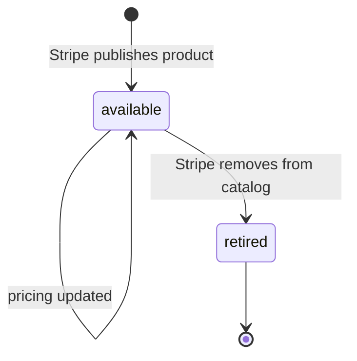

# Climate Product

> API resource: `climate.product` · API version: `2026-04-22.dahlia` · Category: [Climate](README.md)

## What it is

A `climate.product` is a single carbon-removal "SKU" in Stripe's curated catalog — a pathway (direct air capture, biomass carbon removal and storage, enhanced weathering, etc.) bundled with a supplier portfolio that fulfills it. You don't *create* products; Stripe maintains the catalog and you read from it. When you place a [climate.order](orders.md), you reference a `climsku_…` here.

Think of it as the menu Stripe Climate buys against on your behalf. Different products have different prices per tonne, different delivery horizons, and different supplier mixes.

## Why it exists

Carbon removal pathways are heterogeneous in cost, durability, and time-to-delivery. Mineralization is cheap and delivers fast; direct air capture is expensive and delivers years out. Rather than expose raw supplier contracts, Stripe groups suppliers by pathway and surfaces them as Products with stable per-tonne pricing — so your code reasons about "I want to buy from product X" instead of "I want to buy from supplier Y at price Z under contract terms W."

Stripe also handles supplier substitution within a product: if a vendor in the portfolio fails, the product survives and your order's `delivery_details[]` is rewritten silently.

## Lifecycle & states

Climate Products are read-only catalog entries managed by Stripe. There's no `status` field and no API to mutate them. They appear in your account, get re-priced periodically, and may be retired by Stripe (omitted from list responses) when a pathway is no longer offered.



There is no `active` boolean per se — "retired" simply means the product stops appearing in `GET /v1/climate/products`. Existing orders against a retired product continue their delivery lifecycle normally.

## Anatomy of the object

### Identity

| Field | Notes |
|---|---|
| `id` | `climsku_…` |
| `object` | `"climate.product"` |
| `livemode` | true in live, false in test. Test catalog is a small synthetic subset. |
| `created` | unix seconds. |

### Pricing

| Field | Notes |
|---|---|
| `current_prices_per_metric_ton` | Map keyed by ISO currency. Each value is `{ amount_subtotal, amount_fees, amount_total }` integers in the smallest currency unit. **Pricing fluctuates.** Always read just before placing an order. |

### Inventory & delivery

| Field | Notes |
|---|---|
| `metric_tons_available` | Decimal string. Cap on aggregate purchases against this product across all Stripe customers. Treat as advisory — by the time you POST an order it may have shifted. |
| `delivery_year` | Integer year Stripe expects deliveries to complete. Indicative; per-order `expected_delivery_year` is what matters for a specific purchase. May be null for some products. |
| `suppliers[]` | Array of [climate.supplier](suppliers.md) refs in this product's portfolio. Display these to users so they know who is doing the work. |

## Relationships

```mermaid
graph LR
    PRD[Climate Product] --> SUP[Climate Supplier]
    PRD <-- ORD[Climate Order references product]
```

- Products own a portfolio of `suppliers[]`. The portfolio can change over time as Stripe adds or removes vendors.
- Each Order links to exactly one Product, but at delivery time may resolve to multiple suppliers from the portfolio.

## Common workflows

### 1. Show a product picker in your admin UI

```http
GET /v1/climate/products?limit=100
```

Render `id`, `delivery_year`, `current_prices_per_metric_ton.usd.amount_total`, and a join of `suppliers[].name` so the operator picking the product knows what they're buying.

### 2. Just-in-time price refresh before placing an order

```http
GET /v1/climate/products/climsku_…
```

Read `current_prices_per_metric_ton[currency].amount_total`, sanity-check against your budget, then create the [climate.order](orders.md). Don't cache pricing for more than a few minutes if you're auto-purchasing — a price jump between cache and POST can mis-budget you.

### 3. Compute "how many tonnes can $X buy?"

```python
price = product["current_prices_per_metric_ton"]["usd"]["amount_total"]  # cents per tonne
tons = budget_cents / price
```

Then POST `metric_tons=tons` (or just POST `amount=budget_cents` and let Stripe do the math).

## Webhook events

| Event | Fires when | Listener typically does |
|---|---|---|
| `climate.product.created` | Stripe adds a new product to the catalog. | Refresh your local catalog cache; surface to admin UI. |
| `climate.product.pricing_updated` | `current_prices_per_metric_ton` changes for any currency. | Invalidate price cache; recompute any "how many tonnes" UIs. |

There is no `climate.product.deleted` event — products that get retired simply stop appearing in list responses. If you cache, periodically reconcile against `GET /v1/climate/products`.

## Idempotency, retries & race conditions

- Read-only resource — no idempotency concerns on your side for the product itself.
- Pricing read vs. order creation is the real race: `pricing_updated` can fire between your `GET` and your `POST /v1/climate/orders`. Either accept the new price (let `amount=…` resolve to fewer tonnes) or treat the order as `metric_tons=…` and accept whatever the cost computes to.

## Test-mode tips

- Test mode exposes a small synthetic catalog. The IDs do not match live mode. Don't write code that hardcodes `climsku_…` values across modes.
- `stripe trigger climate.product.pricing_updated` fires a sample event you can use to test cache invalidation.
- The Stripe CLI `stripe climate products list` is the fastest way to see what's available.

## Connect considerations

- The Climate catalog is not partitioned per connected account. The same products are visible from any account. Connect doesn't really apply here — Climate orders are platform-level (see [climate.order](orders.md)).

## Common pitfalls

- **Caching pricing for too long.** Per-tonne prices drift. A 6-hour-old cache can mean the order you commit to costs noticeably more than the one you displayed. Re-read inside the order-creation transaction or refresh on every `pricing_updated` webhook.
- **Treating `metric_tons_available` as authoritative.** It's advisory and shared across all Stripe customers. A large concurrent order elsewhere can deplete it between your read and write. Handle "product_unavailable" cancellation reasons gracefully.
- **Hiding `suppliers[]` from end users.** Your sustainability stakeholders usually want to know which vendors are physically doing the removal. Surface supplier names in any "we bought removal" disclosure.
- **Hardcoding `climsku_…` IDs.** They're stable in production but Stripe occasionally retires products. Keep a fallback product configured.

## Further reading

- [API reference: Climate Product](https://docs.stripe.com/api/climate/products/object)
- [Stripe Climate suppliers and pathways](https://stripe.com/climate/suppliers)
