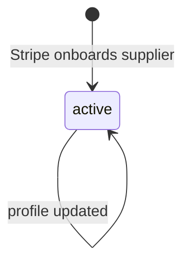
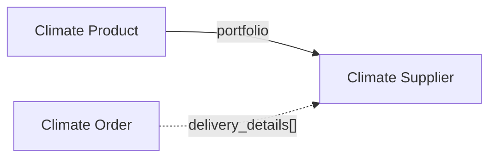

# Climate Supplier

> API resource: `climate.supplier` · API version: `2026-04-22.dahlia` · Category: [Climate](README.md)

## What it is

A `climate.supplier` is a vendor in Stripe's vetted carbon-removal portfolio — Charm Industrial, Heirloom, CarbonCure, Lithos, and so on. Each supplier operates a specific removal pathway (biomass burial, mineralization, direct air capture) at one or more physical sites. The Supplier object exposes their public profile so you can attribute removal to a real-world organization on your sustainability disclosures.

It is read-only. Stripe maintains the supplier list; you can't create, edit, or delete suppliers via API.

## Why it exists

When you tell your customers (or your sustainability report, or the SEC) "we removed N tonnes of CO₂ this quarter," the credible version is "via Charm Industrial in Kansas, USA" rather than "via Stripe Climate." The Supplier object gives you the metadata — name, location, removal pathway, info URL — to render that attribution honestly.

It also lets you display *who* is in a [climate.product](products.md)'s portfolio before purchase, so the engineer placing the order can see exactly which vendors will execute it.

## Lifecycle & states

Suppliers have no `status` field. Stripe's supplier list grows as new vendors clear vetting. Suppliers can be removed from product portfolios when their contracts wind down, but the Supplier object itself remains retrievable so existing order attributions don't dangle.



No terminal states are exposed in the API. A supplier no longer accepting new contracts simply stops appearing in product portfolios.

## Anatomy of the object

### Identity

| Field | Notes |
|---|---|
| `id` | `climsup_…` |
| `object` | `"climate.supplier"` |
| `livemode` | true in live, false in test. The test catalog includes a small synthetic supplier set. |
| `created` | unix seconds. |

### Public profile

| Field | Notes |
|---|---|
| `name` | Display name (e.g. `"Charm Industrial"`). Use in attribution UI. |
| `info_url` | Supplier's public information page. Link out from your sustainability page. |

### Pathway & locations

| Field | Notes |
|---|---|
| `removal_pathway` | enum: `biomass_carbon_removal_and_storage | direct_air_capture | enhanced_weathering` (the catalog may add more over time — handle unknown values defensively). |
| `locations[]` | Array of `{ country, region, city, latitude, longitude }`. Where the supplier physically operates. May contain multiple entries per supplier. Some sub-fields can be null. |

## Relationships



- A Supplier appears in zero or more Product portfolios.
- An Order's `delivery_details[]` array contains Supplier refs once delivery starts. Same Supplier may appear multiple times if they ship in installments.

## Common workflows

### 1. List the catalog for an admin page

```http
GET /v1/climate/suppliers?limit=100
```

Render `name`, `removal_pathway`, and a short string of `locations[].country`. Pair with their `info_url` so users can drill in.

### 2. Render attribution on a customer-facing sustainability page

For each delivered Order, expand or batch-fetch the suppliers in `delivery_details[]` and display:

> "0.42 tonnes removed by **Charm Industrial** (biomass carbon removal and storage), Kansas, USA — delivered 2026-04-15."

### 3. Filter products by pathway

There's no API filter; fetch all products, then for each product join into `suppliers[]` and check `removal_pathway`. Cheap because the catalog is small.

## Webhook events

**No webhook events are emitted for `climate.supplier`.** The only Climate-family events are `climate.order.*` and `climate.product.*`. If your supplier-attribution UI needs to refresh, do it on `climate.product.pricing_updated` (the catalog is small enough that you can re-fetch every supplier on any catalog change) or on a periodic refresh.

## Idempotency, retries & race conditions

- Read-only resource — no idempotency concerns.
- Stale supplier metadata in your cache is essentially harmless: name and pathway rarely change. Refresh weekly is plenty.

## Test-mode tips

- Test-mode exposes a small synthetic supplier set; IDs don't match live. Don't hardcode `climsup_…` values across modes.
- The Stripe CLI: `stripe climate suppliers list` returns the full catalog quickly.
- The Dashboard's Climate page shows the supplier portfolio per product — useful for sanity-checking what your code will render.

## Connect considerations

- Suppliers are global (not partitioned per connected account). Connect doesn't apply.

## Common pitfalls

- **Hardcoding supplier IDs.** Stripe rotates the portfolio over time. Always read fresh.
- **Treating `removal_pathway` as a closed enum.** Stripe is likely to add new pathways (ocean alkalinity enhancement, mineralized aggregate, etc.). Handle unknown values without crashing the page.
- **Not displaying suppliers in attribution.** "We bought carbon removal via Stripe" is weaker than "we bought via Charm Industrial via Stripe Climate." The latter is what auditors and sustainability reviewers expect.
- **Assuming `locations[]` is non-empty or complete.** Some suppliers operate from a single site with full address detail; others have multiple sites with only country populated. Code defensively.

## Further reading

- [API reference: Climate Supplier](https://docs.stripe.com/api/climate/suppliers/object)
- [Stripe Climate supplier portfolio](https://stripe.com/climate/suppliers)
