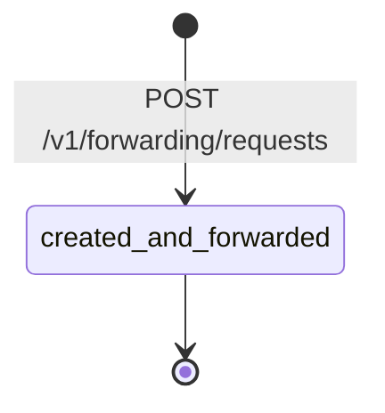
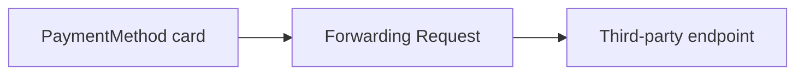

# Forwarding Request

> API resource: `forwarding.request` · API version: `2026-04-22.dahlia` · Category: [Forwarding](README.md)

## What it is

A `forwarding.request` is a single HTTP request Stripe forwards to a third-party endpoint on your behalf, with raw card details (PAN, CVC, expiry, cardholder name) injected from a stored [PaymentMethod](../02-payment-methods/payment-methods.md) just before transmission. You hand Stripe a templated request body containing placeholders; Stripe substitutes the real values inside its PCI environment, posts to the destination URL, captures the response, and returns it to you. Your servers never see the raw card data.

It's an in-line proxy with one job: keep your PCI scope at SAQ-A while you talk to a non-Stripe processor, network token provisioner, fraud vendor, or BIN intelligence service that needs raw card numbers.

## Why it exists

When you migrate processors, integrate a non-Stripe gateway, or call a fraud-prevention API that wants a real PAN, you have two bad options without Forwarding: handle PAN yourself (giant PCI scope upgrade) or stop using that vendor. Forwarding gives you a third option — let Stripe inject the card data into a request *templated by you* and forward it on. The vendor sees the real card; you only see your template and the vendor's response.

It's also the supported way to provision network tokens through partner networks that aren't natively wired into Stripe.

## Lifecycle & states

Forwarding Requests are **synchronous and terminal at creation.** There is no state machine — when `POST /v1/forwarding/requests` returns, the forward has already been attempted and the response (or failure detail) is captured on the object. Subsequent retrievals just return the same record.



The fields you inspect to understand outcome:

- `response_details.status` — the HTTP status the third party returned. Non-2xx is an *application* failure, not a Forwarding failure.
- A non-200 from `POST /v1/forwarding/requests` itself means Stripe couldn't perform the forward (template error, blocked URL, payment method not found, network error reaching the third party). The request object may not be created in those cases.

## Anatomy of the object

### Identity

| Field | Notes |
|---|---|
| `id` | `fwdreq_…` |
| `object` | `"forwarding.request"` |
| `livemode` | true in live, false in test. Test mode forwards using test-mode PaymentMethods (no real PAN). |
| `created` | unix seconds. |
| `metadata` | your bag. Useful for tying the forward to the upstream business event (e.g. `provision_attempt_id`). |

### Source instrument

| Field | Notes |
|---|---|
| `payment_method` | `pm_…` reference to a stored card-type PaymentMethod. Must be a card. Must already exist when the forward is created. |
| `replacements[]` | Array of which fields Stripe should substitute into the outgoing body/headers. Values: `card_number`, `card_expiry`, `card_cvc`, `cardholder_name`, `card_number_prefix`. Only listed fields are substituted; unlisted placeholders are left literal. |

### Destination

| Field | Notes |
|---|---|
| `url` | The third-party URL Stripe will POST to. **Must be on Stripe's allowlist for your account** — Forwarding is not an open proxy. Domains are whitelisted via Stripe support during onboarding. |

### Request you templated

| Field | Notes |
|---|---|
| `request_context.headers` | Headers you supplied (with placeholders). |
| `request_context.body` | Body you supplied (with placeholders like `$$STRIPE_PAN$$`, `$$STRIPE_CVC$$`, `$$STRIPE_EXP_MONTH$$`, `$$STRIPE_EXP_YEAR$$`, `$$STRIPE_CARDHOLDER_NAME$$`). |

### Request actually sent (after substitution)

| Field | Notes |
|---|---|
| `request_details.headers` | Headers as transmitted. **Card values are NOT echoed back here** — Stripe redacts substituted values to keep your scope clean. |
| `request_details.body` | Body as transmitted, with substituted values redacted. |
| `request_details.http_method` | Almost always `POST`. |

### Response captured

| Field | Notes |
|---|---|
| `response_details.headers` | Third party's response headers. |
| `response_details.body` | Third party's response body, captured verbatim. **Read this carefully** — it can contain secrets (network tokens, vendor IDs) you must store for later. |
| `response_details.status` | HTTP status code from the third party. |

## Relationships



- A Forwarding Request is parented to exactly one PaymentMethod and is single-use (one request per object).
- It does not link back to any [PaymentIntent](../01-core-resources/payment-intents.md), [Charge](../01-core-resources/charges.md), or [Customer](../01-core-resources/customers.md). If you need that traceability, put the relevant IDs in `metadata`.

## Common workflows

### 1. Forward a charge to a non-Stripe processor

```http
POST /v1/forwarding/requests
  payment_method=pm_…
  url=https://thirdparty.example.com/v1/charge
  replacements[]=card_number
  replacements[]=card_expiry
  replacements[]=card_cvc
  request[headers][0][name]=Authorization
  request[headers][0][value]=Bearer ABC
  request[headers][1][name]=Content-Type
  request[headers][1][value]=application/json
  request[body]={"amount":1999,"currency":"usd","pan":"$$STRIPE_PAN$$","exp_month":"$$STRIPE_EXP_MONTH$$","exp_year":"$$STRIPE_EXP_YEAR$$","cvc":"$$STRIPE_CVC$$"}
```

Stripe substitutes `$$STRIPE_*$$` placeholders, POSTs to the third party, and returns the captured response in `response_details`.

### 2. Provision a network token

Same shape, different destination. Send the third party's tokenization endpoint, store the returned token from `response_details.body` against your PaymentMethod via metadata or a side table.

### 3. Inspect a past forward

```http
GET /v1/forwarding/requests/fwdreq_…
```

Useful for audit and debugging. Note that `request_details.body` will show redacted values where substitution happened — full PAN is never retrievable after the fact.

### 4. List forwards for reconciliation

```http
GET /v1/forwarding/requests?created[gte]=…&limit=100
```

Iterate to reconcile against the third party's records during a migration.

## Webhook events

**No webhook events are emitted for `forwarding.request`.** It's a synchronous resource; the API response is the only signal you get. If you need durable observability, log the response body and status from the API call into your own pipeline.

## Idempotency, retries & race conditions

- `POST /v1/forwarding/requests` accepts `Idempotency-Key`. Use it. A network blip during the call can otherwise cause your retry to double-charge through the third party — and you have no Stripe-side undo.
- Idempotency caches the response Stripe returned, including the third party's response. This is a feature: a retry within 24h will return the same vendor response without re-hitting them.
- Stripe enforces a per-account rate limit on Forwarding. Treat it as a bursty, low-throughput API.
- Third-party timeouts: Stripe waits up to ~30s for a response. A timeout returns an error; the third party may have processed the request anyway. Build reconciliation that doesn't assume Stripe-side success or failure equates to vendor-side success or failure.

## Test-mode tips

- Test-mode forwards must use a test-mode PaymentMethod. The substitutions inject **test-mode card data** (e.g. `4242…`), not real PANs. This is the only safe way to develop against Forwarding without exposing yourself to PCI scope.
- The destination URL must still be reachable. A common pattern is to point test-mode forwards at a local ngrok tunnel running an echo server, then assert that the body arrived with placeholders substituted.
- Stripe CLI: there's no `stripe trigger` for Forwarding (no events emitted). You exercise the path with real `POST /v1/forwarding/requests` calls.

## Connect considerations

- Forwarding is **platform-account only**. There is no `Stripe-Account` flow for connected accounts. If a connected merchant on your platform needs to forward to a third party, your platform performs the forward on their behalf using a PaymentMethod attached to a customer they own.
- Domain allowlisting is per platform account, not per connected account.

## Common pitfalls

- **Forgetting Forwarding requires Stripe support to enable.** It is not on by default. You'll need to file a request, sign a PCI attestation, and have Stripe whitelist destination domains. Build time around this.
- **High-cardinality logging of `response_details`.** Vendor responses can include large bodies; if you store them all in your DB or logs without trimming, retention costs balloon. Capture a status + extracted fields.
- **Trusting Stripe's redaction for compliance proof.** Stripe redacts substituted values from `request_details`, but your *third party* may log the raw values on their side. Their scope and retention policies matter as much as yours.
- **Using Forwarding to call Stripe APIs.** Don't — there are dedicated SDKs and you lose nothing by talking to Stripe directly. Forwarding is for non-Stripe destinations.
- **Assuming a non-2xx from the third party means Stripe failed.** Stripe succeeded — the *forward* worked. The third party rejected the *contents.* Read `response_details.status` to distinguish.
- **Not handling timeouts.** A 30s deadline ending in error doesn't tell you whether the third party processed the request. Reconcile via the third party's own ledger.
- **Re-forwarding without idempotency.** Double-tokenization or double-charge through a vendor is hard to clean up. Always send `Idempotency-Key`.

## Further reading

- [API reference: Forwarding Request](https://docs.stripe.com/api/forwarding/request/object)
- [Forwarding overview](https://docs.stripe.com/payments/forwarding)
- [PCI scope and SAQ-A](https://docs.stripe.com/security/guide)
