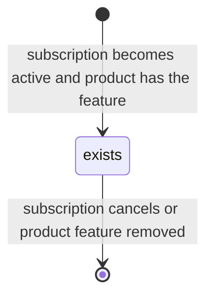
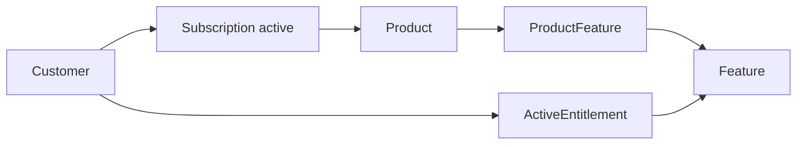

# Active Entitlement

> API resource: `entitlements.active_entitlement` · API version: `2026-04-22.dahlia` · Category: [Entitlements](README.md)

## What it is

An `entitlements.active_entitlement` is the answer to "does *this customer* currently have feature X?" — a single denormalized row that says "yes, customer `cus_…` has feature `feat_…` right now." It is **read-only and computed by Stripe** by joining the customer's active [Subscriptions](../06-billing/subscriptions.md) → their [Products](../03-products/products.md) → attached [ProductFeatures](product-features.md) → underlying [Features](features.md).

You don't create or update Active Entitlements. You list them per customer and treat the result as the source of truth for feature gating.

## Why it exists

Without it, every product team writes the same `is_pro_user(customer)` function: walk the customer's subscriptions, check each is in `active`/`trialing`/`past_due` per your grace policy, look up the Plan IDs, map IDs to feature flags, handle pauses and cancellations-at-period-end. Bugs creep in: a paused subscription incorrectly grants access; a `cancel_at_period_end` subscription incorrectly revokes it; a customer with two subs gets de-duplicated wrong.

Active Entitlements moves that lookup into Stripe. Ask "what features does customer X have right now?" and Stripe returns the merged set, accounting for sub status, multiple subscriptions per customer, and the ProductFeature joins, in one call.

## Lifecycle & states

Active Entitlements have no `status` field. They simply exist (the customer is entitled) or don't (they aren't). The full lifecycle is implicit:



Practically:

- **Comes into existence** when the customer's subscription transitions to a state that grants entitlement (typically `active` or `trialing`) and the subscribed Product has a [ProductFeature](product-features.md) link to the Feature.
- **Disappears** when the gating subscription leaves an entitling state (canceled, unpaid, paused with `mark_uncollectible` per your settings) or the ProductFeature is removed — *but only for new subscriptions*; existing subs keep the entitlement until they themselves end.
- **Whether `past_due` or `paused` keeps the entitlement** depends on Stripe's resolution rules and your account configuration. Treat the API result as authoritative; don't second-guess.

The merged set updates in near-real-time after subscription state changes; the `entitlements.active_entitlement_summary.updated` webhook tells you when to refetch.

## Anatomy of the object

### Identity

| Field | Notes |
|---|---|
| `id` | `ent_…` |
| `object` | `"entitlements.active_entitlement"` |
| `livemode` | true in live, false in test. |

### Pointers

| Field | Notes |
|---|---|
| `customer` | `cus_…`. The customer this row belongs to. |
| `feature` | `feat_…`. Reference to the underlying [Feature](features.md). Expandable. |
| `lookup_key` | The Feature's `lookup_key`, denormalized here for fast access. **This is the field your code should hot-path on** — match against your hardcoded constants like `"api_access"` or `"unlimited_seats"`. |

That's it. The object is intentionally minimal — it is a join row, not a record of state.

## Relationships



Active Entitlement is the materialized output of the chain. It is recomputed by Stripe whenever any link in the chain changes — a sub flipping status, a ProductFeature being attached or detached, a Feature being archived.

## Common workflows

### 1. Gate a request handler

```python
ents = stripe.entitlements.active_entitlements.list(customer=customer_id, limit=100)
keys = {e.lookup_key for e in ents.auto_paging_iter()}
if "api_access" not in keys:
    return 403
```

Cache `keys` for the request lifetime; for hotter paths, cache for a few seconds keyed by customer ID and invalidate on the webhook (below).

### 2. Refresh on webhook

```python
def on_active_entitlement_summary_updated(event):
    customer_id = event["data"]["object"]["customer"]
    refresh_entitlement_cache(customer_id)
```

The `entitlements.active_entitlement_summary.updated` event fires whenever the merged set changes. It is your invalidation signal.

### 3. Bulk audit "who has feature X?"

There's no list-by-feature endpoint. Either iterate your customers and check each, or join your local Subscription/ProductFeature data — Active Entitlements is optimized for `?customer=` lookups.

### 4. Retrieve a single entitlement

```http
GET /v1/entitlements/active_entitlements/ent_…
```

Rarely needed in practice. The list-by-customer flow is the dominant one.

## Webhook events

| Event | Fires when | Listener typically does |
|---|---|---|
| `entitlements.active_entitlement_summary.updated` | The merged entitlement set for a customer changes (subscription transitions, ProductFeature attached/detached, Feature archived). | Re-fetch `GET /v1/entitlements/active_entitlements?customer=cus_…` and refresh your feature-flag cache. |

There is no per-row `created`/`deleted` event. The summary event is the one signal you handle. The event payload includes the affected customer ID — use it as the cache key.

## Idempotency, retries & race conditions

- Read-only resource — no idempotency on writes (there are no writes).
- The summary event is at-least-once. Re-fetching `active_entitlements?customer=…` is idempotent and cheap; do it on every event rather than trying to diff.
- **Lag exists** between a subscription state change (e.g. `customer.subscription.updated` to `canceled`) and the corresponding `entitlements.active_entitlement_summary.updated`. Sub-second to a few seconds. Don't gate critical flows on the assumption they fire simultaneously — if you receive `customer.subscription.deleted`, also invalidate your entitlement cache rather than waiting for the dedicated event.
- The list endpoint is eventually consistent against the underlying subscription state. For absolute correctness during dispute/billing-fraud workflows, fall back to inspecting the [Subscription](../06-billing/subscriptions.md) directly.

## Test-mode tips

- Set up a full Customer → Subscription → Product → ProductFeature → Feature tree in test mode using the Dashboard or fixtures, then exercise:
  - Subscribe → expect entitlement appears.
  - Cancel → expect entitlement disappears.
  - Attach a ProductFeature to an in-flight Subscription's Product → expect it appears for that customer.
- TestClock advances on the underlying [Subscription](../06-billing/subscriptions.md) propagate to entitlements. Useful for testing trial-end transitions.
- `stripe trigger entitlements.active_entitlement_summary.updated` exists for handler smoke tests but is less informative than driving real subscription transitions.

## Connect considerations

- Entitlements are scoped per Stripe account. A platform's Features and a connected account's Features are separate. If a connected merchant on your platform sells Pro features to *their* customers, the Active Entitlements live on that connected account; you query with `Stripe-Account: acct_…`.
- Active Entitlements on the platform account belong to the platform's own Customers (e.g. "is *the merchant* a paying customer of *us*?").

## Common pitfalls

- **Building your own `is_pro(customer)` and trusting it over Active Entitlements.** That's exactly what Entitlements exists to prevent. If you keep a local mirror, refresh aggressively on every webhook.
- **Not handling the `entitlements.active_entitlement_summary.updated` event.** Without it, a customer who upgrades waits until your cache TTL to gain access — bad UX.
- **Treating the absence of an entitlement as "definitely doesn't have access."** During the lag between a subscription becoming `active` and the summary updating (typically <2s but variable), a `list` call may return empty. For the activation path specifically, `customer.subscription.updated` to `active` can be a faster-but-coarser signal.
- **Hardcoding `feature_id` instead of `lookup_key`.** Your code should match on the human-readable lookup key (`"api_access"`); IDs change between accounts and modes.
- **Listing without `customer=`.** The unfiltered list is rarely what you want — it returns rows across customers and quickly hits pagination. Always filter.
- **Misreading "active" as "currently being charged."** A customer in trial has active entitlements; a customer in `past_due` may or may not, depending on settings. Don't assume payment status equals entitlement status — read the API.

## Further reading

- [API reference: Active Entitlement](https://docs.stripe.com/api/entitlements/active-entitlement/object)
- [Entitlements overview](https://docs.stripe.com/billing/entitlements)
- [Subscription state and gating](../06-billing/subscriptions.md)
