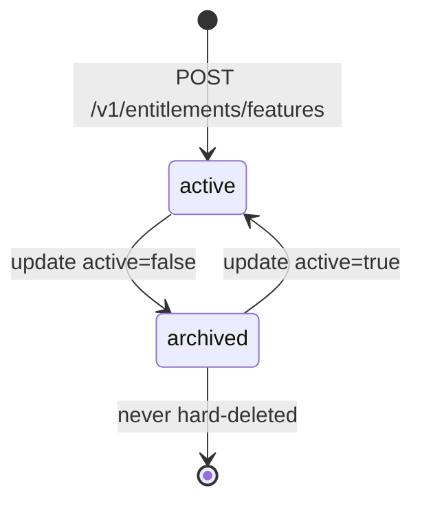
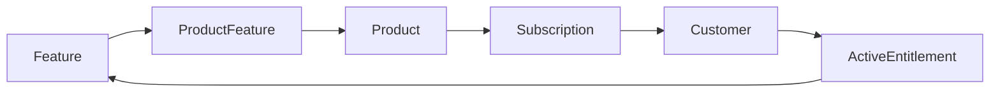

# Feature

> API resource: `entitlements.feature` · API version: `2026-04-22.dahlia` · Category: [Entitlements](README.md)

## What it is

A `entitlements.feature` is a named capability in your product: `api_access`, `unlimited_seats`, `priority_support`, `seat_count_50`. It's the unit you gate code against. Features are defined once in Stripe, attached to one or more [Products](../03-products/products.md) via [ProductFeatures](product-features.md), and surface to your code as [ActiveEntitlements](active-entitlements.md) on a per-customer basis.

A Feature is intentionally just a name with a `lookup_key`. It carries no quantity, no limit, no value — it's a flag. If you need quantitative entitlement (e.g. "5,000 API calls/month"), pair Features with [Billing meters](../06-billing/billing-meters.md) and check both at the gate.

## Why it exists

Putting feature definitions in Stripe rather than your own DB lets product, billing, and engineering reason about the same set of names. Marketing edits a Product to attach `priority_support`; the customer's [ActiveEntitlements](active-entitlements.md) update; your code's check `if "priority_support" in entitlements:` starts returning true — without a deploy, without a schema migration. The Feature is the canonical key both sides agree on.

It also makes "give this customer feature X regardless of plan" tractable: attach a ProductFeature to a Product they're on, or build an "overrides" Product just for grants.

## Lifecycle & states

Features have an `active` boolean. There is no separate `status` enum; "archived" means `active: false`.



- **`active: true`** (default) — the Feature is selectable when creating ProductFeature links. It still appears in lists and can be referenced from code.
- **`active: false`** (archived) — soft-hidden. **Existing ProductFeature links and customer ActiveEntitlements continue to work.** New ProductFeature attachments are blocked. Use this when sunsetting a feature: stop offering it to new Products, but don't disrupt customers already entitled.
- **No hard delete.** Once a Feature exists, its ID is permanent. Archive is the goodbye.

## Anatomy of the object

### Identity

| Field | Notes |
|---|---|
| `id` | `feat_…` |
| `object` | `"entitlements.feature"` |
| `livemode` | true in live, false in test. Test and live Features are independent — IDs do not cross. |
| `metadata` | your bag — useful for tagging features by category, owning team, or release status. |

### Display & key

| Field | Notes |
|---|---|
| `name` | Human-readable label (e.g. `"Priority Support"`). Surfaces in the Dashboard and any hosted UIs that render entitlements. |
| `lookup_key` | String handle your code matches against (e.g. `"priority_support"`). **Treat this as the stable contract** with your application code. Unique within the account; changing it after deploy breaks the gate until your code is updated. |

### State

| Field | Notes |
|---|---|
| `active` | Boolean. `false` = archived. |

That's the entire surface. Features are deliberately thin.

## Relationships



A Feature is referenced by zero or more [ProductFeatures](product-features.md). Each ProductFeature ties it to a Product; subscribing to that Product grants the Feature to the customer as an [ActiveEntitlement](active-entitlements.md).

## Common workflows

### 1. Define your feature taxonomy at setup

Once, when you initially configure billing:

```http
POST /v1/entitlements/features
  name=API Access
  lookup_key=api_access

POST /v1/entitlements/features
  name=Unlimited Seats
  lookup_key=unlimited_seats

POST /v1/entitlements/features
  name=Priority Support
  lookup_key=priority_support
```

Run this from your provisioning pipeline. Use `Idempotency-Key` keyed by `lookup_key` so repeat runs are no-ops.

### 2. Attach a Feature to a Product

See [ProductFeature](product-features.md):

```http
POST /v1/products/prod_…/features
  entitlement_feature=feat_…
```

### 3. Archive a sunset feature

```http
POST /v1/entitlements/features/feat_…
  active=false
```

Existing entitlements survive. New ProductFeature attachments are rejected.

### 4. Rename for display only

```http
POST /v1/entitlements/features/feat_…
  name=API Access (v2)
```

`lookup_key` stays the same; your code keeps working. Only the human-readable label changed.

### 5. List features for an admin UI

```http
GET /v1/entitlements/features?limit=100
```

Display `name`, `lookup_key`, and `active`. Filter `active=true` for the picker your operators use when attaching to Products.

## Webhook events

The Entitlements feature object emits **no per-resource webhook events** in the published catalog. Changes propagate via:

- The downstream `entitlements.active_entitlement_summary.updated` event when archiving a Feature alters customer entitlements (rare — archiving doesn't revoke existing entitlements, only blocks new attachments).
- Direct effect on [Product](../03-products/products.md) and [ProductFeature](product-features.md) interactions.

If you need to track Feature definition changes, poll `GET /v1/entitlements/features` periodically, or read the audit log.

## Idempotency, retries & race conditions

- Always send `Idempotency-Key` on `POST /v1/entitlements/features` keyed by `lookup_key`. Otherwise a retry can produce two Features with the same `name` (Stripe does **not** dedupe by `lookup_key` on the server — it enforces uniqueness, but a retry with the same key returns the conflict, not the existing row, unless you idempotency-key correctly).
- Updates to `name` are last-write-wins. Updates to `lookup_key` are technically allowed but operationally hazardous — see pitfalls.
- A Feature created moments before a ProductFeature attachment may not be queryable in list responses immediately, but is usable by ID. Use the ID returned from the create call directly.

## Test-mode tips

- Test-mode and live-mode Features are completely separate. Provision the same `lookup_key` set in both modes during setup.
- The Stripe CLI: `stripe entitlements features create --name "API Access" --lookup-key api_access` is the fastest seed.
- For end-to-end tests, build the full pipeline: create Feature → create Product → attach ProductFeature → create Subscription → list ActiveEntitlements and assert your `lookup_key` appears.

## Connect considerations

- Features are per-account. A connected account's Features are independent of the platform's. If your platform supplies the feature taxonomy to merchants, you'll need to provision Features on each connected account (typically via `Stripe-Account: acct_…` headers in your onboarding pipeline).

## Common pitfalls

- **Changing `lookup_key` after deploy.** Your code matches on the key; a rename instantly breaks every gate keyed on the old value. If you must rename, do a coordinated migration: deploy code that accepts both keys, then change the key, then remove the old code path.
- **Encoding business logic in `name`.** Keep `name` as a human label. The machine-readable contract is `lookup_key`.
- **Treating `active=false` as "revoke for everyone."** It doesn't revoke. Archiving stops new attachments; existing customers keep the entitlement until their subscription ends or you remove the ProductFeature. To revoke, change Subscriptions or remove ProductFeatures.
- **One Feature per Plan.** Anti-pattern. Features should be product capabilities (`api_access`), not billing tiers (`pro_plan`). Tiers are Products; Features are what tiers grant.
- **Mixing live and test IDs.** Live `feat_…` won't resolve in test mode and vice versa. Keep environment-keyed config.
- **Skipping idempotency on provisioning.** A re-run of your setup script without idempotency keys creates duplicate Features with conflicting `lookup_key`s, which then fail in confusing ways.

## Further reading

- [API reference: Feature](https://docs.stripe.com/api/entitlements/feature/object)
- [Entitlements overview](https://docs.stripe.com/billing/entitlements)
- [ProductFeature: attaching features to products](product-features.md)
- [ActiveEntitlement: querying customer entitlements](active-entitlements.md)
