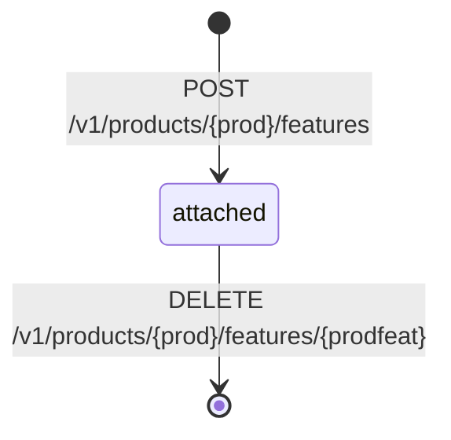
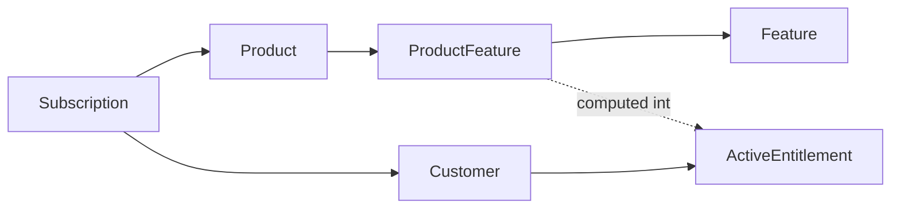

# Product Feature

> API resource: `product_feature` · API version: `2026-04-22.dahlia` · Category: [Entitlements](README.md)

## What it is

A `product_feature` is the join row that attaches an [entitlements.feature](features.md) to a [Product](../03-products/products.md). It says: "Customers subscribed to this Product get this Feature." Stripe combines all ProductFeatures across a customer's active subscriptions to compute their [ActiveEntitlements](active-entitlements.md).

It's a thin link table — no quantities, no limits, no overrides. Just `(product, feature)` plus housekeeping fields. The interesting behavior comes from how Stripe joins it during entitlement computation.

## Why it exists

Without ProductFeature, you'd hard-code "Pro plan grants `api_access`, `unlimited_seats`, `priority_support`" inside your application's plan-to-features mapping. Adding a feature to the Pro plan would require a deploy. Trialing a plan with a different feature mix would require a deploy. ProductFeature moves that mapping into Stripe so product/marketing can edit it from the Dashboard, and your code reads the resulting [ActiveEntitlements](active-entitlements.md) without caring how the join was constructed.

It also enables fine-grained A/B-testing: clone a Product, attach different ProductFeatures, send a slice of new sign-ups to the variant, and you've changed feature mix without touching code.

## Lifecycle & states

ProductFeatures have no `status` enum and no archive flag. They exist or they don't. The lifecycle is simply create-and-delete:



- **Attached** — the link exists; subscribers to the Product get the Feature in their [ActiveEntitlements](active-entitlements.md).
- **Deleted** — the link is gone. **Critical caveat:** removing a ProductFeature does *not* immediately revoke entitlements from existing subscribers. It stops *new* subscriptions to that Product from granting the Feature; existing subs keep the entitlement until their own lifecycle ends (cancellation, expiration). To revoke immediately, end the subscription itself.

There is no "draft" or "scheduled" state. Attach is instant; detach is instant for new sign-ups, deferred for existing ones.

## Anatomy of the object

### Identity

| Field | Notes |
|---|---|
| `id` | The exact prefix may vary across SDK versions — common forms are `feat_link_…` or similar. Treat as opaque. |
| `object` | `"product_feature"` |
| `livemode` | true in live, false in test. |

### Pointers

| Field | Notes |
|---|---|
| `product` | `prod_…` of the Product this attachment hangs off. Immutable. |
| `entitlement_feature` | The linked [Feature](features.md). May be returned as an ID (`feat_…`) or expanded to the full Feature object depending on response shape. (In some SDKs the field is exposed as `feature` — check your library's mapping.) |

That's it. The object is intentionally minimal — there are no quantities, no per-link metadata, no toggle. If you need richer "how much of feature X" semantics, pair with [Billing meters](../06-billing/billing-meters.md) on the same subscription.

## Relationships



- A Product can have many ProductFeatures (one per Feature it grants).
- A Feature can be referenced by many ProductFeatures (across many Products).
- Combination is unique: you can't attach the same Feature to the same Product twice.

## Common workflows

### 1. Attach a Feature to a Product

```http
POST /v1/products/prod_…/features
  entitlement_feature=feat_…
```

The endpoint is **nested under the Product** — there is no top-level `POST /v1/product_features`. The response includes the new ProductFeature ID.

### 2. List a Product's Features

```http
GET /v1/products/prod_…/features?limit=100
```

Useful for an admin UI showing "what does the Pro plan include?" Each row references a Feature; expand to get the Feature's `lookup_key` and `name`.

### 3. Detach a Feature

```http
DELETE /v1/products/prod_…/features/{prodfeat_id}
```

New subscribers to this Product no longer get the Feature. **Existing subscribers keep it** until their subscription ends. To force immediate revocation, also cancel or modify their subscriptions.

### 4. Provision a full plan from your build pipeline

```python
for feature_key in ["api_access", "unlimited_seats", "priority_support"]:
    feat = features.create(name=…, lookup_key=feature_key, idempotency_key=feature_key)
    products.create_feature(
        product="prod_acme_pro",
        entitlement_feature=feat.id,
        idempotency_key=f"prod_acme_pro:{feature_key}",
    )
```

Idempotency-keyed by `(product, feature_key)` so re-runs are no-ops.

### 5. Move a Feature from Pro to Enterprise

Detach from Pro, attach to Enterprise. Existing Pro subscribers keep the Feature (deferred-revoke), new Pro subs don't get it, all Enterprise subs get it. If the goal is "everyone on Pro who currently has X loses X immediately," you'd additionally need to migrate or modify each existing Pro subscription.

## Webhook events

ProductFeature changes do not emit a dedicated per-row event in the published catalog. Their effects propagate through:

- `entitlements.active_entitlement_summary.updated` — fires per-customer when the merged entitlement set changes (e.g. when a new ProductFeature attachment grants a Feature to all current subscribers of that Product, or when removal eventually trims a customer's set).
- `product.updated` may fire on the parent Product as a side effect.

Listen on the summary event and refresh customer entitlement caches.

## Idempotency, retries & race conditions

- Send `Idempotency-Key` on the attach POST keyed by `(product_id, feature_id)` (e.g. `pf:prod_acme_pro:api_access`). The endpoint will reject duplicate attachments with a 400, but a network retry without idempotency could surface that as a confusing failure rather than a no-op.
- Detach is idempotent server-side: deleting an already-deleted link returns a 404. Treat 404 as success in your reconciliation code.
- After attach, the propagation to existing customers' [ActiveEntitlements](active-entitlements.md) is eventually consistent — typically sub-second to a few seconds, with a `entitlements.active_entitlement_summary.updated` per affected customer.
- After detach, propagation depends on subscription lifecycle. New subs see the change immediately; existing subs keep the entitlement until they end. There is no guaranteed timing for when "all existing customers no longer have it" — it's whenever they each individually unsubscribe.

## Test-mode tips

- Test-mode ProductFeatures and live-mode ProductFeatures are completely separate. Provision both during setup if you want parity.
- For end-to-end tests: create Customer → Subscribe to a Product → list ActiveEntitlements (assert empty) → attach a ProductFeature → list ActiveEntitlements (assert the Feature now appears) → detach → list (asserts it stays for this customer until you cancel the sub).
- TestClock advances on the underlying [Subscription](../06-billing/subscriptions.md) propagate to entitlement computation as expected.

## Connect considerations

- Features, Products, and ProductFeatures are all per-account. Attachments live on the same account as the Product. If your platform owns Features and connected accounts own Products, you'll need to provision Features on each connected account first, then attach.
- For Connect platforms providing a curated feature taxonomy, treat ProductFeature provisioning as part of merchant onboarding.

## Common pitfalls

- **Expecting detach to revoke immediately.** It doesn't, for existing subscribers. This is the single most common surprise. Plan: announce → detach (stops new sign-ups) → migrate existing subs → cancel/modify the leftover subs to actually revoke.
- **Attaching a Feature to a Product that no Subscription touches.** Customers don't magically get Features by Product existence — they get them by *subscribing* to a Product. A Product with attached Features and no subscribers grants nothing.
- **Treating ProductFeature as the place to encode quantity.** It's a flag, not a counter. Use [Billing meters](../06-billing/billing-meters.md) for "5,000 calls included," and use the Feature only as a coarse "metered API access" gate.
- **Using a top-level `/v1/product_features` endpoint.** It doesn't exist. Always go through `/v1/products/{product}/features`.
- **Forgetting that the same Feature can be attached to multiple Products.** A customer subscribed to two Products that both grant `api_access` will have one entitlement, not two — Active Entitlements deduplicate by Feature.
- **Not handling 404 on detach.** A retry of a detach that already succeeded returns 404. Treat as idempotent success in your code.
- **Testing only attach paths.** Make sure your handler also re-fetches entitlements after detach + subscription cancellation, since that's the path through which access actually goes away.

## Further reading

- [API reference: Product Feature](https://docs.stripe.com/api/product-feature/object)
- [Attach features to products](https://docs.stripe.com/api/product-feature/create)
- [Entitlements overview](https://docs.stripe.com/billing/entitlements)
- [Feature](features.md) and [ActiveEntitlement](active-entitlements.md)
