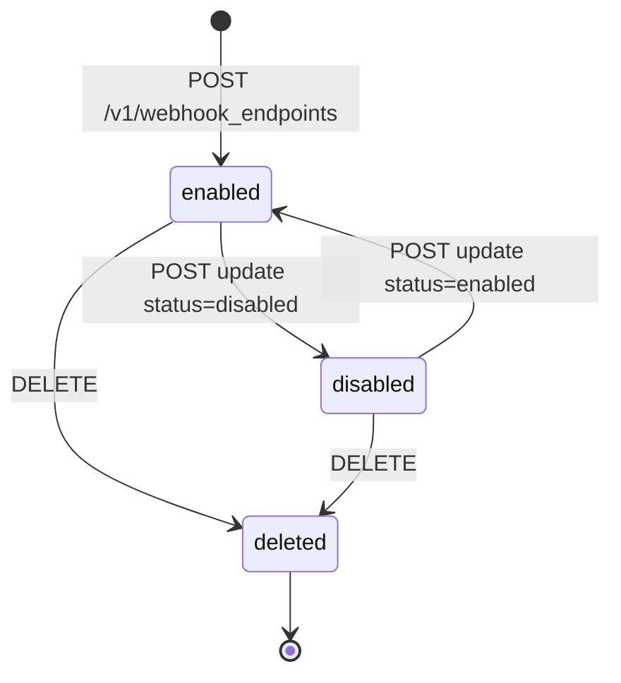
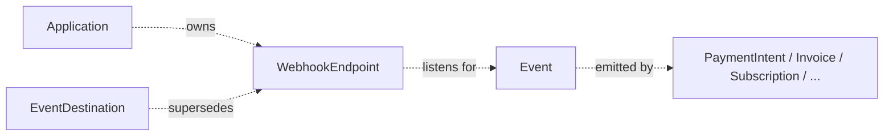

# Webhook Endpoint

> API resource: `webhook_endpoint` · API version: `2026-04-22.dahlia` · Category: [Webhooks](README.md)

## What it is

A `WebhookEndpoint` is a registered HTTPS URL on your servers that Stripe POSTs [Event](../01-core-resources/events.md) payloads to whenever something happens in your account. The object is purely *configuration* — it tells Stripe **where** to send events, **which** events to send, and **what version** to render them in. It is not the events themselves; those are independent `Event` objects that Stripe fans out to every subscribed endpoint.

Each endpoint has its own signing secret (`whsec_…`). That secret is the *only* reason your handler can trust an incoming POST is really from Stripe — anyone can hit your URL with arbitrary JSON, so signature verification is mandatory.

## Why it exists

Polling Stripe for state changes doesn't scale and loses time-sensitive signals (3DS challenges, dispute notifications, async payment settlement). Webhooks invert the relationship: Stripe pushes when something changes, you react. The `WebhookEndpoint` object is how Stripe knows which URLs to push to and what events you care about.

A single account often has several endpoints — one per service that needs events (orders service, fraud service, analytics pipeline, internal Slack bridge), each with its own `enabled_events` whitelist and its own secret so a leak in one doesn't compromise the others.

> Note: Stripe is gradually replacing `webhook_endpoint` with the more general [EventDestination](../01-core-resources/event-destinations.md), which can also push to Amazon EventBridge. Both work in `2026-04-22.dahlia`. New code can use either.

## Lifecycle & states



- **`enabled`** — Stripe delivers matching events. Failures retry on an exponential schedule (typically up to ~3 days). Persistent failures may auto-disable the endpoint and email you.
- **`disabled`** — Endpoint exists but receives no events. Useful when a downstream service is in maintenance and you don't want a retry backlog. Re-enable to resume.
- **`deleted`** — Tombstoned. The `whsec_…` secret stops verifying immediately. Cannot be restored — recreate to get a new endpoint with a new secret.

> Auto-disable: if Stripe gets sustained 4xx/5xx responses or timeouts for many hours, it disables the endpoint and emails the account owner. Once you fix the receiver, flip `status` back to `enabled`.

## Anatomy of the object

### Identity

| Field | Notes |
|---|---|
| `id` | `we_…` |
| `object` | always `"webhook_endpoint"` |
| `livemode` | true in live, false in test. Endpoints are mode-scoped — a test endpoint never receives live events. |
| `created` | unix seconds. |
| `description` | Optional human label. Use this; the Dashboard list gets unreadable fast. |
| `metadata` | Standard key/value bag. |

### Delivery configuration

| Field | Notes |
|---|---|
| `url` | The HTTPS URL Stripe POSTs to. Must be publicly reachable; `localhost` won't work outside `stripe listen`. Stripe enforces HTTPS in live mode. |
| `enabled_events` | Array of event-type strings (`payment_intent.succeeded`, `invoice.paid`, …) **or** `["*"]` for every event Stripe emits. See the [event catalog](../_meta/webhook-catalog.md). |
| `status` | `enabled` or `disabled`. |
| `api_version` | The `Stripe-Version` Stripe renders the event payload against. **Independent of your account default.** Pin it explicitly so a Dashboard upgrade doesn't silently reshape your event payloads. |

### Signing

| Field | Notes |
|---|---|
| `secret` | `whsec_…`. **Returned only on creation and on rotate.** Store it immediately in your secret manager — Stripe will never show it again. |

### Connect

| Field | Notes |
|---|---|
| `application` | If non-null, the `ca_…` of the Connect application that owns this endpoint (created by an OAuth-installed app). Such endpoints receive events for **all** connected accounts under that application — events arrive with `account` set to the originating connected account. |

## Relationships



- A `WebhookEndpoint` has a many-to-many relationship with Event types: one endpoint can subscribe to many event types; one event is fanned out to many endpoints.
- Connect application-owned endpoints receive cross-account events; account-owned endpoints receive only events for the account they were created on.

## Common workflows

### 1. Create an account-level endpoint

```http
POST /v1/webhook_endpoints
  url=https://api.example.com/stripe/webhooks
  enabled_events[]=payment_intent.succeeded
  enabled_events[]=payment_intent.payment_failed
  enabled_events[]=charge.dispute.created
  api_version=2026-04-22.dahlia
  description=Production order service
```

The response includes `secret: whsec_…`. **Capture it immediately**; subsequent reads of the endpoint won't return it.

### 2. Verify a webhook on receipt

The `Stripe-Signature` header looks like `t=1715000000,v1=abc123…,v1=def456…`. The `t` is a unix timestamp, the `v1`s are HMAC-SHA256 signatures of `${t}.${rawBody}` keyed by your `whsec_…`. Multiple `v1`s appear during a secret rotation window.

```js
// Node.js — let the SDK do this
const event = stripe.webhooks.constructEvent(
  rawBody,                 // RAW request body, NOT JSON.parse'd
  req.headers['stripe-signature'],
  process.env.STRIPE_WEBHOOK_SECRET
);
```

The SDK enforces a 5-minute timestamp tolerance (configurable) to defeat replay attacks. **Do not hand-roll verification** — getting timing-attack-resistant string comparison and the multi-signature rotation case right is fiddly.

### 3. Rotate the signing secret

```http
POST /v1/webhook_endpoints/we_…/rotate_secret
  expires_in=86400         # old secret keeps working for 24h
```

The response carries the new `whsec_…`. Deploy it; both old and new sign valid `v1` entries until `expires_in` elapses, so there's no zero-downtime gap.

### 4. Temporarily pause an endpoint

```http
POST /v1/webhook_endpoints/we_…
  disabled=true            # or status=disabled depending on SDK
```

Stripe stops delivering. Re-enable when you're ready. Note: events that *would have* been delivered while disabled are not buffered — they're emitted to other endpoints in real time and dropped for this one.

### 5. Connect platform endpoint receiving events for all connected accounts

```http
POST /v1/webhook_endpoints
  url=https://platform.example.com/stripe/connect-webhooks
  enabled_events[]=account.updated
  enabled_events[]=charge.dispute.created
  connect=true
```

Events arriving here have `event.account = "acct_…"` so your handler knows which connected account the event came from. The signing secret is per-endpoint (still one `whsec_…`).

## Webhook events

The `WebhookEndpoint` object itself emits **no events**. (You won't find `webhook_endpoint.created` in the catalog.) Configuration changes are silent — manage them via your IaC of choice (Terraform Stripe provider, custom scripts) and version-control the desired state.

For the events your endpoints will actually receive, see [_meta/webhook-catalog.md](../_meta/webhook-catalog.md).

## Idempotency, retries & race conditions

- **Stripe retries failed deliveries** with exponential backoff for up to ~3 days. Your handler must be idempotent: same `event.id` arriving twice should be a no-op the second time. Persist seen `event.id`s in a dedupe table with a TTL of 7+ days.
- **Order is not guaranteed.** Two events for the same object may arrive out of order. For high-stakes state machines, refetch the object from the API in the handler instead of trusting the embedded payload.
- **Synchronous responses can race webhooks.** A `payment_intent.succeeded` webhook can arrive *before* your client-side `confirmPayment` promise resolves. Treat the webhook as authoritative.
- **Send `Idempotency-Key` on `POST /v1/webhook_endpoints`** so a network retry doesn't create two endpoints (and two `whsec_…`s) for the same URL.

## Test-mode tips

- `stripe listen --forward-to localhost:3000/webhooks` creates a temporary tunnel, prints a `whsec_…`, and streams every test-mode event to your local box. No need to expose `localhost`.
- `stripe trigger payment_intent.succeeded` emits a fully-formed test event so you can exercise handlers without driving the full payment flow.
- The Dashboard's *Webhooks → endpoint → Send test event* button picks any event type and POSTs a synthetic payload — useful for smoke tests after a deploy.
- A test-mode endpoint and a live-mode endpoint are completely separate objects with separate secrets. Don't try to share configuration.

## Connect considerations

- **`connect=true` at creation** marks the endpoint as a Connect (cross-account) endpoint. It will receive events for every connected account on your platform with `event.account` set to the originating connected account.
- **Connect-installed app endpoints** (created via OAuth handshake) have `application` set to the app's `ca_…`. Stripe routes events for any account that installed your app to this endpoint.
- The `Stripe-Account` header is **not** used at endpoint creation for `connect=true` endpoints — the platform creates them on itself, not on a connected account.
- For per-merchant endpoints (rare but possible: a connected account installs its own webhook), use `Stripe-Account: acct_…` at creation; that endpoint then only receives that account's events.

## Common pitfalls

- **Not verifying signatures.** Without `constructEvent`, anyone who knows your URL can POST a fake `payment_intent.succeeded` and your fulfillment logic will ship goods. *Verify every request.*
- **Parsing the body before verifying.** SDK signature verification needs the **raw bytes**. If your framework auto-parses JSON before your handler runs (Express `body-parser` default, NestJS pipes, etc.), capture the raw body separately or signature verification will fail.
- **Endpoint timing out.** Stripe's delivery timeout is short (a few seconds). If your handler does heavy work synchronously, push to a queue and return `200` immediately — otherwise Stripe will retry and your handler will run twice.
- **`api_version` drift.** If you upgrade your account default but never recreate the endpoint, the endpoint stays pinned to the old version. Payloads suddenly look "old" relative to the API responses your code reads. Either set `api_version` explicitly on every endpoint or recreate after upgrading.
- **Subscribing to `*` in production.** Convenient in dev, dangerous later: when Stripe ships a new event type your handler has never seen, you'll start receiving it with no code path. Subscribe to an explicit list in prod.
- **Rotating the secret without `expires_in`.** Old signatures stop verifying instantly; in-flight retries fail. Always rotate with a window.
- **Storing the `whsec_…` only in the Dashboard.** It's only displayed once. If you lose it, you must rotate.
- **Treating webhook payload as canonical for high-stakes ops.** It's a snapshot. The API is the source of truth — refetch before refunding $50,000.

## Further reading

- [API reference: WebhookEndpoint](https://docs.stripe.com/api/webhook_endpoints/object)
- [Stripe webhooks guide](https://docs.stripe.com/webhooks)
- [Verify signatures](https://docs.stripe.com/webhooks/signatures)
- [EventDestination](../01-core-resources/event-destinations.md) — the successor primitive.
- [Event catalog](../_meta/webhook-catalog.md) — every event type, grouped by source.
