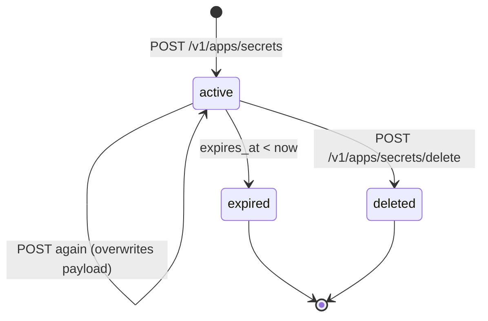
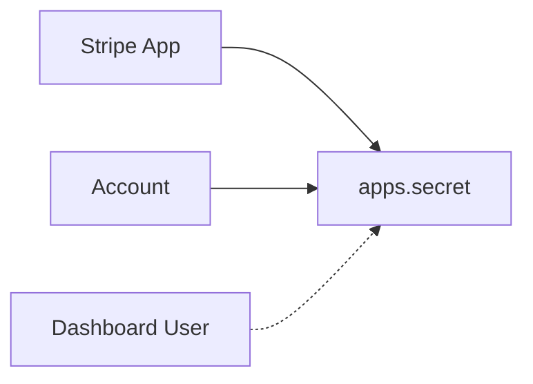

# Apps Secret

> API resource: `apps.secret` · API version: `2026-04-22.dahlia` · Category: [Apps](README.md)

## What it is

An `apps.secret` is a server-managed key/value entry encrypted at rest by Stripe and scoped to a single installed Stripe App on a single Stripe account. Each entry is identified by a `name` (string) within a `scope` (either the whole account, or a specific Dashboard user inside that account). The encrypted `payload` is opaque to Stripe — it's whatever bytes your App needs to remember between invocations.

This is not a general-purpose secret store for your application backend. It exists specifically so a Stripe App that runs inside a merchant's Dashboard has somewhere to stash per-installation state (OAuth tokens to your service, per-merchant configuration, ephemeral cursors) without you having to host a separate database keyed by Stripe account ID.

## Why it exists

Stripe Apps are installable extensions: a merchant clicks "install" on your App in the Stripe App Marketplace, your code starts running inside their Dashboard. Now you have a problem — you need somewhere to remember "this merchant's OAuth refresh token to my service is X." Options before this resource:

- Stand up your own backend, key it by `acct_…`. Most App developers don't want to operate a server just to store a token.
- Stuff state into account `metadata`. Bad: metadata is plaintext, size-capped, visible to the merchant, and anyone with API keys.

`apps.secret` solves this: encrypted, scoped to your App, accessible only with the App's own restricted keys. It is the only Stripe-managed persistence Stripe offers to App developers.

> Hedge: this resource is specifically for Stripe App developers. Normal payments / billing integrations have no reason to touch it. If you're not building a Stripe App, you can skip this page.

## Lifecycle & states

Secrets don't have a `status` enum. They exist or they don't.



- **Active.** Readable via `GET /v1/apps/secrets/find`. Listable via `GET /v1/apps/secrets`. Re-POSTing the same `name` + `scope` overwrites the `payload` (this is the update path — there's no `POST /v1/apps/secrets/:id`).
- **Expired.** If you set `expires_at`, Stripe stops returning the secret on `find` once that time passes. Effectively a TTL.
- **Deleted.** Tombstoned. The same `name` + `scope` can be reused immediately by a fresh `POST /v1/apps/secrets` — Stripe treats it as a new secret.

The terminal `deleted: true` flag mirrors the soft-delete pattern used elsewhere in the API.

## Anatomy of the object

### Identity

| Field | Notes |
|---|---|
| `id` | `secret_…` — opaque. **You generally don't address secrets by ID** — addressing is by `name` + `scope`. |
| `object` | always `"apps.secret"` |
| `livemode` | true in live, false in test. Test and live secrets are independent. |
| `created` | unix seconds. |
| `deleted` | only present (and `true`) on tombstoned reads. |

### Naming & scope

| Field | Notes |
|---|---|
| `name` | The lookup key. Free-form string up to a modest length. **This is what your code uses to fetch the secret back.** |
| `scope.type` | `"account"` or `"user"`. `account` = visible to your App across all Dashboard users on this account. `user` = visible only when the secret was written and read by the same Dashboard user. |
| `scope.user` | Only when `scope.type = "user"`. The `usr_…` ID of the Dashboard user the secret is bound to. |

### Payload & expiry

| Field | Notes |
|---|---|
| `payload` | The encrypted blob. Returned as plaintext when *you* fetch it via `find` (because you authenticated with the App's restricted key). Stripe encrypts at rest. Size cap is small — store opaque tokens, not large blobs. |
| `expires_at` | Optional unix seconds. After this, the secret is no longer returned by `find`. Useful for OAuth access tokens. |

## Relationships



- A secret is **owned** by the (Stripe App) × (Account) tuple. A different App on the same account cannot read it. The same App on a different account cannot read it.
- `scope.type=user` adds a third axis: only the same Dashboard user can read it back. Useful for per-user OAuth tokens within a merchant team.

## Common workflows

### 1. Save a per-account OAuth token

```http
POST /v1/apps/secrets
  name=my_service.refresh_token
  payload=ya29.A0AfH6SM…
  scope[type]=account
  expires_at=1715000000
Authorization: Bearer rk_live_…           # restricted key with apps_secrets_write
```

The next time your App runs on this account (any user), it can fetch the token back.

### 2. Read a secret back

```http
GET /v1/apps/secrets/find?name=my_service.refresh_token&scope[type]=account
Authorization: Bearer rk_live_…
```

The response includes the plaintext `payload`. If the secret has expired or never existed, you get a 404.

### 3. Per-Dashboard-user secret

```http
POST /v1/apps/secrets
  name=my_service.preferences
  payload={"theme":"dark"}
  scope[type]=user
  scope[user]=usr_abc123
```

`usr_abc123` is the Dashboard user the App is currently running for — your App's UI extension can read this from the App SDK context.

### 4. Delete a secret

```http
POST /v1/apps/secrets/delete
  name=my_service.refresh_token
  scope[type]=account
```

Note: `delete` is `POST` to a sub-route, **not** `DELETE /v1/apps/secrets/:id`, because secrets are addressed by name + scope, not by `id`.

### 5. List all secrets at a scope

```http
GET /v1/apps/secrets?scope[type]=account&limit=100
```

Standard cursor pagination via `starting_after`.

## Webhook events

`apps.secret` emits **no webhook events**. Secrets are a pure read/write store; there's no async lifecycle and Stripe doesn't broadcast their changes.

If your App needs to react to "the merchant did X," subscribe to the relevant business event (`payment_intent.succeeded`, `account.updated`, etc.) via a regular [WebhookEndpoint](../19-webhooks/webhook-endpoints.md) instead.

## Idempotency, retries & race conditions

- **`POST /v1/apps/secrets` is naturally idempotent on `(name, scope)`.** Re-posting the same name overwrites the payload. You don't strictly need an `Idempotency-Key`, but sending one is still good hygiene to avoid double-overwrites in concurrent flows.
- **Concurrent writes are last-write-wins.** Two App instances writing the same `name` + `scope` simultaneously: whichever Stripe processes second wins. If you need atomic compare-and-swap, add a version suffix to the `name` and read-then-write with retry.
- **`find` is strongly consistent** with the most recent successful write you observed.

## Test-mode tips

- Test-mode and live-mode secrets are entirely separate. A secret named `foo` in test mode is invisible from a live API key.
- Stripe CLI doesn't have a dedicated `stripe apps secrets` command surface in all versions; use `curl` against `/v1/apps/secrets` with a test-mode restricted key while iterating.
- Inside Stripe App development, the App SDK injects the right restricted key into your backend handler — you don't manage the key yourself.

## Connect considerations

`apps.secret` is per-account: when your Stripe App is installed on account A and account B, each install has its own independent secret namespace. There is no `Stripe-Account` header gymnastics — the restricted key for the App on account A only resolves to account A's secrets.

If your App is built on a Connect platform model, do **not** try to share secrets across the platform's accounts via this resource — it's not designed for cross-account fan-out.

## Common pitfalls

- **Calling these endpoints with a normal `sk_…` key.** They require a restricted key with `apps_secrets_*` scopes, issued in your App's Dashboard. Regular secret keys 403 on `/v1/apps/secrets/*`.
- **Treating `apps.secret` as a generic KV store for your backend.** It's not. It's scoped to a Stripe App installation. If you need a database, use one.
- **Name collisions across `account` and `user` scope.** `name=token` in account scope and `name=token` in user scope are *different* secrets. Stripe routes by `(name, scope.type, scope.user)`, not by `name` alone.
- **Storing large blobs.** The `payload` field has a small cap. Store an opaque reference (URL, ID) and keep the blob elsewhere if it's bigger than a few KB.
- **Forgetting `expires_at` for OAuth access tokens.** Without an expiry, you'll happily attempt to use a stale access token forever. Set `expires_at` to (issue time + token lifetime − a margin) and re-fetch when `find` 404s.
- **Assuming deletion clears caches.** Stripe's read path is fast but if your App caches the payload in process memory, deleting via API doesn't notify your cache. Invalidate yourself.
- **Logging the `payload`.** Don't. The whole point is encrypted-at-rest storage; a log line undoes that.

## Further reading

- [API reference: Apps Secret](https://docs.stripe.com/api/apps/secrets/object)
- [Stripe Apps overview](https://docs.stripe.com/stripe-apps)
- [Secret store guide](https://docs.stripe.com/stripe-apps/store-auth-data-custom-objects)
- [Restricted API keys](https://docs.stripe.com/keys#limit-access)
