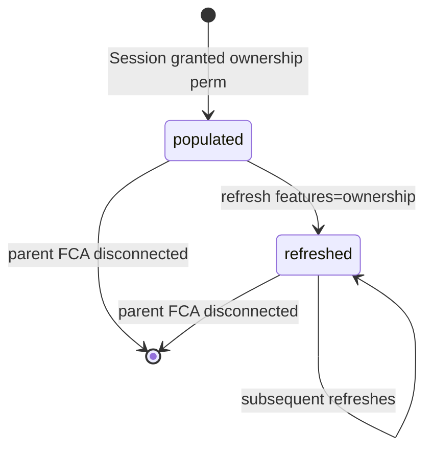
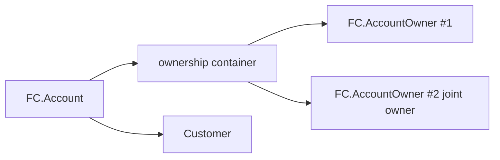

# FinancialConnections AccountOwner

> API resource: `financial_connections.account_owner` · API version: `2026-04-22.dahlia` · Category: [Financial Connections](README.md)

## What it is

A `financial_connections.account_owner` (FCAO) is **the identity the bank has on file for the connected account** — the name, address, email, and phone the customer registered with their institution. One [FC Account](accounts.md) can have multiple owners (joint checking, business accounts with signers).

You only get owner data if the [Session](sessions.md) requested the `ownership` permission *and* the institution actually returns it. Treat ownership data as best-effort: a sizeable minority of US banks omit some fields, and a handful return nothing at all.

## Why it exists

Two jobs:

1. **KYC matching.** You collected a name on signup ("Jane Doe"); the bank says the account is owned by "Jane M. Doe" at "123 Oak St." Match → confidence boost. Mismatch → friction signal.
2. **Fraud signals for ACH/underwriting.** A bank account whose owner doesn't match the Stripe Customer is a classic mule pattern. FCAO lets you score this before debiting.

Without FCAO you'd have to take the customer's claimed identity at face value, or buy KYC data from a third party.

## Lifecycle & states

FCAO has no `status` of its own. It exists as a snapshot tied to its parent FCA's `ownership` object, and is overwritten whenever the FCA's ownership data refreshes.



The "lifecycle" you actually care about is **`refreshed_at`** — when did Stripe last pull this from the institution? Stale owner data can be months old if you never trigger a refresh.

## Anatomy of the object

### Identity

| Field | Notes |
|---|---|
| `id` | `fcao_…` |
| `object` | `"financial_connections.account_owner"` |
| `ownership` | ID of the parent ownership container (an internal grouping object on the FCA). Use this to correlate multiple owners returned together. |
| `refreshed_at` | unix seconds — when Stripe last pulled this from the bank. |

### Identity fields (best-effort)

| Field | Notes |
|---|---|
| `name` | Full name as the bank has it. May include middle initial, titles, suffix — bank-formatted, not normalized. |
| `email` | The email on file at the bank. Often differs from the email the customer gave *you*; that's the whole point. May be null. |
| `phone` | Same: bank-on-file phone, possibly null. |
| `address.line1`, `line2`, `city`, `state`, `postal_code`, `country` | Bank-on-file address. Country is ISO-3166-1 alpha-2. Any sub-field can be null depending on what the institution returns. |

There are no money or status fields — FCAO is purely identity payload.

## Relationships



- An FCA references one ownership container; the container holds 1..n `AccountOwner` objects.
- There is no direct link from `AccountOwner` back to a Stripe [Customer](../01-core-resources/customers.md) — *you* compute the match using the Customer's `name`/`email`/`address` against the FCAO fields.

## Common workflows

### 1. List owners for an account

```http
GET /v1/financial_connections/accounts/fca_…/owners
```

Returns up to 100 per page. Most accounts have one owner; joint and business accounts may have more.

### 2. Refresh ownership before a high-stakes action

```http
POST /v1/financial_connections/accounts/fca_…/refresh
  features[]=ownership
```

Returns the FCA with `ownership_refresh.status: pending`. Wait for the `financial_connections.account.refreshed_ownership` webhook, then re-list owners.

Trigger this before:
- Approving a large ACH debit you've never made before.
- Onboarding a Connect merchant.
- Issuing a high-limit card.

For routine flows, the Session-time snapshot is fine — don't refresh on every page load.

### 3. KYC-match against a Stripe Customer

Pseudocode:

```text
owners = list_owners(fca_id)
customer = retrieve_customer(cus_id)

for owner in owners:
  name_match = fuzzy_match(owner.name, customer.name)         # fuzzy: middle-name, suffix, etc.
  email_match = owner.email && owner.email == customer.email
  addr_match = owner.address.postal_code == customer.address.postal_code

  score = weighted(name_match, email_match, addr_match)
  if score >= threshold: PASS

if no owner passes: queue manual review
```

You decide the policy — Stripe doesn't surface a "match score" itself.

## Webhook events

FCAO has no events of its own. Listen on the parent FCA:

| Event | Fires when | Listener typically does |
|---|---|---|
| `financial_connections.account.refreshed_ownership` | An ownership refresh finished — owner data may have changed. | Re-list owners for this FCA, re-run any KYC-match logic. |
| `financial_connections.account.created` | New FCA minted with `ownership` permission already granted. | Initial owners are available; list and store. |

## Idempotency, retries & race conditions

- `GET /owners` is a read; safe to retry freely. Pagination cursors are stable.
- `refresh` is a write — send `Idempotency-Key`. Multiple in-flight refreshes for the same FCA + features can be coalesced server-side but don't rely on it.
- **Race**: `refreshed_ownership` webhook can fire before your FCA-fetch shows updated data in a regional read. Re-list owners on the webhook; don't read from the in-flight `refresh` response.

## Test-mode tips

- The FC test institution returns a seeded owner ("Jenny Rosen", `jenny.rosen@example.com`) on every test FCA. Use this for match-logic tests with a Stripe Customer of the same name.
- `stripe trigger financial_connections.account.refreshed_ownership` — minimal refresh-event for handler testing.
- There's no separate `stripe trigger` for AccountOwner — it rides on the parent FCA events.

## Connect considerations

- Owners attach to whichever FCA they belong to; that FCA's `account_holder.type` determines visibility. Platform code can't see owners on FCAs created with `Stripe-Account: acct_…` unless it queries with the same header.
- Connect KYC is a great use case for FCAO — but don't conflate it with [Account](../07-connect/accounts.md) Persons (which are the legal-entity people you collect during Connect onboarding). FCAO is the *bank's* view; Persons are the *Stripe's* view.

## Common pitfalls

- **Treating ownership data as authoritative.** Banks return what their CRM has, which may be 5 years out of date. Use ownership as a *signal*, not as ground truth.
- **Strict string-equality on `name`.** Banks store "JANE M DOE", you stored "Jane Doe". Use a fuzzy matcher that handles case, middle initials, suffixes, and Unicode normalization.
- **Assuming every FCA returns owners.** A meaningful slice of US institutions don't surface ownership. Code defensively: empty list ≠ "no owner exists" — it might mean "we couldn't get one".
- **Refreshing on every request.** Refreshes are billable institution round-trips. Cache `refreshed_at` and only re-pull when business logic demands fresh data.
- **Forgetting to request `ownership` at Session-time.** Permissions are immutable on an FCA — if you didn't ask, you can't add it later without a new Session.
- **Conflating `email` mismatch with fraud.** Lots of legitimate customers use a personal email at the bank and a work email with you. Weight email lower than name + address.

## Further reading

- [API reference: AccountOwner](https://docs.stripe.com/api/financial_connections/account_owners)
- [Ownership data guide](https://docs.stripe.com/financial-connections/ownership)
- Sibling objects: [Account](accounts.md), [Session](sessions.md).
