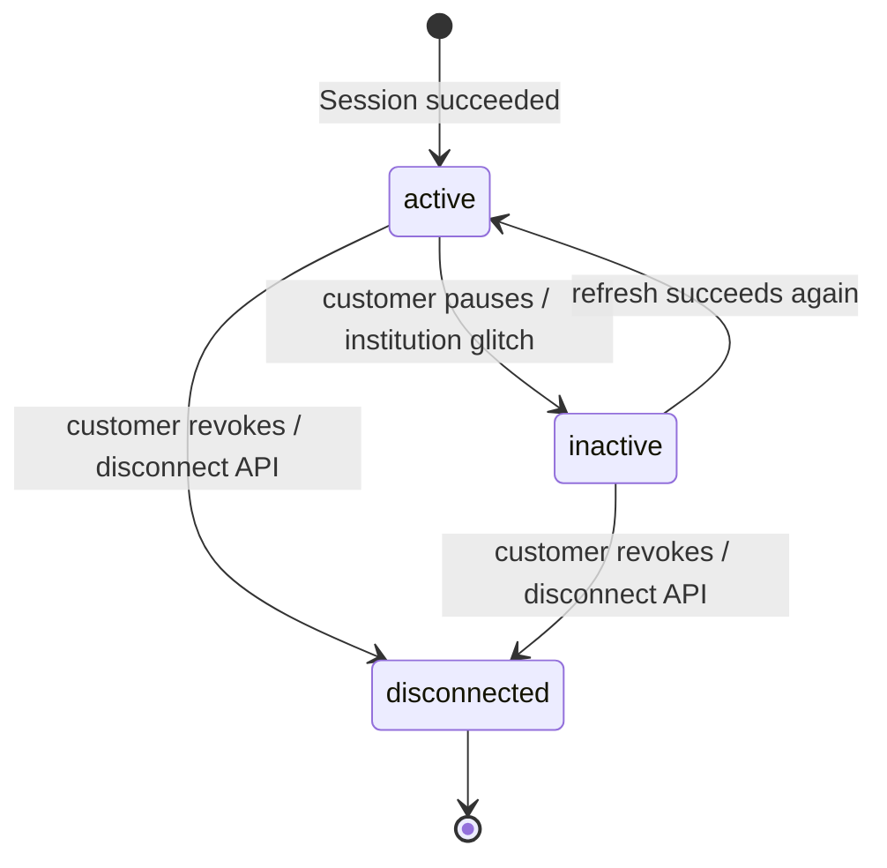
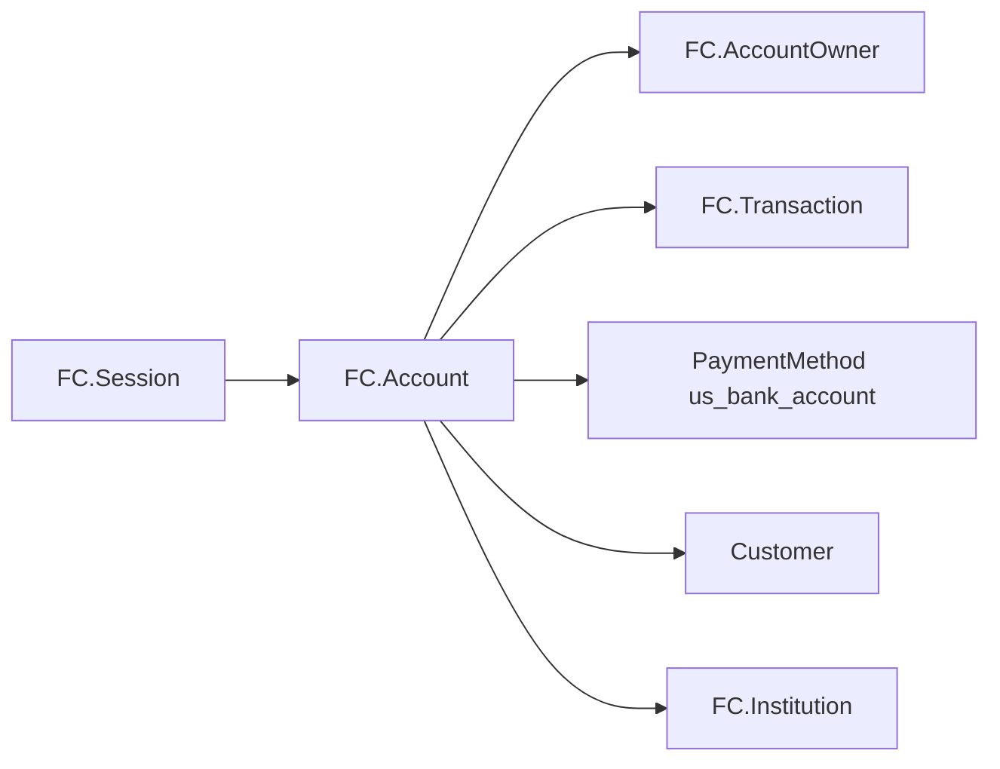

# FinancialConnections Account

> API resource: `financial_connections.account` · API version: `2026-04-22.dahlia` · Category: [Financial Connections](README.md)

## What it is

A `financial_connections.account` (FCA) is Stripe's handle on **one bank account at one financial institution that one of your customers has authorized you to read or debit**. It is *not* the customer's Stripe Customer record, and it is *not* a [PaymentMethod](../02-payment-methods/payment-methods.md) — it's the upstream connection that a `us_bank_account` PaymentMethod can be derived from, and the upstream connection that balance/ownership/transaction data flows through.

Think of it as the long-lived OAuth-grant-shaped object: the customer authorized your platform once via a [Session](sessions.md), and the resulting FCA persists until they revoke it (or the institution drops the link).

## Why it exists

Without an FCA you have two unhappy paths to bank data:

- **Micro-deposits** for ACH verification — 1-2 business days, ~3% drop-off, awful for conversion.
- **Manual statement uploads** for underwriting / cash-flow analysis — the customer screenshots their bank app and you OCR it. Don't.

FCA is the persistent connection that fixes both: instant verification for ACH PMs, and an ongoing read channel for balances/ownership/transactions if the customer granted those permissions.

## Lifecycle & states



- **`active`** — credentials are valid, refreshes work, the account is usable for verification or data reads.
- **`inactive`** — Stripe can't reach the institution on the customer's behalf right now. Could be a transient bank-side outage, a credential change, or the customer pausing the connection from their bank's portal. **Subscriptions and refresh attempts will keep failing until the customer re-authorizes** (Stripe surfaces a re-auth prompt in the embedded UI).
- **`disconnected`** — terminal. The customer revoked the connection (or you called `disconnect`). The FCA stays in your account for audit/history, but you can't refresh, subscribe, or derive new PMs from it. Any `us_bank_account` PMs already minted from this FCA still exist but their `financial_connections_account.status` reflects this.

The state machine isn't surfaced as a single `status` like other Stripe objects — it lives in the top-level `status` field plus per-feature `*_refresh.status` sub-states. Treat the top-level `status` as the source of truth for "is this connection alive?"

## Anatomy of the object

### Identity

| Field | Notes |
|---|---|
| `id` | `fca_…` |
| `object` | `"financial_connections.account"` |
| `created` | unix seconds. |
| `livemode` | standard. |

### Connection ownership

| Field | Notes |
|---|---|
| `account_holder.type` | `customer` or `account`. Says which Stripe entity owns this connection. |
| `account_holder.customer` | `cus_…` if `type=customer`. The most common case — your customer authorized the link. |
| `account_holder.account` | `acct_…` if `type=account`. Used when a connected account itself authorized (Connect flows, e.g. underwriting a Connect platform's merchant). |
| `institution_name` | Human-readable bank name ("Chase", "Wells Fargo"). Display this, not the institution ID. |
| `display_name` | Customer's nickname for the account at their bank ("My Checking"). May be null. |
| `last4` | Last four of the account number. Use for display alongside `institution_name`. |

### Categorization

| Field | Notes |
|---|---|
| `category` | `cash`, `credit`, `investment`, `other`. High-level bucket. |
| `subcategory` | `checking`, `savings`, `mortgage`, `line_of_credit`, `credit_card`, `other`. The actually useful classifier for "is this debit-able via ACH?" — only `checking` and `savings` reliably support `us_bank_account` PMs. |
| `supported_payment_method_types[]` | Today: `us_bank_account` (or empty). Drives whether you can derive a PM. |

### Permissions & subscriptions

| Field | Notes |
|---|---|
| `permissions[]` | Subset of `balances`, `ownership`, `payment_method`, `transactions`. Granted at Session-time and immutable on the FCA. To gain more, run a new Session with the additional perms. |
| `subscriptions[]` | Today: `transactions` (or empty). Active *data subscriptions* you've turned on via the `subscribe` endpoint. Subscriptions are the billable ongoing pull mechanism — having `transactions` permission isn't the same as having an active `transactions` subscription. |

### Status & refresh sub-states

| Field | Notes |
|---|---|
| `status` | `active`, `inactive`, `disconnected`. See lifecycle. |
| `balance_refresh.status` | `failed`, `pending`, `succeeded`. State of the most recent balance refresh. |
| `balance_refresh.last_attempted_at` | unix seconds. |
| `ownership_refresh.status` / `last_attempted_at` | Same shape. Likely null if you never requested ownership. |
| `transaction_refresh.status` / `last_attempted_at` / `next_refresh_available_at` | Same shape. The `next_refresh_available_at` field hints at how soon you can re-trigger; respect it to avoid wasted calls. |

### Balance snapshot

| Field | Notes |
|---|---|
| `balance.as_of` | unix seconds — when this snapshot was pulled from the bank. **This is not "now"**; it's the freshness of the data. Surface it in your UI for high-stakes uses. |
| `balance.type` | `cash` or `credit` — mirrors `category`. |
| `balance.cash.available` | Map keyed by ISO currency, values in minor units. Populated for cash accounts. |
| `balance.credit.used` | Same shape, for credit accounts. |
| `balance.current` | Map keyed by ISO currency. The bank's "current balance" (cash + pending + holds, depending on institution). Treat as best-effort. |

### Ownership

| Field | Notes |
|---|---|
| `ownership` | ID of the parent ownership object referenced by [account-owners](account-owners.md). Null if you didn't grant `ownership` or the institution doesn't return it. |

## Relationships



- **Session → FCA**: a successful Session populates `accounts.data[]` with one or more FCAs.
- **FCA → AccountOwner**: only if `ownership` permission was granted.
- **FCA → Transaction**: only if `transactions` permission *and* an active subscription.
- **FCA → PaymentMethod**: when `payment_method` permission was granted, you can derive a `us_bank_account` PM from this FCA. Multiple PMs may point at the same FCA.
- **FCA → Customer**: via `account_holder.customer`. One customer can have many FCAs.
- The link to [Institution](institutions.md) is implicit (by `institution_name`) — there's no `institution` ID field on the FCA itself in current API shapes; hedge.

## Common workflows

### 1. List a customer's connected accounts

```http
GET /v1/financial_connections/accounts?account_holder[customer]=cus_…
```

Use to render a "manage bank connections" UI. Filter client-side by `subcategory` if you only care about debit-able ones.

### 2. Refresh a balance on demand

```http
POST /v1/financial_connections/accounts/fca_…/refresh
  features[]=balance
```

Returns the FCA with `balance_refresh.status: pending`. Stripe pulls from the institution asynchronously and emits `financial_connections.account.refreshed_balance` when done. Re-fetch the FCA at that point to read the new `balance` snapshot.

`features[]` accepts `balance`, `ownership`, `transactions`. You can request multiple in one call.

> Refreshes aren't free — each pull is a billable institution round-trip. Cache `balance.as_of` and only refresh when business logic actually needs newer data.

### 3. Subscribe to transactions

```http
POST /v1/financial_connections/accounts/fca_…/subscribe
  features[]=transactions
```

Turns on the ongoing pull. Stripe will periodically fetch new transactions and emit `financial_connections.account.refreshed_transactions`; new [Transaction](transactions.md) objects appear under the FCA. Unsubscribe via `POST /v1/financial_connections/accounts/fca_…/unsubscribe`.

The FCA must have the `transactions` permission for `subscribe` to work; if not, run a new Session that requests it.

### 4. Disconnect

```http
POST /v1/financial_connections/accounts/fca_…/disconnect
```

Permanently severs the connection. `status` becomes `disconnected`; refreshes/subscribes will error from here on. Useful for "the customer left, clean up" workflows or when you no longer need ongoing data access.

### 5. Derive a PaymentMethod for ACH

You don't usually call an explicit "derive PM" endpoint — instead, the SetupIntent or PaymentIntent flow that requested the `payment_method` permission will surface the resulting `pm_…` directly on the SI/PI's `payment_method` field after Session completion. See [SetupIntent](../01-core-resources/setup-intents.md) workflow #2 for the canonical pattern.

## Webhook events

| Event | Fires when | Listener typically does |
|---|---|---|
| `financial_connections.account.created` | A Session succeeded and minted a new FCA. | Persist `fca_…` against your local user record. |
| `financial_connections.account.updated` | Most field changes (status flips, permission tweaks). | Re-fetch and reconcile. |
| `financial_connections.account.refreshed_balance` | An async balance refresh finished. | Re-fetch FCA, read `balance` + `balance.as_of`, update cached snapshot. |
| `financial_connections.account.refreshed_transactions` | An async transactions refresh finished — new [Transaction](transactions.md) objects exist. | List transactions under this FCA since your last cursor. |
| `financial_connections.account.refreshed_ownership` | Ownership data refreshed. | Re-list [account-owners](account-owners.md). |
| `financial_connections.account.deactivated` | Status flipped to `inactive`. | Surface a re-auth prompt next time the customer is on-session. |
| `financial_connections.account.reactivated` | Back to `active` after re-auth. | Resume any paused workflows that depend on this FCA. |
| `financial_connections.account.disconnected` | Customer revoked or you called `disconnect`. | Mark local connection as gone; stop any pending subscribe/refresh attempts. |

## Idempotency, retries & race conditions

- `refresh` and `subscribe` are not strictly idempotent — calling `refresh` twice in quick succession queues two pulls. Stripe deduplicates within a short window for the same `features[]`, but treat `Idempotency-Key` as required for these write endpoints.
- `disconnect` is idempotent: calling it on an already-disconnected FCA is a no-op (returns the FCA unchanged).
- **Race**: `refreshed_balance` webhook can arrive before your next FCA fetch reflects the new snapshot if you read from a regional cache. Re-fetch on receipt; don't trust the in-flight response of the original `refresh` call.
- **Race**: `account.created` may fire before the corresponding Session's `succeeded` webhook. If your handler keys off the Session, buffer or fetch on demand.

## Test-mode tips

- Use the FC test institution **"Test Institution"** (`fcinst_test_…`) in any Session. It returns a deterministic FCA with seeded balance/transactions.
- `stripe trigger financial_connections.account.created` — minimal account for handler testing.
- `stripe trigger financial_connections.account.refreshed_balance` — balance-update path.
- For SetupIntent + FC instant verification, see the [SetupIntent](../01-core-resources/setup-intents.md) test-mode tips for routing/account combos that succeed instantly.

## Connect considerations

- An FCA created with `account_holder.type=account` lives **on the connected account** if the Session was made with `Stripe-Account: acct_…`. Platform code can't see it without that header.
- If the platform creates the Session with `account_holder.type=customer` and the Customer is a platform-owned `cus_…`, the FCA lives on the platform regardless of any connected account in the picture. Common pattern for KYC of a Connect merchant: use `account_holder.type=account` with the merchant's `acct_…`.
- A `us_bank_account` PM derived from an FCA is owned by whichever account owns the FCA. Cross-account use requires PM cloning (see [PaymentMethod](../02-payment-methods/payment-methods.md) Connect notes).
- Permissions you can request differ per region/account; hedge — check the Connect dashboard.

## Common pitfalls

- **Treating refresh as free.** Every `refresh` is a billable institution round-trip. Cache aggressively and only refresh when business logic actually needs newer data than `balance.as_of`.
- **Confusing permissions with subscriptions.** Having `transactions` in `permissions[]` only grants the right to subscribe — until you call `subscribe`, no transactions flow. Conversely, you can't subscribe to a feature you didn't request at Session time.
- **Acting on `inactive` as terminal.** It's not. The customer can re-auth and the FCA flips back to `active` weeks later. Don't auto-disconnect on `inactive` unless your product requires it.
- **Reading `balance.current` as "spendable right now".** Definitions vary by institution. Use `balance.cash.available` for spendable funds where the FCA is a cash account.
- **Keying off `last4` for "same bank account".** Two different accounts at the same institution can share the same last4. Use `id` (FCA) or, downstream, the PM's `us_bank_account.fingerprint`.
- **Forgetting `account_holder` on Session creation.** Without it the resulting FCA has no owner and you can't list it scoped by Customer/Account later.
- **Polling instead of webhooking.** Refreshes can take seconds to minutes — don't tight-loop GET the FCA. Subscribe to the `refreshed_*` events.

## Further reading

- [API reference: Financial Connections Account](https://docs.stripe.com/api/financial_connections/accounts)
- [Financial Connections overview](https://docs.stripe.com/financial-connections)
- [Collect bank account data](https://docs.stripe.com/financial-connections/data-collection)
- Sibling objects: [Session](sessions.md), [AccountOwner](account-owners.md), [Transaction](transactions.md), [Institution](institutions.md), [PaymentMethod](../02-payment-methods/payment-methods.md), [SetupIntent](../01-core-resources/setup-intents.md).
