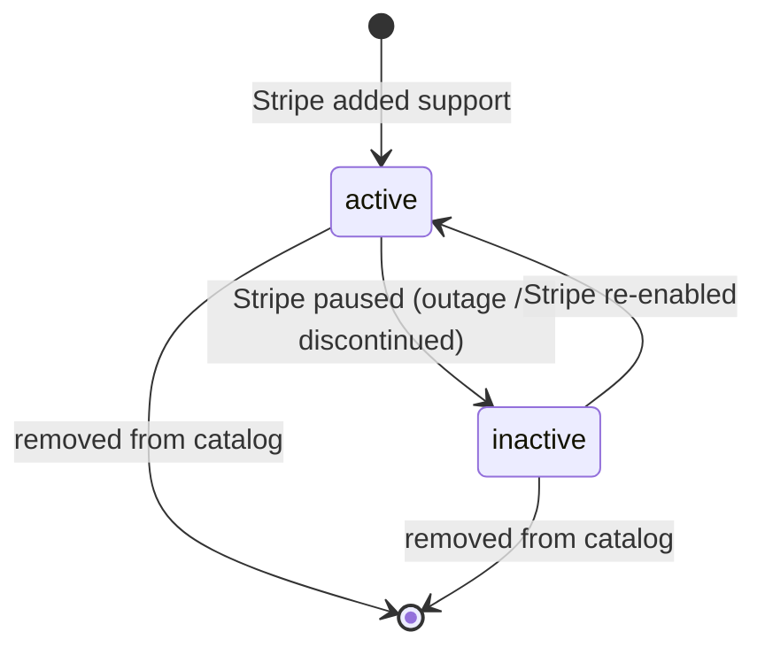
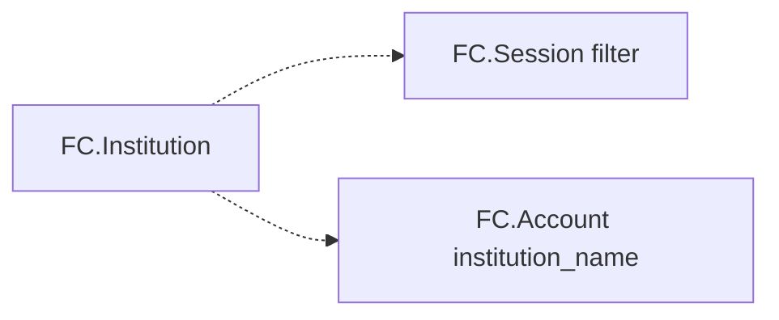

# FinancialConnections Institution

> API resource: `financial_connections.institution` · API version: `2026-04-22.dahlia` · Category: [Financial Connections](README.md)

## What it is

A `financial_connections.institution` (FCINST) is **a financial institution that Financial Connections supports** — Chase, Wells Fargo, Bank of America, your local credit union, and so on. It's a **read-only catalog object** maintained by Stripe; you don't create, update, or delete one. You list and retrieve.

You'll touch FCINST in two situations: when you want to **filter the institution picker** (skip it entirely, or restrict to a subset), and when you want to **build your own institution picker** instead of using Stripe's.

## Why it exists

Most integrations never query FCINST directly — Stripe.js's collector renders its own picker from the same catalog. You need it when:

- You already know the customer's bank from a routing number / prior signal and want to skip the picker.
- Your UX requires a picker styled to your brand.
- You want to tell the customer in advance which institutions you support.

## Lifecycle & states



- **`active`** — usable in a Session today.
- **`inactive`** — temporarily unsupported (institution outage, decommissioned integration). Sessions filtered to an `inactive` institution will fail; surface a friendly error and offer manual entry / micro-deposits as fallback.

There's no per-customer state — FCINST is global catalog.

## Anatomy of the object

### Identity

| Field | Notes |
|---|---|
| `id` | `fcinst_…` |
| `object` | `"financial_connections.institution"` |
| `name` | Display name as Stripe presents it ("Chase", "Wells Fargo", "Test Institution"). |
| `livemode` | standard. |

### Display & branding

| Field | Notes |
|---|---|
| `url` | Canonical institution website. Useful for "having trouble? visit your bank" links. |
| `phone` | Customer support phone for the institution. May be null. |
| `featured` | Boolean. Stripe marks the most commonly-used banks as featured for picker prominence. Mirror this in your own picker if you build one. |

### Banking identifiers

| Field | Notes |
|---|---|
| `routing_numbers[]` | ABA routing numbers associated with this institution. Use to map a customer-supplied routing number → `fcinst_…` for skip-the-picker flows. Multiple routing numbers per institution is common (regional, wire vs ACH). Hedge: not exhaustive — some institution sub-routing-numbers won't show up. |
| `mic_codes[]` | Market Identifier Codes (ISO 10383). Relevant primarily for investment-account institutions; usually empty for retail banks. Hedge: support and population vary. |

### Status

| Field | Notes |
|---|---|
| `status` | `active`, `inactive`. See lifecycle. |

There are no money, ownership, permission, or refresh fields on FCINST — it's pure catalog metadata.

## Relationships



- A [Session](sessions.md) can filter to one institution via `filters.institution=fcinst_…`.
- An [FC Account](accounts.md) carries the bank's `institution_name` (string), but **doesn't typically carry the `fcinst_…` ID itself** in current API shapes — hedge on this; correlate by name if you need the round-trip.

## Common workflows

### 1. List supported institutions

```http
GET /v1/financial_connections/institutions?limit=100
```

Cursor-paginated. Useful filters:

- `q=chase` — full-text name search. Use this when building a picker with a search box.

Cache the catalog — it changes slowly. A daily refresh is ample.

### 2. Retrieve a single institution

```http
GET /v1/financial_connections/institutions/fcinst_…
```

Use when you've persisted an `fcinst_…` and want fresh metadata (name change, status flip).

### 3. Skip the picker — go straight to the bank

If your customer has already told you their bank (or you derived it from a routing number):

```text
fcinst_id = lookup_by_routing(customer_supplied_routing)  # your local cache of catalog
session = create_session(
  account_holder=...,
  permissions=['payment_method'],
  filters={ institution: fcinst_id },
)
```

The Stripe.js collector launches directly into the institution's auth flow, no picker shown.

### 4. Build your own institution picker

```text
catalog = list_institutions(limit=100, paginate)
group_by(catalog, featured=true) → top-of-list
render_search(query → list_institutions(q=query))
on_select → create_session(filters.institution=selected.id)
```

Useful when you have a strong brand UX or need to pre-filter by, say, only US national banks.

### 5. Map a routing number to an institution

```text
inst = list_institutions(...).find(i => i.routing_numbers.includes(user_routing))
```

Imperfect — `routing_numbers[]` is a strong but not complete list. Fall back to picker if no match.

## Webhook events

FCINST emits **no webhook events**. The catalog is mutated by Stripe-internal processes; you discover changes by re-listing or by encountering an error during a Session.

## Idempotency, retries & race conditions

- All operations are reads. Retry freely. Cursors are stable.
- Catalog changes (new institutions added, statuses flipped) are not announced — your cache may be slightly stale. Refresh on a schedule.
- **Race**: an institution's `status` can flip from `active` to `inactive` between your picker render and your Session create. The Session create won't fail at create-time, but the customer's auth attempt will. Handle errors gracefully; offer a fallback path.

## Test-mode tips

- The FC test institution **"Test Institution"** has a stable `fcinst_…` you can hard-code into Sessions for deterministic test flows.
- `GET /v1/financial_connections/institutions` in test mode returns a small fixed catalog (Test Institution + a handful of synthetic banks), not the full live catalog.
- There's no `stripe trigger` event for institutions — the catalog is read-only.

## Connect considerations

- FCINST is a global Stripe-managed catalog; it doesn't differ between platform and connected accounts. The same `fcinst_…` is valid in any account context.
- No `Stripe-Account` header semantics — the catalog is the same view everywhere.

## Common pitfalls

- **Hardcoding `fcinst_…` IDs in production code.** They're stable but Stripe doesn't guarantee never to remove an institution. Look up by name + routing or by retrieve-on-startup.
- **Building a picker from a one-time list call.** The catalog changes — refresh on a schedule (daily is fine), or on every customer-facing page load if your DB caching makes that cheap.
- **Trusting `routing_numbers[]` as exhaustive.** It covers the most common routing numbers per institution but not all sub-codes. Fall back to the full picker if a routing-number lookup misses.
- **Filtering to an `inactive` institution.** Session creation succeeds, customer auth fails. Always check `status: active` before offering an institution in your UI.
- **Surfacing the raw `id` to customers.** Display `name`, not `fcinst_…`.
- **Skipping `featured`.** Picker conversion drops noticeably when popular banks are buried alphabetically. Sort featured to the top.

## Further reading

- [API reference: Institution](https://docs.stripe.com/api/financial_connections/institutions)
- [Filter institutions](https://docs.stripe.com/financial-connections/customizing-onboarding-flow)
- Sibling objects: [Session](sessions.md), [Account](accounts.md).
