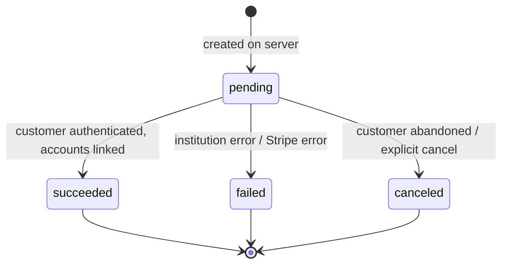
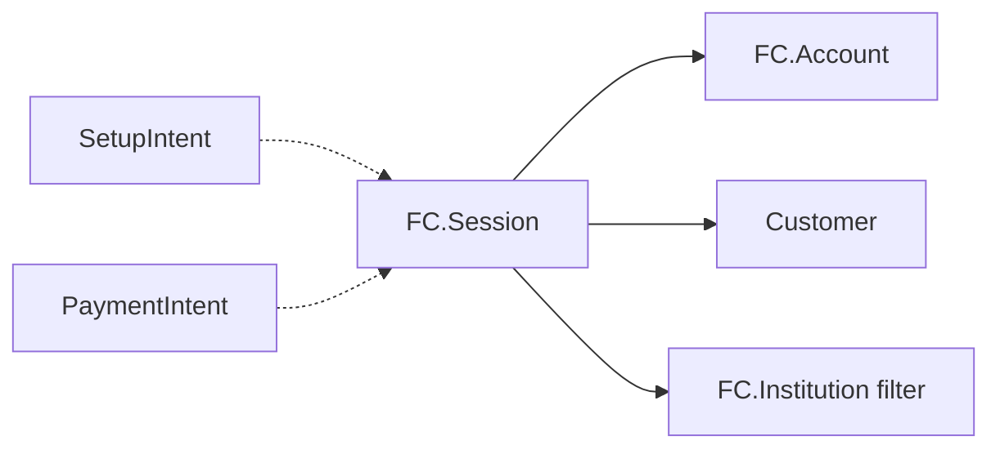

# FinancialConnections Session

> API resource: `financial_connections.session` · API version: `2026-04-22.dahlia` · Category: [Financial Connections](README.md)

## What it is

A `financial_connections.session` is the **short-lived, single-use authorization flow** your customer goes through to connect their bank account to your Stripe integration. Server creates it; client mounts Stripe.js to render the institution-picker + login UI; customer authenticates with their bank; the Session ends with one or more [FC Accounts](accounts.md) attached.

Conceptually identical to the Plaid Link token + Link onOpen flow, with the same lifetime model: minutes, not days.

## Why it exists

Bank-account authorization can't be a server-only operation — the customer has to physically log in to their bank in a browser-trusted UI. Session is the bridge: a server-minted credential (`client_secret`) the browser uses to drive a Stripe-hosted (or embedded) auth flow without ever sharing API keys or institution credentials with your code.

It's also the **negotiation point for permissions**: which features (`balances`, `ownership`, `payment_method`, `transactions`) the customer is consenting to, and which institution constraints apply.

## Lifecycle & states



- **`pending`** — Session created, `client_secret` is live, customer hasn't completed the flow yet. `accounts.data[]` is empty. The Session is single-use; once it leaves `pending`, it's terminal.
- **`succeeded`** — customer linked at least one account. `accounts.data[]` is populated; each entry is a fully-formed FCA. **This is your trigger to derive PMs / start subscribing**.
- **`failed`** — institution refused, network died mid-flow, or some other unrecoverable error. Read the error and start a new Session if you want to retry.
- **`canceled`** — the customer closed the dialog or `cancel` was called. Same recovery path: new Session.

> Sessions live for ~24h after creation. After that the `client_secret` is dead even in `pending` — start over.

## Anatomy of the object

### Identity

| Field | Notes |
|---|---|
| `id` | `fcsess_…` |
| `object` | `"financial_connections.session"` |
| `client_secret` | Same scoped credential semantics as [PaymentIntent](../01-core-resources/payment-intents.md)'s. The browser needs it to mount the collector. **Don't log.** |
| `livemode` | standard. |
| `status` | enum, see lifecycle. |

### Owner of the connection

| Field | Notes |
|---|---|
| `account_holder.type` | `customer` or `account`. Required at create time. |
| `account_holder.customer` | `cus_…` if `type=customer`. |
| `account_holder.account` | `acct_…` if `type=account`. Used in Connect KYC flows. |

### Permissions & data hints

| Field | Notes |
|---|---|
| `permissions[]` | What the customer is being asked to consent to: subset of `balances`, `ownership`, `payment_method`, `transactions`. **Set this at create-time** — immutable afterward, and propagates to every resulting FCA. |
| `prefetch[]` | Subset of `balances`, `ownership`, `transactions`. Tells Stripe to immediately pull this data after auth so your first FCA fetch returns populated snapshots instead of empty placeholders. |
| `return_url` | Where the customer goes after the flow if they used redirect-based auth. Required for some institutions. |

### Filtering the institution picker

| Field | Notes |
|---|---|
| `filters.countries[]` | ISO-3166-1 alpha-2. Today: typically `['US']`. |
| `filters.account_subcategories[]` | Limit which account types the customer can pick — e.g. `['checking', 'savings']` to hide credit cards. Useful for ACH PM flows where only debit-able accounts make sense. |
| `filters.institution` | `fcinst_…` to skip the picker entirely and go straight to one institution. Use when you've already let the customer choose in your own UI. |

### Outcome

| Field | Notes |
|---|---|
| `accounts.data[]` | Empty until `succeeded`. After success, an array of [FC Accounts](accounts.md) the customer linked. **One Session can return multiple accounts** if the customer ticks more than one at the picker. |

## Relationships



- A standalone Session is the bare-metal flow.
- A SetupIntent or PaymentIntent that includes `payment_method_options.us_bank_account.financial_connections` **creates a Session implicitly** as part of confirmation. You usually don't see the `fcsess_…` ID directly in that case — Stripe.js handles it.

## Common workflows

### 1. Standalone Session — read bank data only

```http
POST /v1/financial_connections/sessions
  account_holder[type]=customer
  account_holder[customer]=cus_…
  permissions[]=balances
  permissions[]=transactions
  prefetch[]=balances
  filters[countries][]=US
  return_url=https://example.com/onboarding/complete
Idempotency-Key: onboard-cus_…-v1
```

Server returns `{ id: "fcsess_…", client_secret: "fcsess_…_secret_…", … }`. Client:

```js
const fc = await stripe.collectFinancialConnectionsAccounts({
  clientSecret,
});
// fc.financialConnectionsSession.accounts is the array of fca_…s
```

After return, server fetches the Session:

```http
GET /v1/financial_connections/sessions/fcsess_…
```

`status: succeeded` and `accounts.data[]` is populated. Persist the FCA IDs against the Customer.

### 2. Instant US bank verification for a SetupIntent

This is the canonical "ACH PM in seconds" flow. The Session is implicit — you configure FC on the SetupIntent itself.

```http
POST /v1/setup_intents
  customer=cus_…
  payment_method_types[]=us_bank_account
  payment_method_options[us_bank_account][verification_method]=instant
  payment_method_options[us_bank_account][financial_connections][permissions][]=payment_method
  payment_method_options[us_bank_account][financial_connections][prefetch][]=balances
```

Stripe.js's `confirmSetup` walks the customer through the FC flow. On success the resulting `pm_…` is verified, the FCA exists in your account, and `setup_intent.payment_method` references the PM. See [SetupIntent](../01-core-resources/setup-intents.md) workflow #2 for the full pattern.

### 3. Pre-filtered to one institution

If you've built your own institution picker (or you know the customer's bank from prior signal), skip Stripe's picker:

```http
POST /v1/financial_connections/sessions
  account_holder[type]=customer
  account_holder[customer]=cus_…
  permissions[]=payment_method
  filters[institution]=fcinst_…
```

The customer lands directly on the bank's login.

### 4. Session for a Connect merchant (KYC)

```http
POST /v1/financial_connections/sessions
  account_holder[type]=account
  account_holder[account]=acct_…
  permissions[]=balances
  permissions[]=ownership
```

The connected account's owner authorizes; the resulting FCA lives on `acct_…`, queryable only with `Stripe-Account: acct_…`.

## Webhook events

The Session itself doesn't emit standalone events in the public catalog. You react to the **child FCA events** instead:

| Event | Fires when | Listener typically does |
|---|---|---|
| `financial_connections.account.created` | A Session succeeded and minted an FCA. | Persist the FCA, kick off any post-link work (subscribe, refresh, derive PM). |

If you need a Session-completion signal and you're using a standalone Session, use the client-side `collectFinancialConnectionsAccounts` promise resolution + a server-side `GET /sessions/fcsess_…` to confirm `status: succeeded`. Don't trust the client return alone — confirm server-side.

## Idempotency, retries & race conditions

- **Always** set `Idempotency-Key` on `POST /sessions`. Without it, a duplicate request mints a second Session and a second `client_secret`, doubling your potential auth UI to the customer.
- A Session is single-use for the customer-flow side: once the client mounts the collector with a `client_secret`, that Session can't be re-mounted for a new attempt. Retry = new Session.
- **Race**: the client-side `accounts` array on `collectFinancialConnectionsAccounts` resolves before `account.created` webhooks land. If your business logic depends on the FCA existing server-side, fetch the Session via the API on return rather than trusting the client.
- **Race**: a customer who closes the popup mid-flow may leave the Session in `pending` indefinitely (until 24h expiry). Don't block on a final webhook — time-box it client-side.

## Test-mode tips

- Use the FC test institution **"Test Institution"** for any test Session — returns a deterministic FCA with seeded balance/owners/transactions.
- Test bank credentials inside the FC flow: username `success`, password anything → succeeds. Username `failure` → fails. Username `requires_oauth` → exercises the OAuth bank-redirect path.
- `stripe trigger financial_connections.account.created` is the closest CLI hook for end-to-end testing of the post-Session reaction.
- There's no `stripe trigger` for Session creation itself — you exercise it by calling the API.

## Connect considerations

- Pass `Stripe-Account: acct_…` on `POST /sessions` to create a Session **on a connected account**. The resulting FCA lives there too.
- For platform-driven KYC of a merchant, set `account_holder.type=account` + `account_holder.account=acct_…` on a Session created **on the platform** (no `Stripe-Account` header). The FCA lives on the platform but is associated with the merchant's `acct_…`.
- `client_secret` for a Connect-side Session works with the same Stripe.js methods, but the publishable key used to initialize Stripe.js must match the account-of-creation context.

## Common pitfalls

- **Asking for more permissions than you need.** Each extra permission costs an extra consent screen and conversion drop. Ask for `payment_method` only if you need the PM; add `transactions` only if you'll subscribe.
- **Forgetting `prefetch[]`.** Without it, your first FCA read returns null balances and you'll have to call `refresh` and wait for a webhook. Prefetch trades a small Session-creation latency for instant data on completion.
- **Treating client return as authoritative.** Always re-fetch the Session server-side and check `status: succeeded` before mutating your DB. The client can be tampered with.
- **Reusing one Session across attempts.** It's single-use; mint a new one on retry.
- **Mixing `type=account` and `Stripe-Account` headers in inconsistent ways.** The combinations matter: `Stripe-Account: acct_X` + `account_holder.type=account, account=acct_X` is a connected-account-side flow; `account_holder.type=account, account=acct_X` *without* the header is a platform-driven KYC flow. Pick one model and stick to it.
- **Not setting `return_url`.** Some institutions only support OAuth-redirect auth; without `return_url` the flow can't complete. Set it always.
- **Long-lived `client_secret` storage.** Don't write it to a database. It's a session credential, not a user credential.

## Further reading

- [API reference: Session](https://docs.stripe.com/api/financial_connections/sessions)
- [Collect an account](https://docs.stripe.com/financial-connections/other-data-powered-products)
- [ACH instant verification with FC](https://docs.stripe.com/payments/ach-direct-debit/set-up-payment#web-collect-bank-account)
- Sibling objects: [Account](accounts.md), [Institution](institutions.md), [SetupIntent](../01-core-resources/setup-intents.md), [PaymentIntent](../01-core-resources/payment-intents.md), [PaymentMethod](../02-payment-methods/payment-methods.md).
