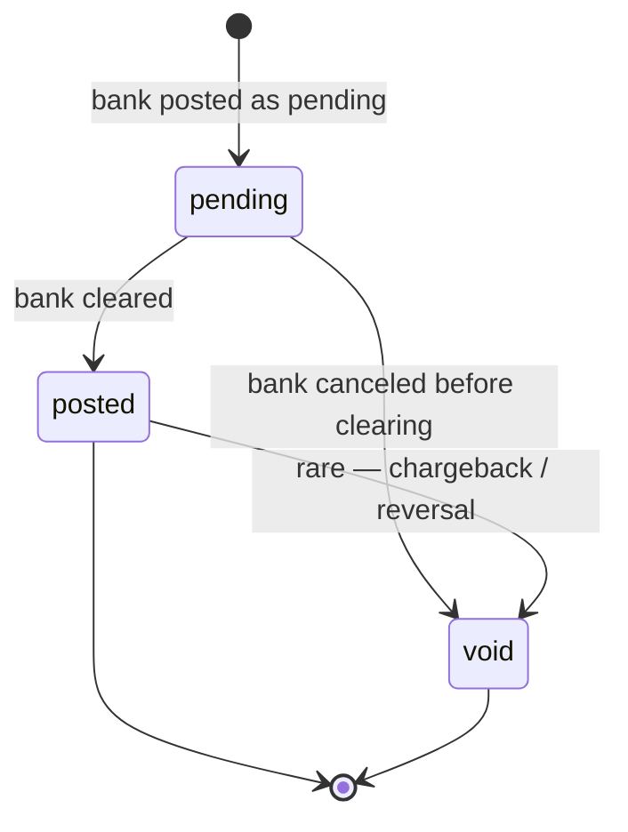
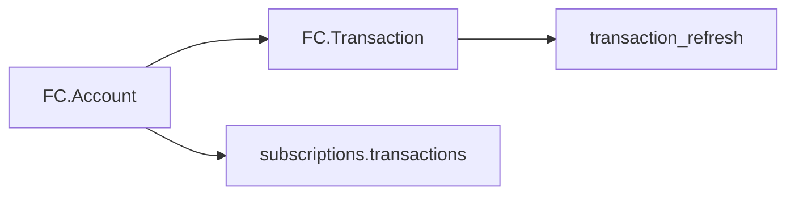

# FinancialConnections Transaction

> API resource: `financial_connections.transaction` · API version: `2026-04-22.dahlia` · Category: [Financial Connections](README.md)

## What it is

A `financial_connections.transaction` (FCTXN) is **one row from the connected bank account's transaction ledger** — a debit, a credit, a fee, an interest payment. Stripe pulls these from the institution on your behalf after you've granted the `transactions` permission and called `subscribe` on the parent [FC Account](accounts.md).

Crucially: this is **not a Stripe-money-movement transaction**. It's a *read-through* of what the bank shows the customer. The lifecycle (`pending → posted → void`) belongs to the bank, not to you.

## Why it exists

The use cases are all "I need to know what happened in my customer's bank":

- **Underwriting.** Lender wants 90 days of cash-flow before approving a loan.
- **Fraud / mule detection.** Suspicious deposit patterns prior to a large outbound ACH.
- **Accounting integration.** Mirror bank activity into your books.
- **Treasury management.** Internal CFO dashboard pulling balances + transactions across many corporate accounts.

The alternative is statement OCR or screen-scraping; FCTXN is the structured, sanctioned channel.

## Lifecycle & states



States are **bank-driven**:

- **`pending`** — bank shows the transaction but hasn't cleared it. Authorization holds, ACH-in-flight, etc.
- **`posted`** — cleared. `status_transitions.posted_at` is set. Treat as terminal for most purposes.
- **`void`** — canceled. Could be a pre-clearing cancel (most common) or a post-clearing reversal (rare). `status_transitions.void_at` is set.

> Status changes for the **same FCTXN** flow in via subsequent transactions-refreshes. The FCTXN ID is stable across refreshes; treat updates as the source of truth, don't insert duplicates by row.

## Anatomy of the object

### Identity

| Field | Notes |
|---|---|
| `id` | `fctxn_…` — stable across refreshes. |
| `object` | `"financial_connections.transaction"` |
| `account` | `fca_…` of the parent [FC Account](accounts.md). |
| `livemode` | standard. |

### Money

| Field | Notes |
|---|---|
| `amount` | Signed integer in minor units. **Negative = debit (money leaving the account); positive = credit (money entering)**. Hedge: a few institutions invert sign — verify against a known transaction during integration. |
| `currency` | ISO 4217. Almost always matches the FCA's account currency. |

### Description

| Field | Notes |
|---|---|
| `description` | Bank-formatted memo string. Highly variable across institutions ("ACH DEBIT COMCAST 12345", "POS PURCHASE TARGET T-1234", "Zelle payment to Jane"). Don't parse for structured data — display or full-text search. |

### Status

| Field | Notes |
|---|---|
| `status` | `pending`, `posted`, `void`. |
| `status_transitions.posted_at` | unix seconds — null until posted. |
| `status_transitions.void_at` | unix seconds — null unless voided. |
| `transacted_at` | unix seconds — when the bank says the transaction occurred. **Different from `posted_at`** — a card swipe on Friday may post on Monday; `transacted_at` is Friday. Use this for date display to the customer. |

### Provenance

| Field | Notes |
|---|---|
| `transaction_refresh` | ID of the refresh that surfaced this transaction. Useful for debugging "why did this appear / disappear?" |

There is no `metadata` on FCTXN — it's a read-only mirror of bank data. Annotate in your own DB if you need to.

## Relationships



- An FCA must have **both** `transactions` permission **and** an active `subscriptions[]=transactions` to produce FCTXNs.
- FCTXNs are never deleted — Stripe retains them for the life of the FCA.

## Common workflows

### 1. Subscribe to transactions on an FCA

```http
POST /v1/financial_connections/accounts/fca_…/subscribe
  features[]=transactions
Idempotency-Key: subscribe-fca_…-tx
```

Stripe begins polling the institution. Initial backfill depth varies by institution (typically 90 days). When ready, `financial_connections.account.refreshed_transactions` fires.

### 2. List transactions for an FCA

```http
GET /v1/financial_connections/transactions?account=fca_…&limit=100
```

Standard cursor-paginated list. Useful filters:

- `transacted_at[gte]=…&transacted_at[lt]=…` — bank's transaction date range.
- `transaction_refresh.status=succeeded` — only transactions surfaced by a successful refresh.

### 3. Sync incrementally on each `refreshed_transactions` webhook

Pseudocode:

```text
on financial_connections.account.refreshed_transactions(fca_id):
  cursor = read_local_cursor(fca_id)  # last seen transacted_at + last seen id
  loop:
    page = list_transactions(account=fca_id, transacted_at[gte]=cursor.ts, starting_after=cursor.id)
    for txn in page:
      upsert_local(txn)  # by id; replaces prior status if exists
    if !page.has_more: break
    cursor = page.last
  save_local_cursor(fca_id, cursor)
```

**Always upsert by `id`** — the same FCTXN may flow through multiple refreshes as its status moves `pending → posted`. Never insert duplicates.

### 4. Trigger an out-of-band refresh

```http
POST /v1/financial_connections/accounts/fca_…/refresh
  features[]=transactions
```

Use sparingly — Stripe's automatic polling cadence covers most needs, and on-demand refreshes cost institution round-trips. Reasonable triggers: customer just made a deposit and is staring at your "pending" UI; you need a fresh snapshot before approving an underwriting decision.

### 5. Unsubscribe when you're done

```http
POST /v1/financial_connections/accounts/fca_…/unsubscribe
  features[]=transactions
```

Stops further automatic refreshes. Existing FCTXNs persist; no new ones flow.

## Webhook events

FCTXN has no events of its own. You react to the parent FCA's events:

| Event | Fires when | Listener typically does |
|---|---|---|
| `financial_connections.account.refreshed_transactions` | An async transactions refresh finished. New / updated FCTXNs are queryable. | Run the incremental sync from workflow #3. |
| `financial_connections.account.created` | New FCA, possibly with `transactions` permission. | If the use-case demands it, immediately `subscribe` to transactions. |

## Idempotency, retries & race conditions

- `GET /transactions` is a read; retry freely. Cursors are stable.
- `subscribe` / `unsubscribe` are writes — send `Idempotency-Key`. Re-subscribing an already-subscribed FCA is a no-op.
- **Race**: `refreshed_transactions` webhook can fire before the new transactions are queryable in your region for a brief window. If your list returns nothing immediately on receipt, retry once with backoff.
- **Status mutation**: a single FCTXN can change `status` multiple times. Your handler must be idempotent on `id` — don't append on every webhook.
- **Backfill on subscribe**: the initial subscribe surfaces a large historical backfill in one or two refresh events. Don't size your handler assuming small batches.

## Test-mode tips

- The FC test institution returns a seeded transaction set on every test FCA — a mix of pending, posted, and void rows across recent dates.
- `stripe trigger financial_connections.account.refreshed_transactions` — exercises your sync handler.
- For lifecycle testing (pending → posted), trigger the refresh event twice; the test institution flips a subset of transactions to `posted` between calls.
- There's no direct `stripe trigger` for individual FCTXN creation — they ride on the FCA's refresh events.

## Connect considerations

- FCTXNs inherit visibility from their parent FCA. Connected-account-owned FCA → transactions only visible with `Stripe-Account: acct_…`.
- For platform-driven underwriting of merchants (you call `subscribe` on the merchant's FCA from the platform), the transactions are read by the platform and **the merchant doesn't see them in their dashboard** — be explicit in your terms about this data access.

## Common pitfalls

- **Treating FCTXN as a Stripe money movement.** It's not. There's no [BalanceTransaction](../01-core-resources/balance-transactions.md) attached, no payout, no fee. It's a read-through of the bank.
- **Parsing `description` for structured fields.** Don't. It's bank-formatted free-text. Use it for display or for full-text search; never for routing logic.
- **Inserting on every refresh instead of upserting by `id`.** Status updates flow as repeated rows with the same `id`. Insert-only logic creates duplicates.
- **Polling instead of webhooking.** Stripe will pull on a cadence; you'll hammer your DB if you list every minute. Trust `refreshed_transactions` and run the incremental sync.
- **Assuming sign convention.** The norm is negative=debit, positive=credit, but a small number of institutions invert. Verify against a known transaction during integration QA.
- **Forgetting that `pending` can become `void`.** If you've already taken a credit decision on a pending deposit, a later void can leave you exposed. Wait for `posted` for high-stakes flows.
- **Subscribing without the `transactions` permission.** The `subscribe` call errors. Permissions are immutable on an FCA — re-Session if you need them.
- **Holding subscribed FCAs forever.** Each subscribed FCA is a billable ongoing pull. Unsubscribe when the underwriting decision is made or the customer churns.

## Further reading

- [API reference: Transaction](https://docs.stripe.com/api/financial_connections/transactions)
- [Subscribe to transactions](https://docs.stripe.com/financial-connections/transactions)
- [Pulling transaction data](https://docs.stripe.com/financial-connections/other-data-powered-products#transactions)
- Sibling objects: [Account](accounts.md), [Session](sessions.md).
