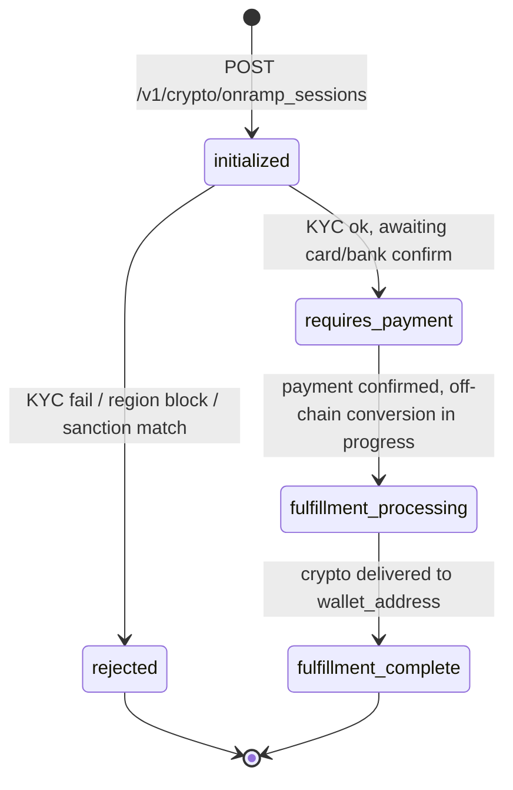
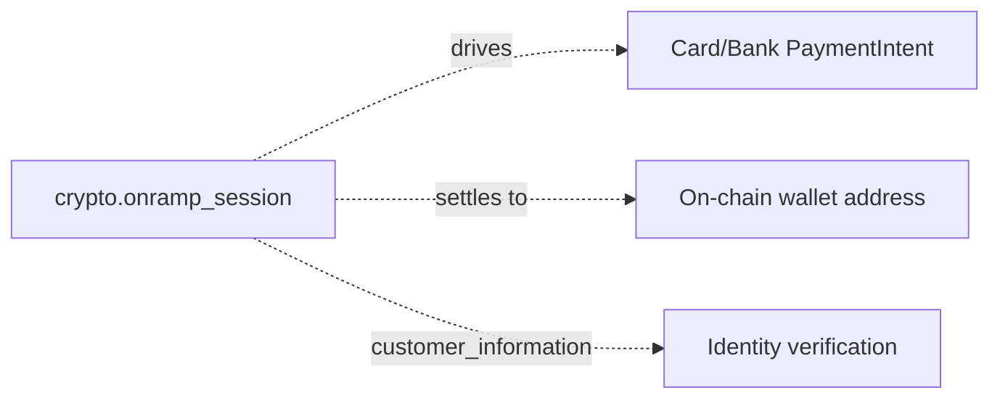

# Crypto Onramp Session

> API resource: `crypto.onramp_session` · API version: `2026-04-22.dahlia` · Category: [Crypto](README.md)

## What it is

A `crypto.onramp_session` represents one fiat-to-crypto purchase flow: the customer pays in fiat (card or bank), Stripe (or its on-ramp partner) routes the value through a crypto liquidity provider, and the chosen asset lands at the wallet address you specify on the chosen network. The object tracks the full pipeline — KYC state, transaction quote, fees, network and currency selection, and the eventual settlement transaction ID on-chain.

You don't render the on-ramp UI yourself. You create the session server-side, hand the `client_secret` to the browser, and mount the Stripe-hosted `<stripe-onramp>` web component. The component drives KYC collection, payment-method capture, asset/network choice, and quote acceptance; you watch for completion via webhooks.

> Hedge: the crypto on-ramp product is geographically restricted (US-centric, expanding), KYC-heavy, and has a fast-evolving list of supported networks/assets. The shape below reflects `2026-04-22.dahlia`, but specific supported networks and currency strings change frequently — **consult the Stripe crypto docs and changelog for the current supported list before shipping**.

## Why it exists

If you're building a wallet, a DeFi front-end, or any product that holds custodial or non-custodial crypto, you need a way for users to bring in fiat. Without an on-ramp:

- You either integrate every fiat-to-crypto exchange yourself, or
- You ship users off-platform to a third-party on-ramp, losing the flow.

`crypto.onramp_session` packages "fiat in → crypto out at this wallet address" into one Stripe primitive: KYC, payment, exchange, and on-chain settlement, with the same compliance posture and dispute/chargeback handling as a normal Stripe payment.

## Lifecycle & states



- **`initialized`** — session created. `client_secret` valid; mountable in browser.
- **`rejected`** — KYC declined, region not supported, or sanctions screen hit. Terminal.
- **`requires_payment`** — KYC cleared, customer is on the payment step.
- **`fulfillment_processing`** — fiat captured. Stripe / partner is converting and broadcasting on-chain. Can take seconds (L2s) to minutes (busy mainnet).
- **`fulfillment_complete`** — funds at the destination wallet. `transaction_details.transaction_id` populated with the on-chain tx hash. Terminal.

> Status name strings above match Stripe's documented enum at the time of writing; if you see additional intermediate states like `payment_processing`, treat them as informative — pin the exact set against the API reference for the version you're calling.

## Anatomy of the object

### Identity

| Field | Notes |
|---|---|
| `id` | `cos_…` |
| `object` | always `"crypto.onramp_session"` |
| `livemode` | true in live, false in test. |
| `created` | unix seconds. |
| `metadata` | Standard key/value bag — best place to stash your internal order ID. |
| `client_secret` | Opaque token for mounting `<stripe-onramp>`. **Treat as a credential** — anyone with it can drive the session. Don't log or query-string it. |
| `status` | enum, see lifecycle above. |

### Customer & compliance

| Field | Notes |
|---|---|
| `customer_information` | Sub-object Stripe populates as KYC progresses (collected name, address, dob, etc.). Pre-filling some of it server-side speeds up the flow. |
| `customer_ip_address` | Pass it from your backend if you can; Stripe uses it for fraud and region eligibility. |
| `preferred_region` | Hint about which jurisdiction to prefer for KYC defaults. |

### Transaction details

The `transaction_details` sub-object is the heart of the session. Fields commonly include:

| Field | Notes |
|---|---|
| `destination_currency` | The crypto asset (e.g. `usdc`, `eth`, `btc`). String enum that grows over time. |
| `destination_currency_network` / `destination_network` | Which chain (`ethereum`, `polygon`, `solana`, `base`, …). The asset/network combination must be supported. |
| `destination_amount` | Crypto amount delivered, denominated in the asset's smallest unit when applicable. May be set on create (asset-out flow) or computed from `source_amount` (fiat-in flow). |
| `source_currency` | Fiat ISO (`usd`, `eur`, …) the customer pays in. |
| `source_amount` | Fiat amount in cents. |
| `source_exchange_amount` | What was actually converted, after fees, on the partner's order book. |
| `fees.network_fee_monetary` | On-chain gas estimate, denominated in fiat. |
| `fees.transaction_fee_monetary` | Stripe / partner spread, in fiat. |
| `wallet_address` | Where the crypto is delivered. You provide this. |
| `wallet_addresses` | Some flows allow multiple per-asset addresses; consult docs for current shape. |
| `last_wallet_address` | Most recent address used (when the customer can change it during the flow). |
| `lock_wallet_address` | If `true`, the customer cannot edit the address from the UI. Set this for non-custodial app flows where you've already validated the address. |
| `quote_expiration` | Unix seconds when the displayed price stops being honored — if the customer dawdles, they get a fresh quote. |
| `supported_destination_currencies` / `supported_destination_networks` | Constraint lists you can pass to limit what the customer sees in the picker. |
| `transaction_id` | On-chain tx hash, populated when `status: fulfillment_complete`. The single piece of evidence to reconcile against block explorers. |

> The `transaction_details` shape has changed across releases. If you see fields here that don't match your live response, refer to the API reference for `2026-04-22.dahlia` — **Stripe iterates on this object faster than on payments primitives**.

## Relationships



- A session orchestrates a payment under the hood, but the payment is implementation detail — you don't manage a `PaymentIntent` yourself for on-ramp flows.
- The session is **not** a [Customer](../01-core-resources/customers.md) wrapper. KYC happens inside the session and is reusable across sessions for the same end user (Stripe handles the linkage internally).

## Common workflows

### 1. Fixed-fiat purchase (customer chooses asset)

Server:

```http
POST /v1/crypto/onramp_sessions
  transaction_details[source_currency]=usd
  transaction_details[source_amount]=10000
  transaction_details[wallet_address]=0xabc…
  transaction_details[supported_destination_currencies][]=usdc
  transaction_details[supported_destination_currencies][]=eth
  transaction_details[supported_destination_networks][]=ethereum
  transaction_details[supported_destination_networks][]=base
  transaction_details[lock_wallet_address]=true
  customer_ip_address=203.0.113.10
  metadata[order_id]=ord_abc
```

Return `client_secret` to the browser. Mount `<stripe-onramp client-secret="…">`. Wait for the `crypto.onramp_session.fulfillment_complete` webhook.

### 2. Fixed-asset purchase (customer pays whatever it costs)

```http
POST /v1/crypto/onramp_sessions
  transaction_details[destination_currency]=usdc
  transaction_details[destination_network]=base
  transaction_details[destination_amount]=50000000        # 50 USDC at 6 decimals
  transaction_details[wallet_address]=0xabc…
```

Stripe quotes the fiat side and the customer pays it.

### 3. Reconcile on-chain delivery

On `crypto.onramp_session.fulfillment_complete`:

```text
event.data.object.transaction_details.transaction_id   # 0xdeadbeef…
event.data.object.transaction_details.destination_currency_network
```

Look up the tx hash on the chain's explorer to verify the destination address received the expected amount. Don't credit the user in your app until the on-chain tx has the customary confirmation count for that network.

## Webhook events

Subscribe via [WebhookEndpoint](../19-webhooks/webhook-endpoints.md). Likely event names follow the `crypto.onramp_session.*` pattern:

| Event | Fires when | Listener typically does |
|---|---|---|
| `crypto.onramp_session.created` | Session created. | Mark order pending. |
| `crypto.onramp_session.updated` | Status or transaction_details mutate. | Update internal status. |
| `crypto.onramp_session.fulfillment_complete` (or equivalent) | Crypto delivered on-chain. | Credit user, surface tx hash. |

> The exact event names for terminal states have shifted between releases. **Check the [_meta/webhook-catalog.md](../_meta/webhook-catalog.md) and the Stripe changelog** before wiring handlers — don't assume the names above without verification.

## Idempotency, retries & race conditions

- **Send `Idempotency-Key`** on `POST /v1/crypto/onramp_sessions`. A network retry creating two sessions means two KYC-eligible flows for the same intent, which can confuse users and fraud heuristics.
- **Webhooks are at-least-once.** Dedupe on `event.id` and ignore later events that move you backwards in the lifecycle.
- **The on-chain settlement and the `fulfillment_complete` webhook are not atomic** — the webhook fires when Stripe broadcasts the tx; final confirmation is a chain-side event. Always look up the tx hash on the explorer before treating settlement as final for high-value flows.

## Test-mode tips

- Test-mode sessions don't touch real chains. Stripe simulates the on-chain settlement with synthetic transaction IDs so your handler logic can be exercised end-to-end.
- Supported test cards mirror the rest of Stripe (`4242…`). KYC in test mode auto-approves with synthetic identities.
- Region-eligibility checks may behave differently in test — verify in live (sandbox) once before launch.

## Connect considerations

The on-ramp product is generally **platform-only**, not designed for `Stripe-Account` per-merchant routing the way Payments is. If you need on-ramp on connected accounts, check current eligibility with Stripe — Connect support for crypto is a moving target.

There's no native `application_fee_amount` on the on-ramp session. Platforms that need to take a cut typically charge separately (e.g. via your own fee on top of the fiat the customer pays).

## Common pitfalls

- **Hard-coding supported asset/network strings.** They change. Read them from your config layer and surface a friendly error if Stripe rejects an unsupported combo.
- **Treating `fulfillment_complete` as on-chain finality.** It's not. It means broadcast. Wait for the requisite chain confirmations before crediting irreversible product.
- **Letting the customer enter the wallet address.** For non-custodial wallet apps integrating the on-ramp, *you* know the user's address — set it server-side and `lock_wallet_address=true`. User-typed addresses are the #1 source of irreversible loss.
- **Logging the `client_secret`.** It can drive the session — don't put it in URLs or analytics.
- **Skipping KYC pre-fill.** If you already have the user's name/address/dob from your own KYC, pass them in `customer_information` to dramatically reduce abandonment.
- **Assuming the asset/network list is stable.** Stripe adds and removes supported chains as partner availability changes. Reconfirm before each release.
- **Using the on-ramp for "off-ramp" (crypto-to-fiat).** This object is one-directional. Off-ramp is a separate product surface (different resource family) — don't conflate them.

## Further reading

- [API reference: Crypto Onramp Session](https://docs.stripe.com/api/crypto/onramp_sessions/object)
- [Stripe crypto on-ramp guide](https://docs.stripe.com/crypto/onramp)
- [`<stripe-onramp>` web component reference](https://docs.stripe.com/crypto/onramp/quickstart)
- [Stripe changelog](https://docs.stripe.com/changelog) — supported assets/networks change frequently.
