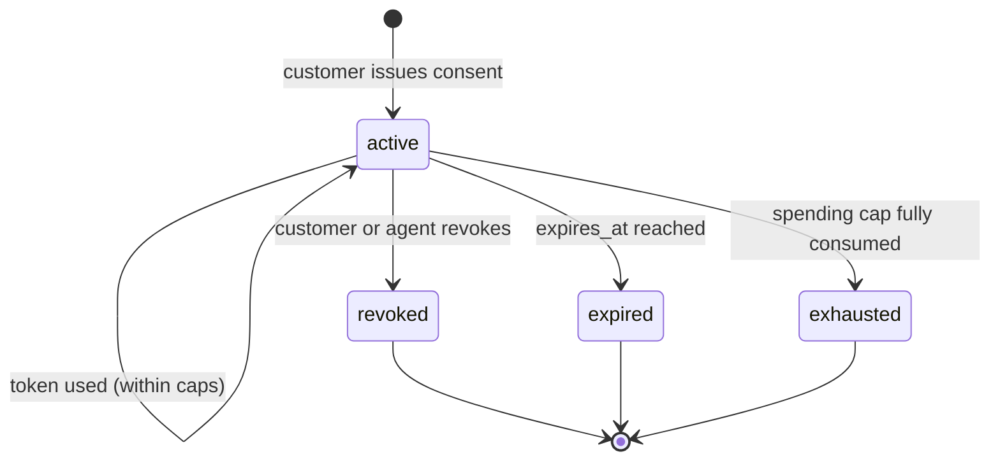
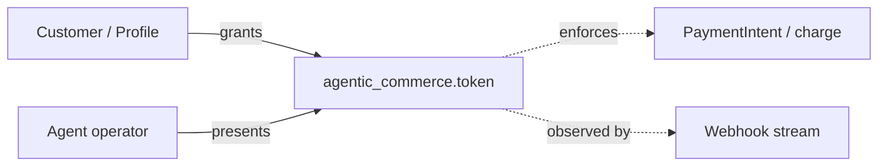

# Agentic Commerce Token

> API resource: `agentic_commerce.token` · API version: `2026-04-22.dahlia` · Category: [Agentic commerce](README.md)

> **Brand-new resource family.** Introduced in API version `2026-04-22.dahlia`. Field names, status enum values, sub-object shapes, and webhook event names below are described to convey the *model* — they may differ in detail from what's currently shipped. **Always cross-reference the [official API reference](https://docs.stripe.com/api) and the [Stripe changelog](https://docs.stripe.com/changelog) before writing production code against this object.** This guide deliberately leans on conceptual framing rather than committing to a fixed field schema.

## What it is

An `agentic_commerce.token` (referred to here as a *consent token*) is the artifact a customer creates when they authorize an autonomous agent — an AI shopping assistant, an LLM-driven travel planner, an automated reorder bot — to make payments on their behalf inside a bounded set of rules. The token records:

- **Who** the agent is (an identifier of the agent operator).
- **Whose** funds are being authorized (a Stripe [Customer](../01-core-resources/customers.md) or equivalent identity).
- **How much** the agent may spend, per transaction and per period.
- **Where** the agent may spend it (allowed merchants, blocked merchants, allowed categories).
- **When** the authorization expires.

At payment time, the agent presents the token alongside the payment attempt. Stripe enforces the caps and restrictions before authorizing the underlying instrument; if the attempt would breach a limit, Stripe declines. The customer can revoke the token at any time, instantly invalidating future use.

> Mental model: this is *OAuth-for-money*. The customer grants a scoped, revocable, observable delegation. Stripe is the policy enforcer that turns "agent says it's okay" into a structurally enforced permission.

## Why it exists

LLM agents can already book travel, order groceries, top up subscriptions. Without a primitive like this:

- Each merchant has to invent its own consent + cap mechanism (and they all do it differently).
- Customers have no consolidated view of "what agents have permission to spend my money."
- Banks and card networks have no signal that a transaction was agent-initiated, which matters for liability and fraud scoring.
- Revocation is ad-hoc and per-merchant.

The consent token standardizes the consent shape, the policy enforcement, and the observability surface (webhooks for issuance, use, breach, revocation). It also gives the card networks a hook to apply agentic-commerce-specific liability frameworks as those rules evolve.

## Lifecycle & states

The exact enum values are likely to evolve; the conceptual states almost certainly will not.



- **`active`** — token can be presented to authorize payments. Each successful use is observed (and counted toward periodic caps).
- **`revoked`** — terminal. Customer pulled consent, or the agent operator self-revoked, or Stripe revoked for policy reasons. New authorization attempts decline.
- **`expired`** — terminal. `expires_at` passed.
- **`exhausted`** — terminal (or transient until period reset, depending on the cap shape). Cap budget consumed.

> The exact terminal state names (`revoked`, `inactive`, `cancelled`, `consumed`, …) and whether per-period caps reset within the same `active` state vs. require a new token are details that may differ from what's described above. **Verify against the live API reference.**

## Anatomy of the object

The exact field names below are illustrative. Treat the **categories** as load-bearing and the **specific keys** as needing verification.

### Identity

| Conceptual field | Notes |
|---|---|
| `id` | Likely `act_…` or `agtok_…` — a token identifier you'll reference in payment calls. |
| `object` | `"agentic_commerce.token"`. |
| `livemode` | Standard Stripe boolean. |
| `created` | unix seconds. |
| `metadata` | Standard key/value bag. |
| `status` | enum, see lifecycle. |

### Parties

| Conceptual field | Notes |
|---|---|
| `customer` | The [Customer](../01-core-resources/customers.md) (or [Profile](../24-profiles/profiles.md)) granting consent. |
| `agent` | An identifier of the agent operator — likely a registered Stripe Agent record or a free-form opaque ID, depending on whether Stripe ships a sibling `Agent` object. **Confirm against the API reference.** |

### Spending caps

| Conceptual field | Notes |
|---|---|
| `spending_caps.max_per_transaction` | Hard ceiling on a single authorization. |
| `spending_caps.max_per_period` | Cap across a rolling window. |
| `spending_caps.period` | Window for `max_per_period` (`day`, `week`, `month`, …). |
| `spending_caps.currency` | The cap's currency; cross-currency conversion happens at use time. |

### Merchant restrictions

| Conceptual field | Notes |
|---|---|
| `merchant_restrictions.allowed` | Allowlist (specific merchant IDs or category strings). |
| `merchant_restrictions.blocked` | Blocklist. |
| `merchant_restrictions.categories` | Likely MCC or Stripe-defined category bundles. |

The exact representation (allowlist of `acct_…` Connect accounts? Stripe merchant identifiers? MCC codes? a new `merchant_*` resource?) is the area most likely to differ from what's described here.

### Time bounds

| Conceptual field | Notes |
|---|---|
| `expires_at` | Unix seconds. After this, the token can't authorize regardless of remaining cap. |
| `usage` | Possibly a sub-object reporting cumulative spend, per-period spend, and number of authorizations seen. **Treat as conceptual** — exact shape needs verification. |

## Relationships



- A customer may issue multiple tokens to the same agent (different scopes).
- A token is tied to one customer and one agent identity.
- At payment time, the token is referenced from a [PaymentIntent](../01-core-resources/payment-intents.md) (or whatever payment primitive the agentic flow uses) — the exact parameter name (`agentic_commerce_token=…`, or a top-level `agent_consent_token`, etc.) is **subject to verification against the current API reference**.

## Common workflows

> The HTTP examples below are illustrative of the model, not an authoritative request schema. Double-check parameter names before implementing.

### 1. Customer issues a consent token

In your UI, show the customer the agent's requested scope and have them confirm. Server-side:

```http
POST /v1/agentic_commerce/tokens
  customer=cus_…
  agent=agt_…
  spending_caps[max_per_transaction]=10000
  spending_caps[max_per_period]=50000
  spending_caps[period]=month
  spending_caps[currency]=usd
  merchant_restrictions[allowed][]=mcc:5411          # grocery
  merchant_restrictions[allowed][]=acct_specific_…
  expires_at=1735689600
  metadata[agent_session]=sess_xyz
```

Persist the returned `id`. The agent operator now has authority within the declared scope.

### 2. Agent uses the token at payment time

When the agent initiates a payment on the customer's behalf:

```http
POST /v1/payment_intents
  amount=4500
  currency=usd
  customer=cus_…
  agentic_commerce_token=act_…           # parameter name to verify
  payment_method=pm_…
  off_session=true
  confirm=true
```

Stripe checks the token: status `active`, within `max_per_transaction`, period budget remaining, merchant in allowlist, not in blocklist, not expired. If any check fails, the PaymentIntent declines with an agent-specific decline code. If all pass, the PI proceeds normally and the spend is debited from the token's period budget.

### 3. Customer revokes

```http
POST /v1/agentic_commerce/tokens/act_…/revoke
```

(Or `DELETE /v1/agentic_commerce/tokens/act_…`, depending on the API surface — **verify**.) The token transitions to `revoked` immediately; subsequent agent-initiated payments using it decline.

### 4. Surface the token in your UI

List active tokens for a customer so they can review and revoke:

```http
GET /v1/agentic_commerce/tokens?customer=cus_…&status=active
```

Render scope, current period spend, and a revoke button.

## Webhook events

Subscribe via [WebhookEndpoint](../19-webhooks/webhook-endpoints.md). The likely event family is `agentic_commerce.token.*`:

| Event (likely) | Fires when | Listener typically does |
|---|---|---|
| `agentic_commerce.token.created` | Customer issued consent. | Audit log; reflect in customer portal. |
| `agentic_commerce.token.updated` | Status, spend usage, or scope mutated. | Refresh internal cache. |
| `agentic_commerce.token.revoked` | Customer or agent revoked. | Inform agent operator stack to stop attempting. |
| `agentic_commerce.token.cap_breached` (possible) | Agent attempted to spend above a cap. | Surface in fraud monitoring; possibly notify customer. |

> **Confirm event names against [_meta/webhook-catalog.md](../_meta/webhook-catalog.md) and the live changelog.** Events for brand-new resource families are commonly renamed across the first few `dahlia.X` patch releases.

## Idempotency, retries & race conditions

- **Always send `Idempotency-Key`** on token creation. Two tokens for the same intent is a security and UX problem (the customer thinks they revoked one but the duplicate is still spending).
- **Cap accounting is server-side and authoritative.** Do not trust client-side assumptions about remaining budget — always rely on Stripe's decline at payment time as the enforcement boundary.
- **Race between revoke and an in-flight payment.** A payment that has already been authorized before the revoke lands will still settle. Revocation prevents *future* authorizations; it does not unwind in-flight or already-captured ones. To recover funds, use [Refund](../01-core-resources/refunds.md).
- **Webhook ordering is not guaranteed.** A `token.updated` reflecting a spend can arrive after a separate `payment_intent.succeeded`. Refetch the token if you need authoritative current usage.

## Test-mode tips

- Use a test-mode customer and test-mode agent identifier. Test-mode tokens enforce caps the same way as live tokens against test PaymentIntents.
- The Stripe CLI `stripe trigger` command will (over time) gain agentic-commerce events; check `stripe trigger --help` for the current list.
- Practice the revocation flow end-to-end before launch — it's the path that breaks if you introduced caching of token state on your side.

## Connect considerations

For Connect platforms hosting the agent operator (rather than the customer):

- The token is bound to a customer on a particular Stripe account. If your platform's customers each live on connected accounts, the token is created with `Stripe-Account: acct_…` and only enforces against payments on that account.
- Cross-account agent flows (one agent acting across many connected accounts) are an evolving area — **confirm support against current docs** before architecting.
- The merchant-restriction allowlist's representation may differ when expressed in Connect contexts (platform's `acct_…` vs. external merchant identifier). Verify.

## Common pitfalls

- **Treating the token as a payment method.** It isn't. It's an authorization layer that sits *on top of* a payment method. The customer still needs an attached PM (card, bank account, …) for the agent to charge against.
- **Granting overly broad scope.** A token without merchant restrictions and a high `max_per_period` is a blank cheque. Default to the narrowest plausible scope and let the agent ask for more if needed.
- **Storing token IDs without surfacing them to the customer.** Customers must be able to see and revoke their consents; not surfacing them in your UI is an erosion of the consent contract.
- **Building cap enforcement client-side.** Stripe enforces. Your client logic is best-effort UX; the authoritative answer comes from the payment attempt.
- **Assuming the field names in this guide are accurate.** They convey the *shape* of the model. **Always verify against the API reference for `2026-04-22.dahlia` (or your pinned version) before coding.** This is a fast-moving area; don't pin business logic to an unverified field name.
- **Forgetting to refund on revocation.** Revocation stops future spend. It does not refund prior charges; if the agent's last action was disputed by the customer, you have to refund explicitly.
- **No fraud telemetry on agent-initiated payments.** Agent payments behave differently from human payments; Radar rules tuned on human behavior may misclassify them. Pipe the `agent` identifier into your own fraud signals.

## Further reading

- [API reference: Agentic commerce](https://docs.stripe.com/api) — search for "Agentic" in the official sidebar.
- [Stripe changelog](https://docs.stripe.com/changelog) — track `dahlia.X` patches that adjust this object.
- [Category overview](README.md) — broader framing of Stripe's agentic-commerce push.
- [Profile](../24-profiles/profiles.md) — likely the identity primitive consent tokens lean on.
