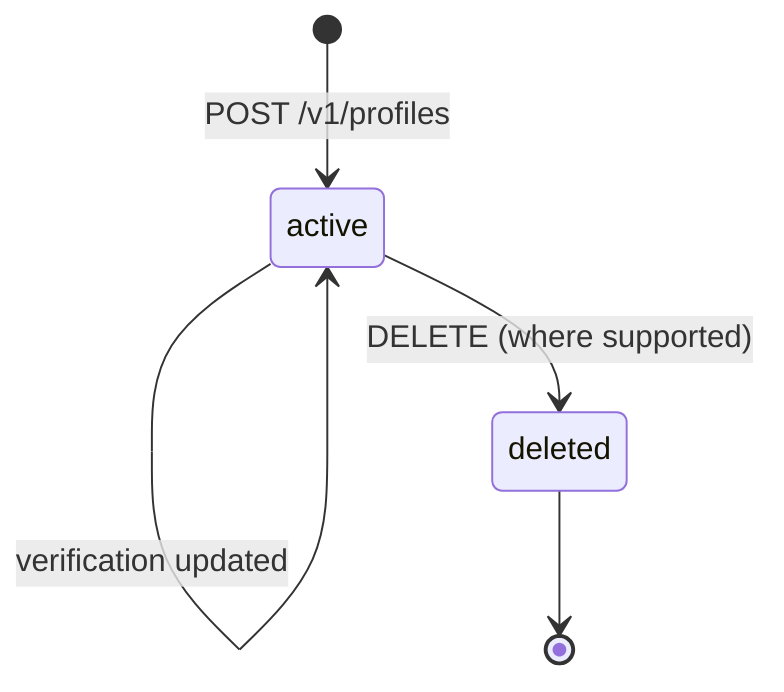
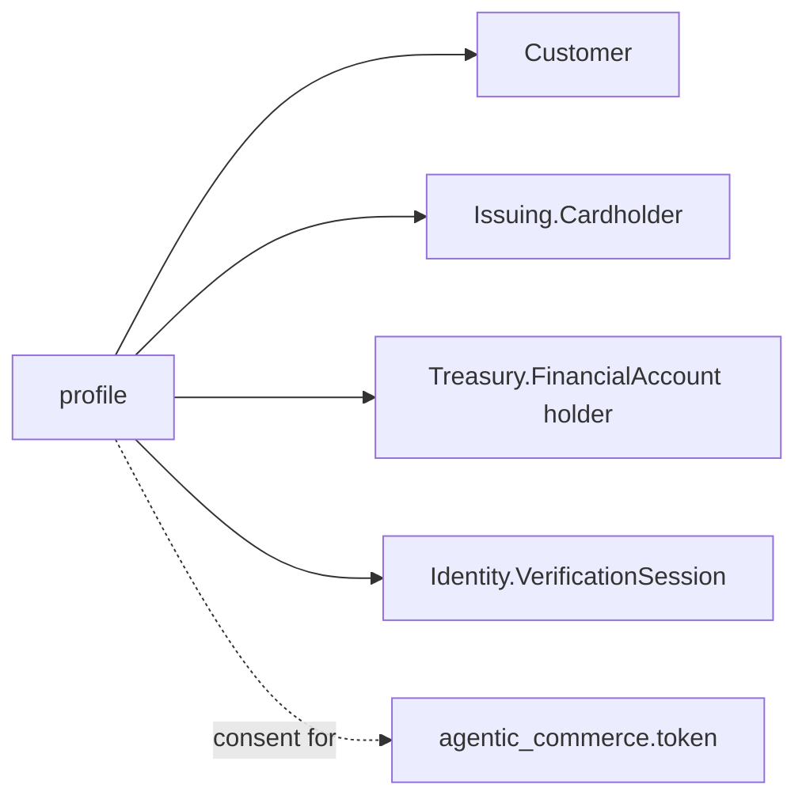

# Stripe Profile

> API resource: `profile` · API version: `2026-04-22.dahlia` · Category: [Profiles](README.md)

> **Brand-new resource family.** Introduced in API version `2026-04-22.dahlia`. The Profile model is described here in conceptual terms because the exact field shape is still evolving across `dahlia.X` patch releases. **Field names, sub-object shapes, and the precise set of linkable products may differ from what's described below — always verify against the [official API reference](https://docs.stripe.com/api) and the [Stripe changelog](https://docs.stripe.com/changelog) before writing production code.** This guide focuses on the *mental model* and explicitly hedges on field-level detail.

## What it is

A `profile` is Stripe's unified per-end-user identity record. It centralizes the identifying information about a single human (or business) — name, contact details, address, date of birth, government IDs, and the result of any KYC/identity verification — so that the same person can be referenced from many product objects without duplicating that data or re-doing verification each time.

Conceptually: before Profile, if the same person was your paying customer (`Customer`), held a card you issued (`Issuing.Cardholder`), held a Treasury balance (`Treasury.FinancialAccount`), and verified their identity (`Identity.VerificationSession`), you had four loosely-related records and four chances for them to drift out of sync. Profile is the upstream identity object those four downstream objects all link to.

## Why it exists

Three problems Stripe's pre-Profile world had:

1. **KYC re-collection.** Verifying the same person for Payments, then again for Issuing, then again for Treasury — wasteful, painful UX.
2. **Identity drift.** When the user updated their address in your Customer record, their Cardholder record stayed stale.
3. **No "who is this person, really?" handle.** Cross-product reporting and risk required ad-hoc joins on email or external IDs.

Profile fixes all three by being the single canonical identity record. Verification snapshots are stored on the Profile and can be reused by downstream products that accept them; downstream records link by `profile=prof_…` instead of redeclaring identity fields.

> Hedge: the *exact* set of products that accept a Profile reference (Customer, Cardholder, FinancialAccount holder, Verification Session, …) is part of what's expanding through `dahlia.X`. Don't assume a product accepts Profile linking until you've checked its current API reference.

## Lifecycle & states

A Profile is persistent. It doesn't have a payment-style status enum.



- **`active`** — exists and can be referenced. Mutable: you can update contact info, attach new linked records, or refresh the verification snapshot.
- **`deleted`** — tombstoned (where supported). Linked downstream records are not auto-deleted; they keep the linkage but the profile resolves to a tombstone.

> Whether and how Profile supports deletion is one of the surface details that may change. **Verify before relying on a delete path.** In practice most teams treat Profiles as append-only and update fields rather than deleting.

## Anatomy of the object

The fields below convey *what kinds of data live on a Profile*. Treat the categories as load-bearing and the specific keys as needing verification against the current API reference.

### Identity

| Conceptual field | Notes |
|---|---|
| `id` | Likely `prof_…`. |
| `object` | `"profile"`. |
| `livemode` | Standard Stripe boolean. **Test and live profiles are independent**, like every other Stripe resource. |
| `created` | unix seconds. |
| `metadata` | Standard key/value bag — best place to stash your internal user ID. |

### Contact

| Conceptual field | Notes |
|---|---|
| `name` | Legal name (likely first/last sub-fields, possibly a separate display name). |
| `email` | Primary email. |
| `phone` | E.164 phone. |
| `address` | Standard Stripe address sub-object (line1, city, postal_code, state, country, …). |
| `dob` | Date of birth, likely as `{day, month, year}`. Required for many verification paths. |

### Verification snapshot

| Conceptual field | Notes |
|---|---|
| `verification` | A snapshot of the most recent identity verification result. Likely contains the source [VerificationSession](https://docs.stripe.com/identity) ID, the verified document type, and a timestamp. **The exact shape is what's most likely to differ from the description here — verify.** |
| `verification.status` | Whether the snapshot is currently usable (`verified`, `unverified`, `expired`, …). |
| `verification.last_verified_at` | When the snapshot was captured. Some downstream products require recency. |

### Linked downstream records

| Conceptual field | Notes |
|---|---|
| `linked_objects.customer` (or similar) | The [Customer](../01-core-resources/customers.md) bound to this Profile, if any. |
| `linked_objects.cardholder` | The Issuing Cardholder, if any. |
| `linked_objects.financial_account` | The Treasury FinancialAccount holder, if any. |
| `linked_objects.verification_session` | The most recent Identity verification session that fed the snapshot. |

> The exact name of this aggregation field — `linked_objects`, `links`, separate top-level `customer` / `cardholder` / `financial_account` keys, or a sub-resource — is **subject to verification**. The conceptual point is that the Profile knows what it's been used to back.

## Relationships



- A Profile is a **parent** of identity for downstream records that opt into linking.
- A Profile is **not** a Customer. A Customer is a billing/payments object; a Profile is an identity object. They cohabit and link, but they're distinct.
- One Profile can back at most one Customer per account (typically), but expect a single Profile to back several different products' identity records at once.

## Common workflows

> The HTTP examples below are illustrative of the model, not an authoritative request schema. **Verify parameter names against the live API reference before implementing.**

### 1. Create a Profile from KYC results

After running an Identity verification session that succeeded:

```http
POST /v1/profiles
  name[first]=Jane
  name[last]=Doe
  email=jane@example.com
  phone=+15551234567
  address[line1]=…
  address[country]=US
  dob[year]=1990
  dob[month]=4
  dob[day]=12
  verification[verification_session]=vs_…
  metadata[app_user_id]=42
```

The returned `prof_…` becomes your canonical identity handle for Jane.

### 2. Create a Customer linked to the Profile

```http
POST /v1/customers
  profile=prof_…
  email=jane@example.com
```

The Customer inherits identity context from the Profile. If you later update the Profile's address, downstream products that read identity through the Profile see the update without you touching the Customer record.

### 3. Reuse Profile verification for Issuing

```http
POST /v1/issuing/cardholders
  profile=prof_…
  type=individual
  status=active
```

If the Profile's verification snapshot satisfies Issuing's KYC requirements (jurisdiction, recency, document types), Issuing accepts the Cardholder without re-collecting docs. **The exact KYC equivalence rules are jurisdiction-specific and evolving** — confirm with current Issuing docs.

### 4. Refresh a stale verification

```http
POST /v1/identity/verification_sessions
  profile=prof_…
```

When the customer completes the new session, attach the result to the Profile to refresh the snapshot. Downstream products that require recent verification regain compliance.

### 5. Update contact info once, propagate everywhere

```http
POST /v1/profiles/prof_…
  address[line1]=New address
  email=new@example.com
```

Linked records that read through the Profile get the update. Records that copied the field at link time may stay stale — **verify the propagation semantics for each product** (some pull-through, some snapshot-at-link).

## Webhook events

Subscribe via [WebhookEndpoint](../19-webhooks/webhook-endpoints.md). Likely event family: `profile.*`.

| Event (likely) | Fires when | Listener typically does |
|---|---|---|
| `profile.created` | A new Profile is created. | Sync to your DB. |
| `profile.updated` | Identity field changed, verification refreshed, or a new linked object attached. | Re-sync; recheck downstream eligibility. |
| `profile.deleted` (if supported) | Profile tombstoned. | Soft-suspend in your DB. |

> **Confirm event names against [_meta/webhook-catalog.md](../_meta/webhook-catalog.md) and the live changelog.** Brand-new resource families commonly see event names adjusted across the first few patch releases.

## Idempotency, retries & race conditions

- **Always send `Idempotency-Key`** on `POST /v1/profiles`. Two Profiles for the same human is exactly the problem this resource is meant to prevent.
- **Profile updates are last-write-wins.** Concurrent updates from two services on the same Profile race; serialize on your side if you have multiple writers.
- **Verification snapshot refreshes can race with downstream reads.** If you trigger a re-verify and immediately attempt an Issuing operation that requires fresh KYC, the verification snapshot may not yet be `verified`. Rely on `profile.updated` (or a refetch) to confirm the snapshot is current.
- **Linked-object propagation is product-dependent.** Don't assume "I updated the Profile, the Cardholder is now also updated" — some products snapshot, some pull-through. Test each linkage you depend on.

## Test-mode tips

- Test-mode profiles use synthetic verification (Stripe Identity in test mode auto-passes with documented test inputs). Verification snapshots produced this way are usable from test-mode Customer / Cardholder / FinancialAccount creations only.
- A test-mode Profile cannot back a live-mode Customer; livemode is a hard partition.
- The Stripe CLI's `stripe trigger` command will (over time) gain `profile.*` events; check `stripe trigger --help` for the current list.

## Connect considerations

- Profile's relationship to Connect is one of the highest-uncertainty areas. Open questions include: do Profiles live on the platform or on connected accounts? Can a single Profile span both? What happens during a Connect account migration?
- **Until you've verified the answer in the API reference for your pinned version**, default to creating Profiles on the same account that owns the linked products. Don't try to share Profiles cross-account.
- Platforms doing platform-level KYC (with downstream Connect accounts holding limited records) should especially read the current docs carefully — this surface area is one of the explicit motivators for the Profile resource.

## Common pitfalls

- **Treating Profile as a replacement for Customer.** It's not. Customers are still where billing relationships live. A Profile *backs* a Customer; it doesn't replace one.
- **Assuming all products accept Profile linking.** Coverage is rolling out. A given product may still want full identity inline. Don't refactor your whole code path on the assumption it works everywhere — verify per product.
- **Building irreversibly on field names from this guide.** The shape is evolving. Wrap field reads behind a small adapter so a renamed field is one diff, not a sweeping refactor. **This warning applies in particular to the `verification` and `linked_objects` shapes.**
- **Skipping idempotency on creation.** Duplicate Profiles for the same human re-introduce exactly the data fragmentation Profile is supposed to fix.
- **Pinning to the floating account default Stripe-Version.** Pin to `2026-04-22.dahlia` (or whichever exact `dahlia.X` you've verified your code against) so a future point-release doesn't silently reshape Profile responses under you.
- **Forgetting that verification ages out.** Many regulated products require KYC within the last N months/years. A Profile created two years ago without a recent re-verify may no longer satisfy downstream requirements. Track recency and prompt re-verify proactively.
- **Confusing Profile with `Person` (Connect).** [Person](../07-connect/persons.md) is a Connect-specific record for the humans behind a connected account (owners, directors). Profile is a much broader, end-user-facing identity primitive. Different objects, different lifecycles.

## Further reading

- [API reference: Profile](https://docs.stripe.com/api) — search for "Profile" in the official sidebar.
- [Stripe changelog](https://docs.stripe.com/changelog) — Profile is iterating; track patches.
- [Identity](https://docs.stripe.com/identity) — the verification product whose snapshots back Profiles.
- [Category overview](README.md) — broader framing of cross-product identity.
- [_meta/api-version.md](../_meta/api-version.md) — version pinning notes; especially relevant here.
