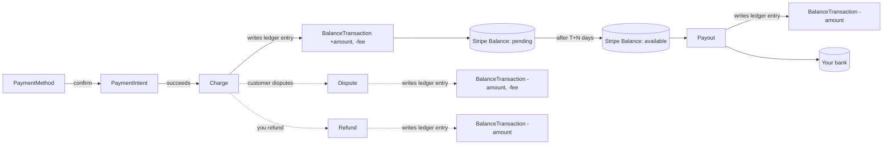

# How a dollar moves through Stripe

If you understand this one diagram, every later object falls into place.

## The five facts that explain everything

1. **Every cent that moves creates a `BalanceTransaction`.** Charges, refunds, fees, transfers, payouts, disputes, adjustments, top-ups, application fees — every one of them. If you can't tie a movement to a `BalanceTransaction`, your books will not reconcile.

2. **Charges are not money in your bank.** A successful Charge moves funds into your Stripe `pending` balance. It takes a settlement window (typically 2 business days for US cards) before they roll to `available` and become eligible for payout.

3. **Payouts are scheduled, not synchronous.** Once funds are `available`, Stripe issues a Payout on your configured schedule (daily/weekly/monthly). The Payout object is what your bank sees; the bank statement line corresponds to one Payout object.

4. **Refunds and disputes pull from your balance, not from the original Charge.** If your `available` balance is too low, refunds/disputes go negative — Stripe will then debit your bank or block payouts. This is why marketplaces sometimes hold reserves.

5. **Webhooks are the source of truth, not API responses.** Many state changes happen asynchronously (3DS challenges, ACH settlement, dispute creation, subscription renewals). The synchronous response only tells you what was true at request time. Always reconcile with `*.succeeded` / `*.failed` / `*.updated` events.

## How Connect changes the picture

On a Connect platform, a charge can route money in three ways:

- **Direct charge** — created on the connected account (`Stripe-Account` header). Funds land in the connected account's balance. Platform takes `application_fee_amount`, which moves to *platform* balance.
- **Destination charge** — created on the platform with `transfer_data[destination]: acct_…`. Funds land on the platform first, then a Transfer to the connected account is created automatically.
- **Separate charges and transfers** — platform creates a charge to itself, then explicitly creates a Transfer later. Lets you split one customer payment across many connected accounts.

In all three cases, the `BalanceTransaction` chain still applies — there are now multiple ledgers to track (one per Stripe account).

## Reading the ledger

To prove what hit your bank in a payout:

1. List `balance_transactions?payout=po_…` — every entry that rolled into that payout.
2. Each entry has `source: ch_… | rf_… | tr_… | dispute_… | applicationfee_…` pointing to the originating object.
3. Sum `net` across the list — it equals the payout's `amount`.

This is the basis for every reconciliation script anyone has ever written against Stripe.
