# State machines, all in one place

Cross-reference for every state-bearing object in this project. Each diagram is the canonical lifecycle; follow the link for what each state allows.

## PaymentIntent

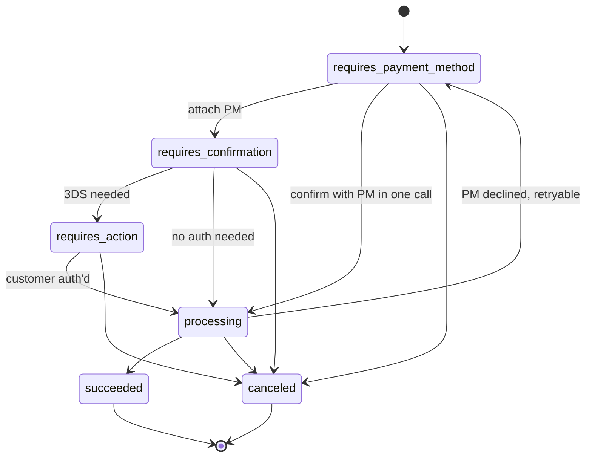

Detail: [PaymentIntent](../01-core-resources/payment-intents.md).

## Charge

A Charge has no `status` enum but has booleans that act like one:

- `captured: false` + `status: succeeded` → authorization only (uncaptured).
- `captured: true` + `status: succeeded` → captured, funds settling.
- `status: failed` → declined or errored at the network.
- `refunded: true` (full) or partial via `amount_refunded` → reversed.
- `disputed: true` → customer filed chargeback.

Detail: [Charge](../01-core-resources/charges.md).

## Refund

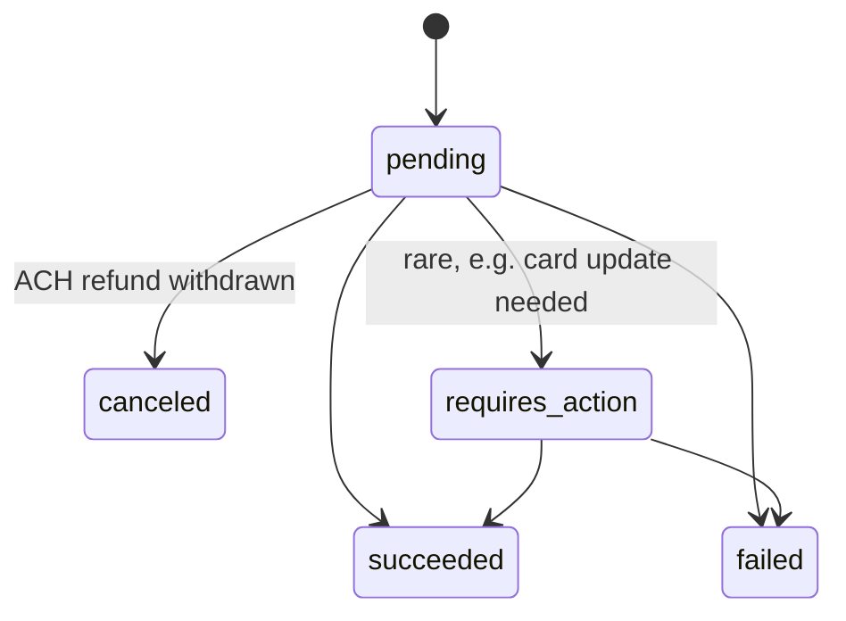

Detail: [Refund](../01-core-resources/refunds.md).

## Dispute

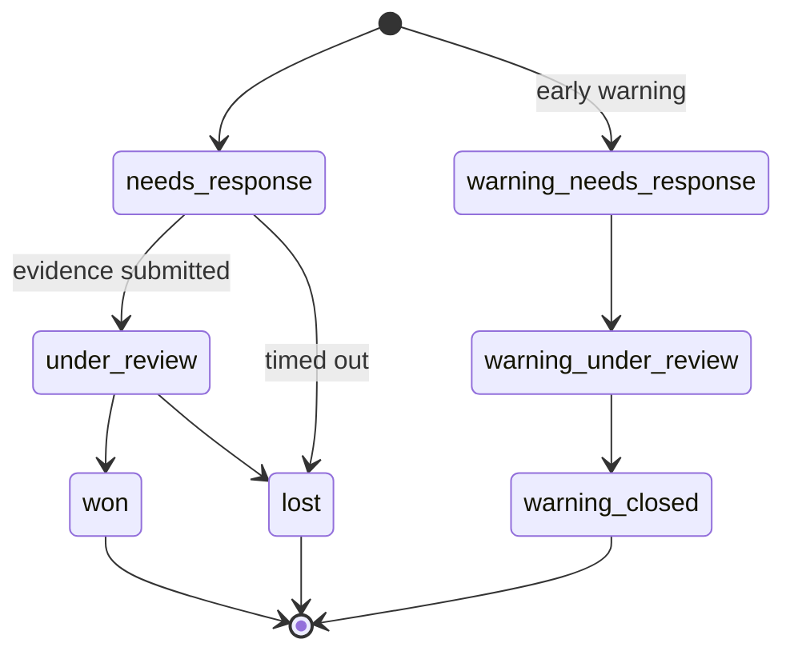

Detail: [Dispute](../01-core-resources/disputes.md).

## Payout

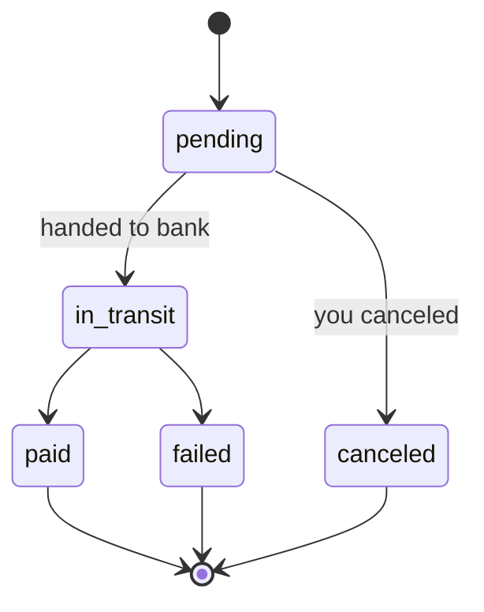

Detail: [Payout](../01-core-resources/payouts.md).

## Invoice

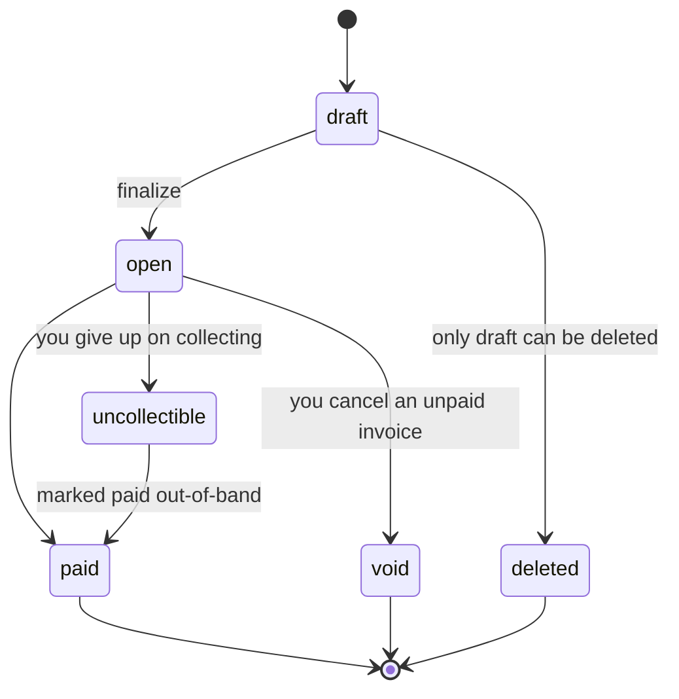

Once an invoice is `open`, **its lines are immutable** — no more InvoiceItems, no field edits except metadata, description, and a few payment-config fields. Reductions to a finalized invoice happen via [CreditNote](../06-billing/credit-notes.md).

Detail: [Invoice](../06-billing/invoices.md).

## Subscription

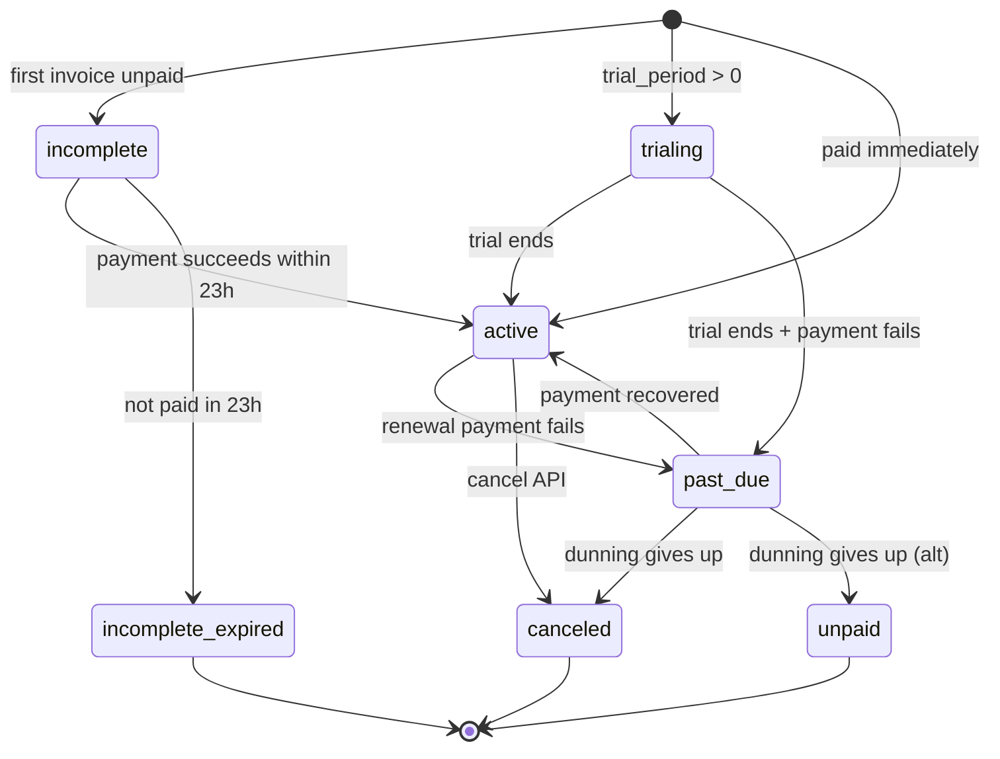

Detail: [Subscription](../06-billing/subscriptions.md).

## SetupIntent

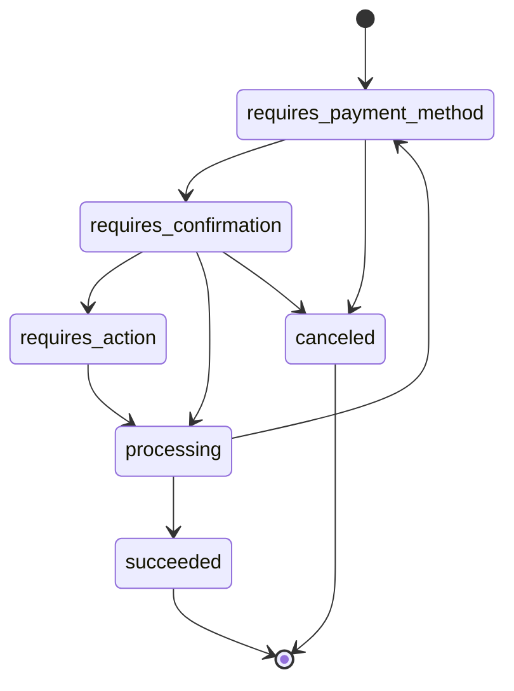

Detail: [SetupIntent](../01-core-resources/setup-intents.md).

## Checkout Session

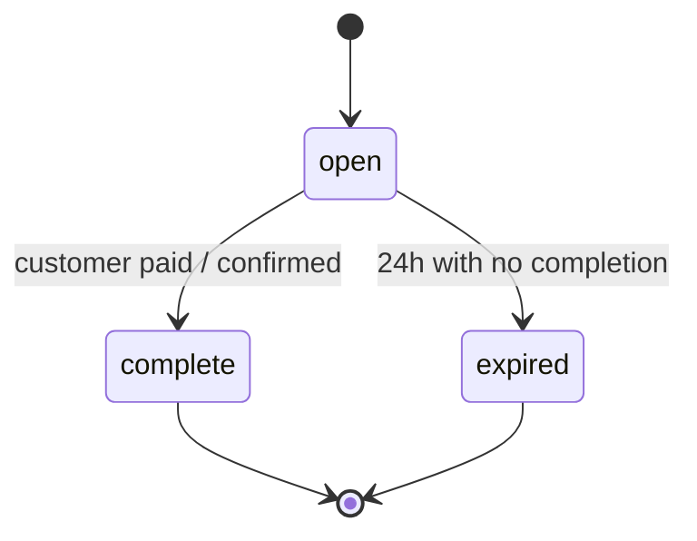

Detail: [Checkout Session](../04-checkout/sessions.md).

## Issuing Authorization

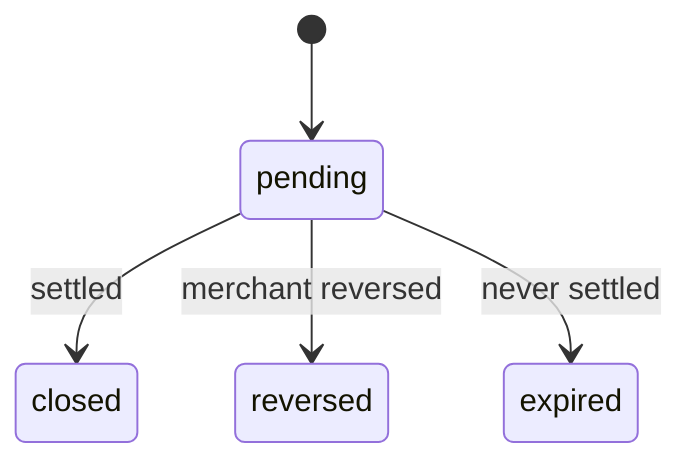

Detail: [Issuing Authorization](../09-issuing/authorizations.md).

## Quote

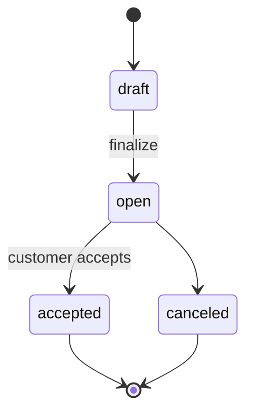

Detail: [Quote](../06-billing/quotes.md).

## Subscription Schedule

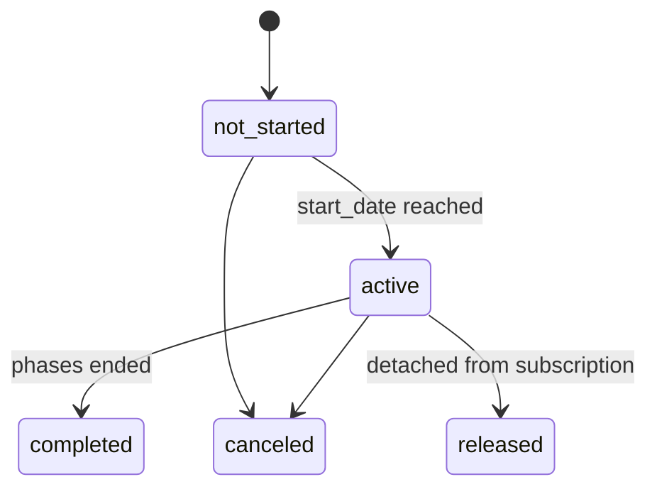

Detail: [SubscriptionSchedule](../06-billing/subscription-schedules.md).

## Verification Session (Identity)

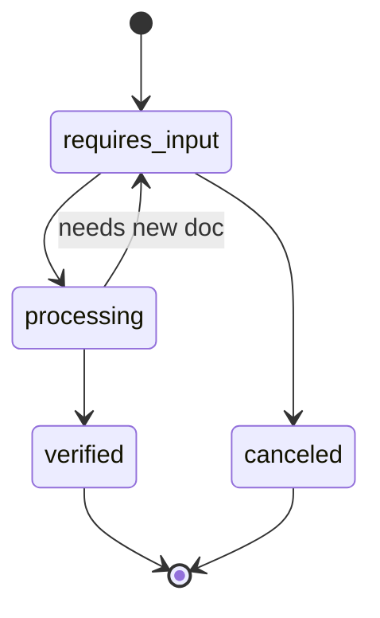

Detail: [Identity VerificationSession](../12-identity/verification-sessions.md).
