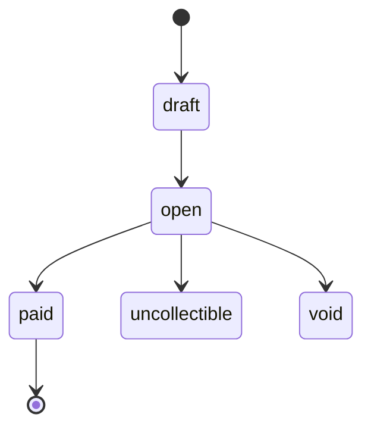
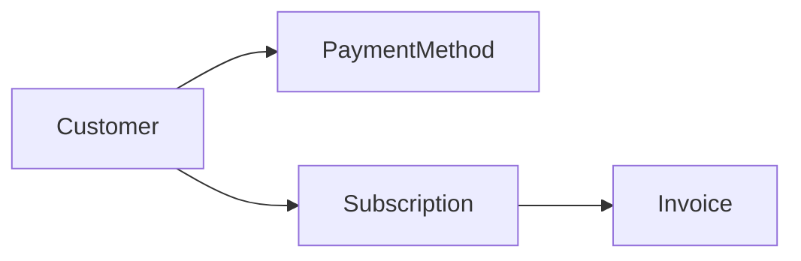

# <Object Name>

> API resource: `<resource_name>` · API version: `2026-04-22.dahlia` · Category: [<category>](README.md)

## What it is

One paragraph in plain English. What does this object represent in the real world? Where does it sit in the Stripe domain?

## Why it exists

What problem would you have without it? When does an integration reach for this object instead of a neighboring one?

## Lifecycle & states

The full state machine — every value `status` (or equivalent) can hold, every transition between them, and what each state allows or blocks.

For each state, document:

- What triggers entry into the state (API call, webhook, time-based event, customer action).
- What is mutable in this state and what is frozen.
- What downstream objects can be created against the object in this state.
- Which terminal states are reversible vs. irreversible.

## Anatomy of the object

Group fields by purpose, not alphabetically. Cover only the fields a developer must understand:

- **Identity** — `id`, `object`, `livemode`.
- **Money** — `amount`, `currency`, `amount_*` derivatives.
- **Status** — `status` and any sibling state fields (`paid`, `captured`, `disputed`, …).
- **Relations** — foreign keys to other resources.
- **Metadata** — `metadata`, `description`, `statement_descriptor`.
- **Timestamps** — `created`, status transition timestamps.

For each field, explain: type, whether it can be `null`, what produces the value, what reads it.

## Relationships

For each relationship: parent vs child, whether the link is required, whether it can change after creation, and what happens if the linked object is deleted/archived.

## Common workflows

### Workflow 1: <name>

Step-by-step recipe with the actual API calls. Note where idempotency keys belong.

### Workflow 2: <name>

…

## Webhook events

| Event | Fires when | Listener typically does |
|---|---|---|
| `<object>.created` | … | … |
| `<object>.updated` | … | … |
| `<object>.<terminal>` | … | … |

## Idempotency, retries & race conditions

- Which operations are idempotent natively, which require an `Idempotency-Key`.
- What Stripe deduplicates server-side and what it doesn't.
- Race conditions between API responses and webhook delivery (and how to resolve them — usually webhooks are the source of truth).

## Test-mode tips

- Magic test data (card numbers, IBANs, BSB).
- How [TestClock](../06-billing/test-clocks.md) interacts with this object.
- Useful CLI commands (`stripe trigger <event>`).

## Connect considerations

- What changes when this object is created on a connected account via `Stripe-Account` header.
- Whether `application_fee_amount` / `transfer_data` apply.
- Permissions required (Standard vs. Express vs. Custom).

## Common pitfalls

- Real mistakes engineers make with this object — frame as "what looks right but isn't".

## Further reading

- [API reference](https://docs.stripe.com/api/<path>) — official field-by-field reference.
- Related guides on docs.stripe.com.
